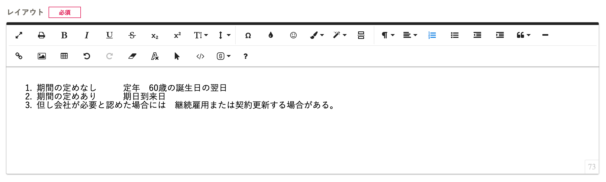
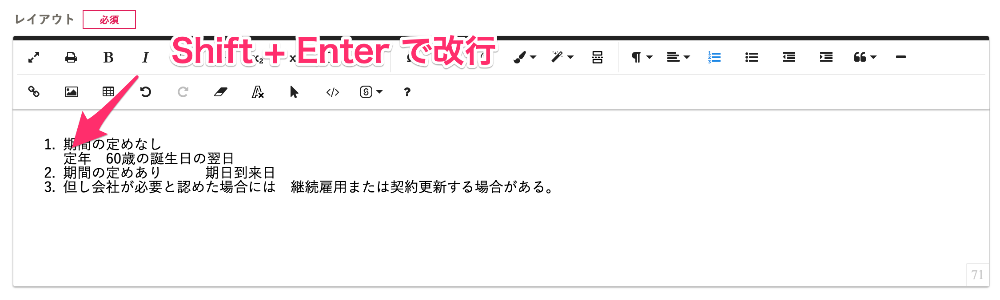

書類テンプレートのレイアウト画面でEnterキーを押すと、新しい段落が作成される（htmlモードで見ると
タグで囲まれます）ため、行間が空きます。

段落を変えずに改行したい場合は、Shift + Enterを同時に押してください。

# Shift + Enterを同時に押す

:::tips
箇条書きや段落番号の途中で改行する場合、上記のように、改行したい箇所でキーボードのShift + Enterを同時に押してください。
:::
