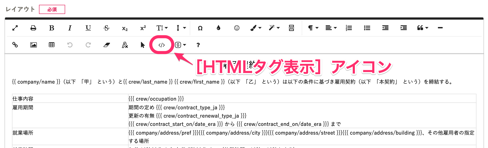
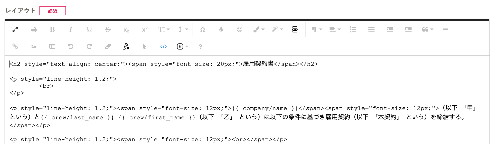
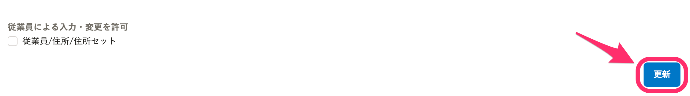

HTMLタグを使った書類テンプレートのレイアウト編集方法を説明します。

:::alert
この編集操作には、HTMLの知識が必要です。
HTMLの編集によって発生した不具合、HTMLの記述についてはサポート対象外となります。予めご了承ください。
[SmartHRサポートポリシー](https://knowledge.smarthr.jp/hc/ja/articles/360044805593)
:::

# レイアウト画面をHTMLタグ表示に切り替える

書類テンプレートをHTMLで編集するために、レイアウト画面を［HTMLタグ表示］に切り替えます。

## ツールバーの ［ ］ アイコンをクリック

ツールバーの  **［HTMLタグ表示］** アイコンをクリックしてください。

クリックすると、レイアウト画面がHTMLタグ表示に切り替わります。

## HTMLでレイアウトを編集する

レイアウト画面に直接HTMLを入力して編集してください。

編集後は、もう一度  **［HTMLタグ表示］** アイコンをクリックして表示を切り替え、画面下部の **［更新］** をクリックすると、保存されます。

:::alert
HTMLタグ表示のまま **［更新］** をクリックすると、レイアウトの変更が反映されませんのでご注意ください。
:::
