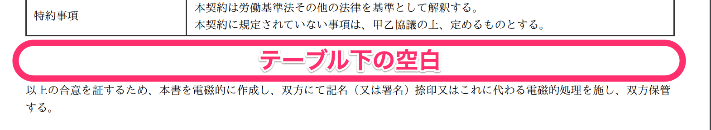
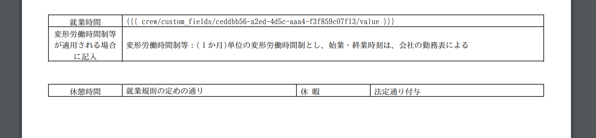

# HTMLタグ表示モードで編集する

書類テンプレートのレイアウト作成画面で表を編集している時に、下記のような状況になることがあります。

1.  表の位置や幅を調整したい
2.  意図しない空間ができてしまう
3.  列数の異なる表を結合したい
4.  罫線を非表示にしたい

これらは、HTMLで編集する必要があります。

ここでは、ケースごとのHTMLタグの記述方法を説明します。

:::alert
この編集操作には、HTMLの知識が必要です。
HTMLの編集によって発生した不具合、HTMLの記述についてはサポート対象外となります。予めご了承ください。
[SmartHRサポートポリシー](https://knowledge.smarthr.jp/hc/ja/articles/360044805593)
:::

## 1\. ツールバーの ［  ］ アイコンをクリックして、HTMLタグ表示に切り替える

書類テンプレートをHTMLで編集するために、レイアウト画面を **［HTMLタグ表示］** に切り替えます。

ツールバーにある **［HTMLタグ表示］** アイコンをクリックしてください。

クリックすると、レイアウト画面がHTMLタグ表示に切り替わります。

## 2\. HTMLタグに記述を書き加える

HTMLタグ表示モードに切り替え、記述を加えます。

:::related
[書類テンプレートをHTMLで編集する](https://knowledge.smarthr.jp/hc/ja/articles/360037608913)
:::
:::tips
書類テンプレートのステータスが「使用中」の場合、書類テンプレート作成・編集画面の下部には、 **［更新］** ではなく **［次へ］** が表示されます。
 **［次へ］** をクリックし、必要に応じて変更概要を入力した上で、 **［更新］** をクリックしてください。
:::

# HTMLタグを使用して任意のレイアウトに調整する

## **表を「右寄せ」「左寄せ」「中央寄せ」にしたい場合**

表や文章を「右寄せ」「左寄せ」「中央寄せ」にする場合の、HTMLの記述を紹介します。

#### 1\. 任意のHTMLタグをコピーする

下記から、作成する表のHTMLタグをコピーします。

 **「右寄せ」にする場合** 

<table style="width: 100%">
<tbody>
<tr>
<td>データ1-1</td>
<td>データ1-2</td>
</tr>
<tr>
<td>データ2-1</td>
<td>データ2-2</td>
</tr>
</tbody>
</table>

 **「左寄せ」にする場合** 

<table style="width: 100%">
<tbody>
<tr>
<td>データ1-1</td>
<td>データ1-2</td>
</tr>
<tr>
<td>データ2-1</td>
<td>データ2-2</td>
</tr>
</tbody>
</table>

 **「中央寄せ」にする場合** 

<table style="width: 100%">
<tbody>
<tr>
<td>データ1-1</td>
<td>データ1-2</td>
</tr>
<tr>
<td>データ2-1</td>
<td>データ2-2</td>
</tr>
</tbody>
</table>

#### 2\. ［HTMLタグ表示］に切り替え、コピーしたHTMLタグを貼りつける

ツールバーにある **［HTMLタグ表示］** アイコンをクリックして、コピーしたHTMLタグを貼りつけます。

#### 3\. テキスト表示に切り替え、［更新］をクリック

ツールバーにある **［HTMLタグ表示］** アイコンをクリックしてテキスト表示に切り替えた後、書類テンプレート作成・編集画面の下部にある **［更新］** をクリックすると、変更が適用され、設定した位置で表が作成できます。

表全体の横幅を調整したい場合は、
タグ内の**widthの％数値**を変更して、表の幅を変更してください。

## **表の行の縦幅を調整する場合**

表（テーブル）の行の縦幅を指定したい場合の、HTMLの記述を紹介します。

#### 1\. 下記のHTMLタグをコピーする

下記のHTMLタグをコピーします。

<table>
<tbody>
<tr style="height: 50px">
<td>データ1-1
</td>
<td>データ1-2</td>
</tr>
<tr>
<td>データ2-1</td>
<td>データ2-2</td>
</tr>
</tbody>
</table>

#### 2\. ［HTMLタグ表示］に切り替え、コピーしたHTMLタグを貼りつける

ツールバーにある［HTMLタグ表示］アイコンをクリックして、コピーしたHTMLタグを貼りつけます。

#### 3\. テキスト表示に切り替え、［更新］をクリック

ツールバーにある **［HTMLタグ表示］** アイコンをクリックしてテキスト表示に切り替えた後、書類テンプレート作成・編集画面の下部にある **［更新］** をクリックすると、縦幅を調整できる表が作成されます。

表の縦幅を調整したい場合は、<tr style>タグ内の**heightのpxの数値**を変更して調整してください。

## **表の下にできた空白を削除する場合**

表（テーブル）の下に空白ができた場合に、削除するためのHTMLの記述を紹介します。

#### 1\. "margin-bottom: 0px;" を追記する

タグの中に"margin-bottom:2em;" などの記述があると、表の下に余白が設定されます。

表の下にある空白を削除したい場合は、テーブルの開始タグ <table>のスタイル部分（style=" "）の記述に、

**margin-bottom: 0px;**

を追記します。

なお、<table>にスタイル部分（style=" "）の指定がない場合は、スタイルの指定も必要になります。

その場合は、

**style="margin-bottom: 0px;"**

を追記します。

#### 2\. テキスト表示に切り替え、［更新］をクリック

ツールバーにある **［HTMLタグ表示］** アイコンをクリックしてテキスト表示に切り替えた後、書類テンプレート作成・編集画面の下部にある **［更新］** をクリックすると変更が適用され、表の下の空白がなくなります。

## **表と表の間にある空白を削除する場合**

表（テーブル）と表のあいだに空白ができた場合に、削除するためのHTMLの記述を紹介します。

#### 1\. "margin-bottom: 0px;" に書き換える

テーブル間にできた空白を埋めるには、1つ目のテーブルの開始タグ **<table>**のスタイル部分（style="        "）の記述を

 **style="margin-bottom: 0px;"** 

に変更します。

#### 2\. 表と表の間にある 
... 
を削除

表と表の間、タグで表現すると **...</table> と <table>... の間にある
タグ**、

画像の例の場合、

 **
 
** 

という箇所も削除します。

該当のタグが元から存在しない場合もあります。

#### 3\. テキスト表示に切り替え、［更新］をクリック

ツールバーにある **［HTMLタグ表示］** アイコンをクリックしてテキスト表示に切り替えた後、書類テンプレート作成・編集画面の下部にある **［更新］** をクリックすると変更が適用され、テーブル間の空白がなくなります。

## **列数の異なるテーブルとテーブルを結合する場合**

項目ごとに列数が異なる場合、1つの表でセルの結合を繰り返すと、列の幅が調整しづらくなることがあります。

以下の方法で、列数の異なる2つの表を結合し、1つの表のように見せることができます。

#### 1\. 列数が異なる項目ごとに表を分けて追加

まず列数が異なる項目ごとに表をそれぞれ追加します。

#### 2\. style="margin-bottom: -1px;" を挿入

それぞれの <table> タグに、

**style="margin-bottom: -1px;"** 

を追加、または書き換えます。

:::tips
**<td>**タグ内の **width** をそろえると、より一つのテーブルに見せられます。

:::

#### 3\. テキスト表示に切り替え、［更新］をクリック

ツールバーにある **［HTMLタグ表示］** アイコンをクリックしてテキスト表示に切り替えた後、書類テンプレート作成・編集画面の下部にある **［更新］** をクリックすると、変更が適用され、列数の異なる別々のテーブルが、1つの表のように表示され、列の幅の調整もしやすくなります。

## **テーブルの罫線を非表示にする場合**

テーブル内の罫線は削除できません。

非表示にしたい場合は、罫線の色を白に指定してください。

#### 1\. style="border:1px solid #fff;" を挿入

罫線の色を白にするには、HTMLモードに切り替え、罫線を削除したい箇所にある **<table>** と **<td>** タグに、

**style="border:1px solid #fff;"** 

を挿入します。

#### 2\. テキスト表示に切り替え、［更新］をクリック

ツールバーにある **［HTMLタグ表示］** アイコンをクリックしてテキスト表示に切り替えた後、書類テンプレート作成・編集画面の下部にある **［更新］** をクリックすると変更が適用され、罫線が見えなくなります。

