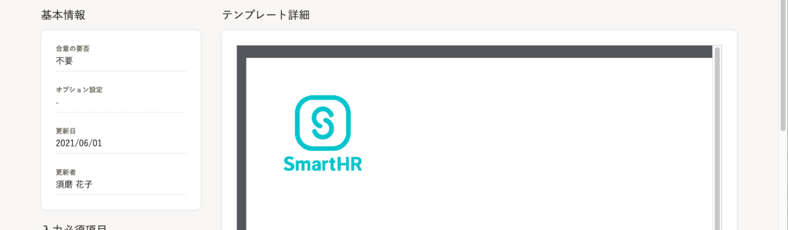
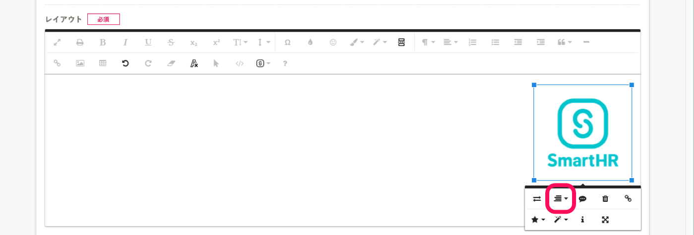
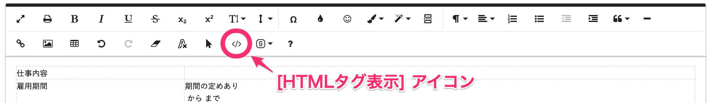
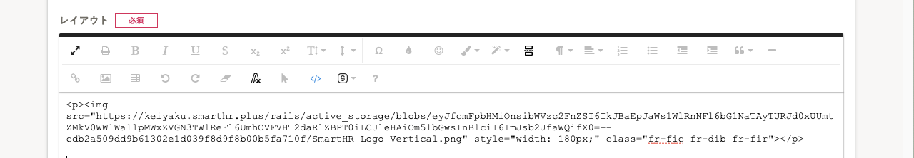
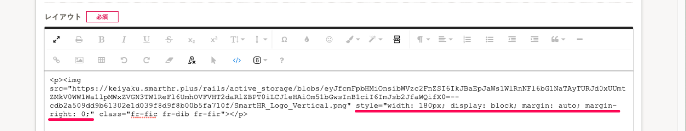
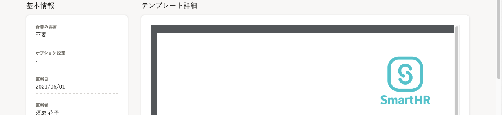
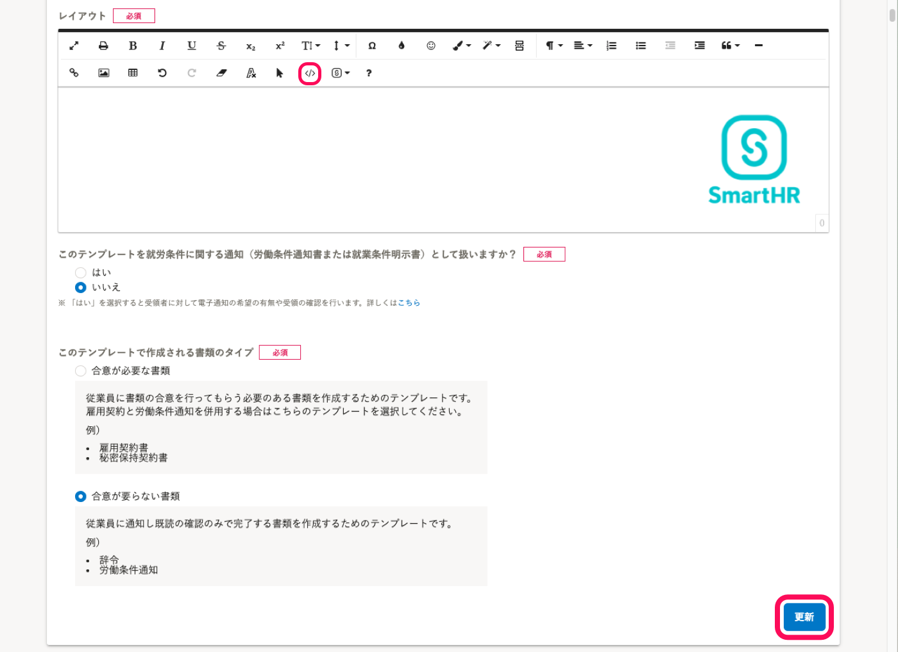

# HTMLタグ表示モードで編集する

## 書類テンプレートに挿入した画像は、左揃えで配置されます

この配置を変えるには、HTML表示モードで編集する必要があります。

レイアウト画面で挿入した画像をクリックした時に表示されるツールバーの配置ボタンをクリックすると、レイアウト画面上での配置が変わりますが、プレビューで確認をすると配置の変更は適用されていません。

## 1\. ツールバーの ［</>］ アイコンをクリックして、HTMLタグ表示に切り替える

書類テンプレートをHTMLで編集するために、レイアウト画面を［HTMLタグ表示］に切り替えます。

ツールバーにある **［HTMLタグ表示］** アイコンをクリックしてください。

クリックすると、レイアウト画面がHTMLタグ表示に切り替わります。

## 2\. imgタグのスタイル部分（style="        "）に記述を書き加える

HTMLタグ表示モードに切り替え、タグのstyleに配置に関する記述を加えます。

画像のサイズ変更をしている場合は、widthのスタイルが追記されているので、上書きしないように注意してください。

### **右揃えにしたい場合：style="display: block; margin: auto; margin-right: 0;"**

タグのstyleに、"display: block; margin: auto; margin-right: 0;" を追記してください。

style="width: 50px;" （数字は設定によって変わります）という記述は画像サイズを指定するものなので、削除しないでください。

widthの記述があった場合には、

style="width: 50px; display: block; margin: auto; margin-right:0;"

のように、並べて記述しておいてください。 

### **中央揃えにしたい場合：style="display: block; margin: auto;"**

タグのstyleに、"display: block; margin: auto; margin-right: 0;" を追記してください。

style="width: 50px;" （数字は設定によって変わります）という記述は画像サイズを指定するものなので、削除しないでください。

widthの記述があった場合には、

style="width: 50px; display: block; margin: auto;"

のように、並べて記述しておいてください。 

## 3\. テキスト表示に切り替え、［更新］をクリック

ツールバーにある **［HTMLタグ表示］** アイコンをクリックしてテキスト表示に切り替えた後、書類テンプレート作成・編集画面の下部にある **［更新］**  をクリックすると、変更が適用されます。

