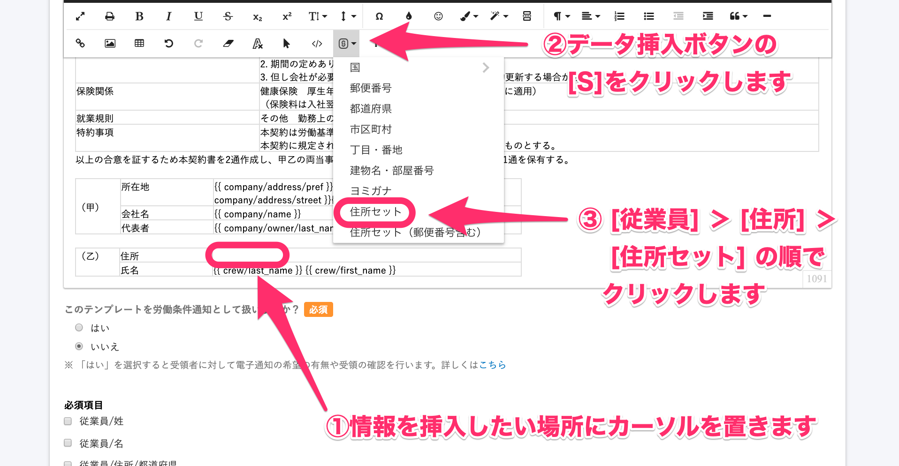
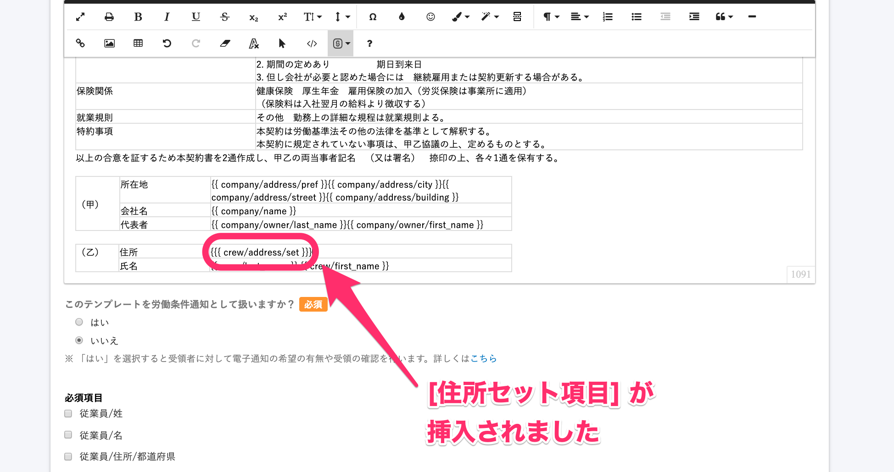
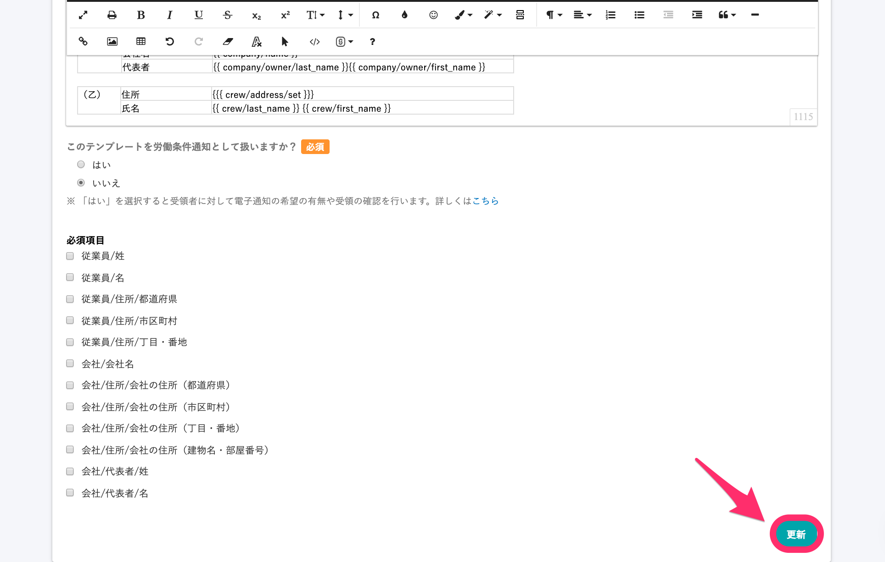
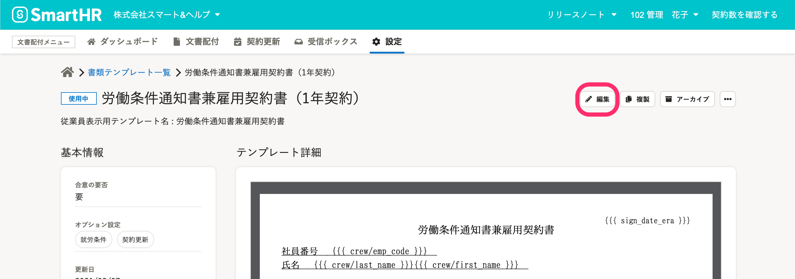
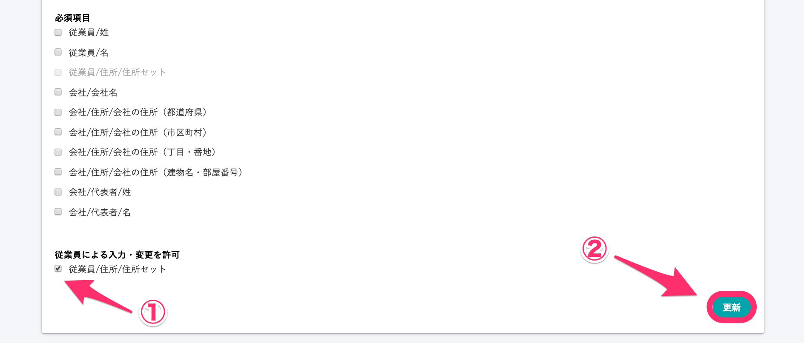

SmartHR に招待前で従業員情報の住所の項目が済んでいない従業員に対し、書類に記載する従業員の住所を本人に入力してもらう方法を紹介します。

:::alert
書類の確認・合意と住所入力を同時に依頼できる従業員は、以下の通りです。
- SmartHR への招待が済んでいない
- 従業員招待と同時に文書配付機能から依頼を送信する
:::

# 従業員が住所入力できる書類テンプレートを作成

従業員が入力・変更できる項目は、**テンプレート変数**の **\[住所セット\]** のみです。

この項目を **テンプレート変数** として、書類に挿入したうえで、**従業員による入力・変更を許可** すると、書類の確認・合意時に住所入力をしてもらうことができます。

:::related
[テンプレート変数を使って書類テンプレートを作成する](https://knowledge.smarthr.jp/hc/ja/articles/360036818773)
:::

## 1.書類テンプレートを新規作成する

書類テンプレートの作成手順は、[書類テンプレートを作成する](https://knowledge.smarthr.jp/hc/ja/articles/360026263953) をご覧ください。

## 2.テンプレート変数 \[住所セット\] 項目を挿入し、\[更新\] をクリック

**\[書類テンプレートの編集\]** 画面で、従業員の住所を表示・差し込みさせたい箇所にカーソルを置き、データ挿入ボタン **\[S\]** をクリックして、**\[従業員\] ＞ \[住所\] ＞ \[住所セット\]** の順でクリックします。

**\[住所セット\]** をクリックすると、カーソルを置いていた場所に **\[住所セット項目\]** が挿入されます。

編集画面下部にある **\[更新\]** をクリックして、書類テンプレートの変更内容を保存します。

変更内容を保存すると、書類テンプレートのブレビューが表示されている画面に戻るので、 **\[編集\]** をクリックし、再度、編集画面を表示します。

## 3\. \[従業員による入力・変更を許可\] の項目にチェックを入れ、\[更新\] をクリック

**\[書類テンプレートの編集\]** 画面下部にある **\[従業員による入力・変更を許可\]** \> **\[従業員/住所/住所セット\]**の項目にチェックを入れ、**\[更新\]** をクリックすると、署名時に住所入力を依頼する設定が完了します。

# SmartHR への招待と文書配付機能の依頼を同時に送る

 SmartHR への招待と書類の確認・合意依頼送信を同時にする手順は、下記のヘルプページを参照してください。

[メールアドレスアカウントに入社の手続きと雇用契約書への合意を同時に依頼する](https://knowledge.smarthr.jp/hc/ja/articles/360026262173)

[社員番号アカウントに招待と雇用契約書への合意を同時に依頼する](https://knowledge.smarthr.jp/hc/ja/articles/4404302233369)

:::alert
- 署名時に住所入力も依頼する機能は、**\[住所セット\]** 項目を挿入した場合のみ有効です。
- 書類のセットに**従業員による入力・変更を許可**したテンプレートを複数含めることが可能です。その際、1枚目の書類に入力した住所が2枚目以降にも反映されます。（なお、2枚目以降の書類で**従業員による入力・変更を許可**を設定していない場合は1枚目で入力した住所は引き継がれませんのでご注意ください）
:::
