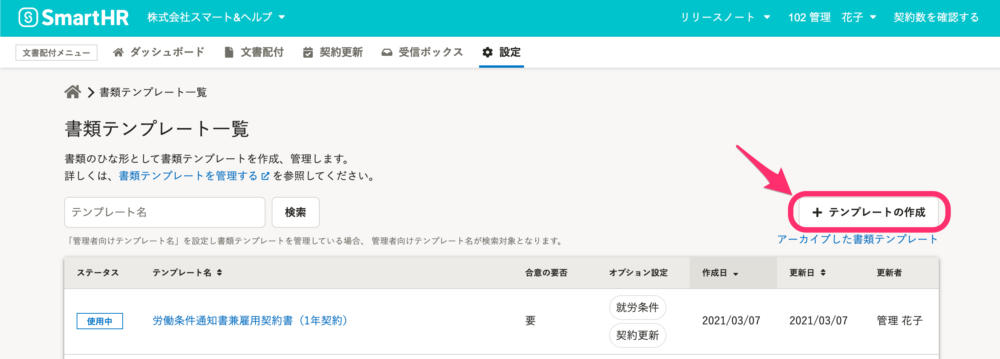
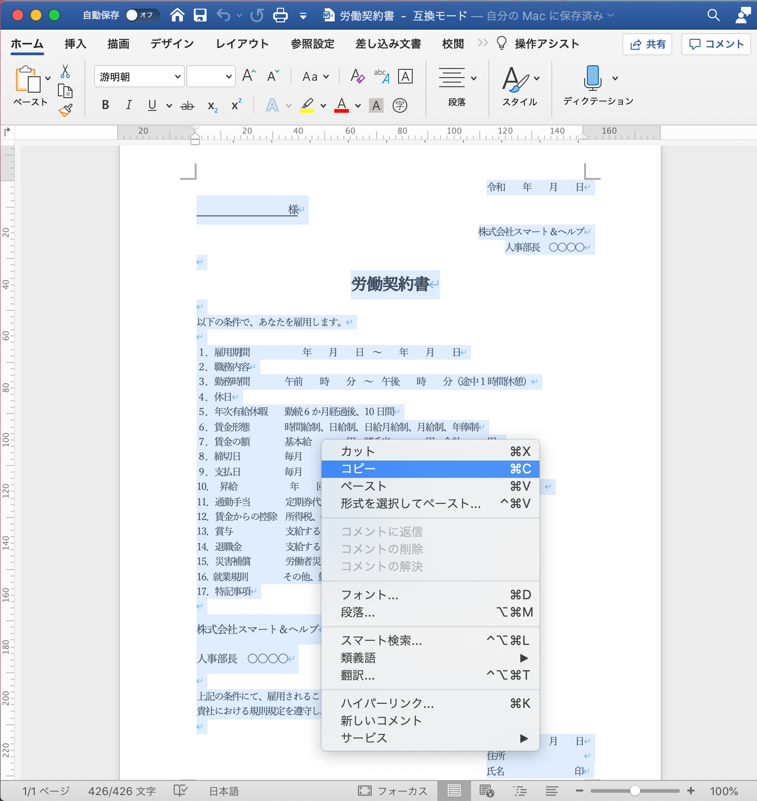
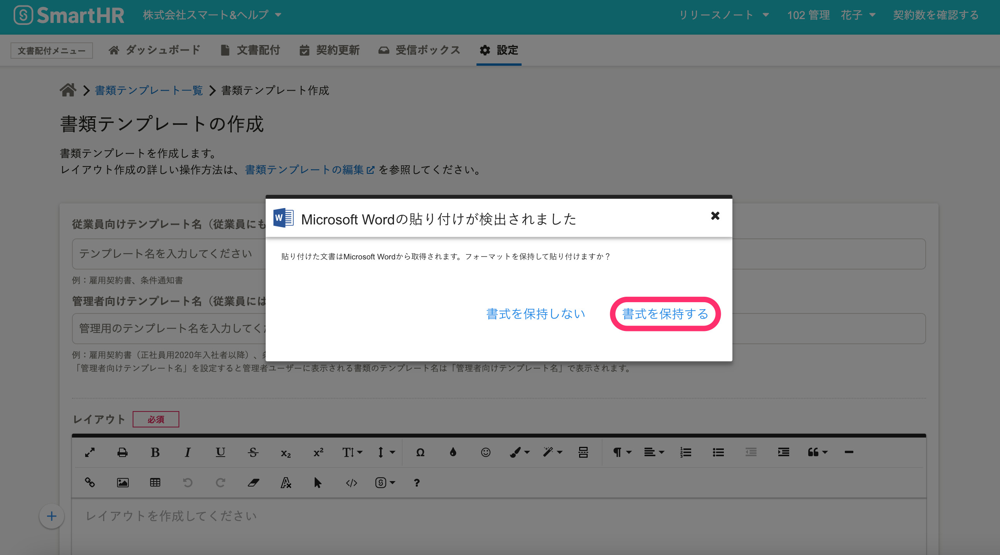
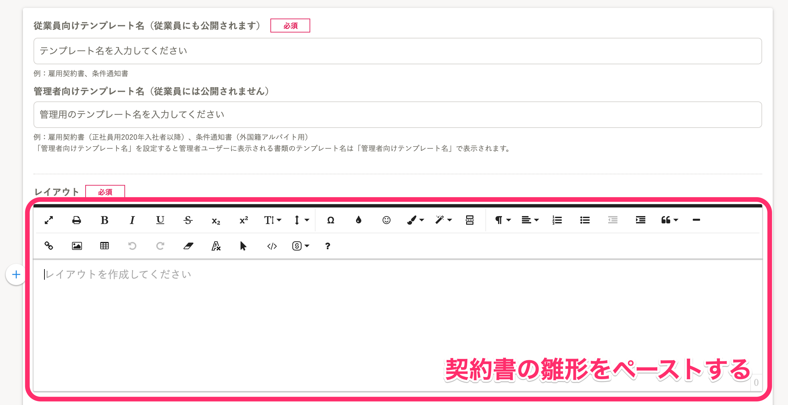
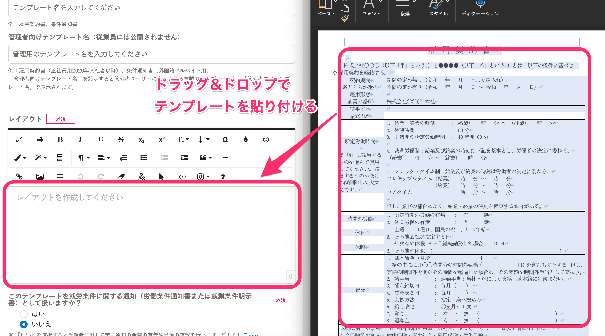
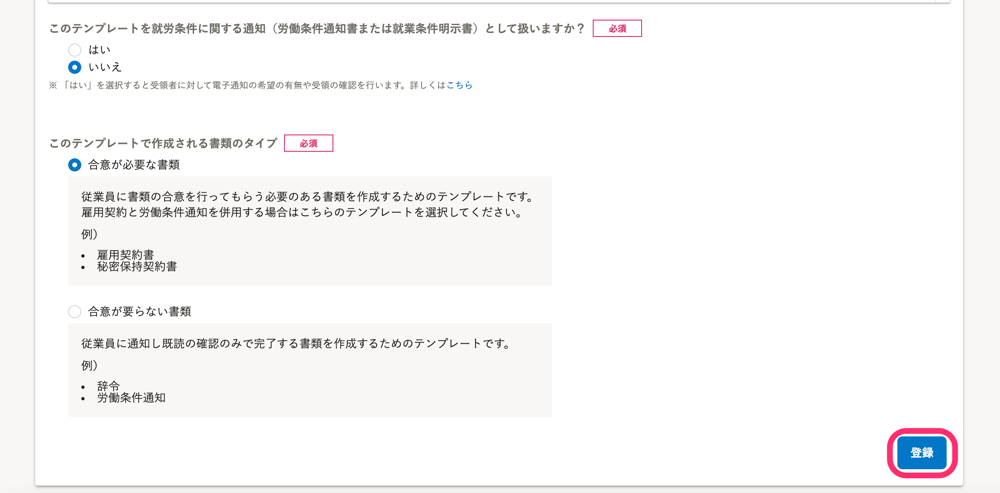

Microsoft Wordで作成した書類を使って、 **［書類テンプレート］** を作成できます。

:::alert
元となるファイルのレイアウトを完全に再現するものではなく、書式の情報を保持できる機能となります。
:::

# 書類テンプレート編集画面にWordのデータを貼り付ける

## 1\. ［設定］>［書類テンプレート］をクリック

文書配付メニューの **［**  **設定］** から **［**  **書類テンプレート］** をクリックして、**書類テンプレート一覧画面** を表示します。

## 2\. ［テンプレートの作成］をクリック

 **［+ テンプレートの作成］** をクリックして、**書類テンプレート作成画面** を表示します。

## 3\. Wordファイルの内容をコピーする

書類テンプレートに使用したい書類のファイルをMicrosoft Wordで開き、内容を全て選択してコピーします。

## 4\. ［レイアウト］エリアにペーストする

**書類テンプレート作成画面** の中央にある、 **［**  **レイアウト］** エリアにペーストすると、「**Microsoft Wordの貼り付けが検出されました**」というポップアップ画面が表示されます。

 **［書式を保持する］** をクリックすると、Microsoft Wordの書式を保ったままデータが貼り付けられます。

:::alert
Microsoft Word上で文章を全選択し **［**  **レイアウト］** 欄にドラッグ&ドロップする方法でも、契約書の雛形をエディタに移せます。

:::

# 書類テンプレートの設定を確認し、登録する

## ［登録］をクリックしてテンプレートを保存する

**テンプレート名**、**就労条件通知に関する設定**と、**書類のタイプ**の設定を確認し、画面下部にある **［**  **登録］** をクリックすると、書類テンプレートが保存されます。

Wordの差し込み機能を使っていた箇所は **書類にテンプレート変数** を挿入しなおすなど、必要に応じて編集して下さい。

:::related
[書類テンプレートを作成する](https://knowledge.smarthr.jp/hc/ja/articles/360026263953)
[書類テンプレートをHTMLで編集する](https://knowledge.smarthr.jp/hc/ja/articles/360037608913)
:::
