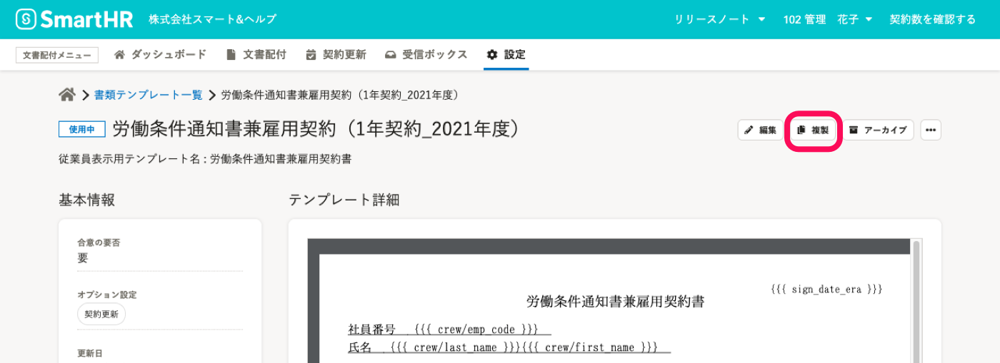
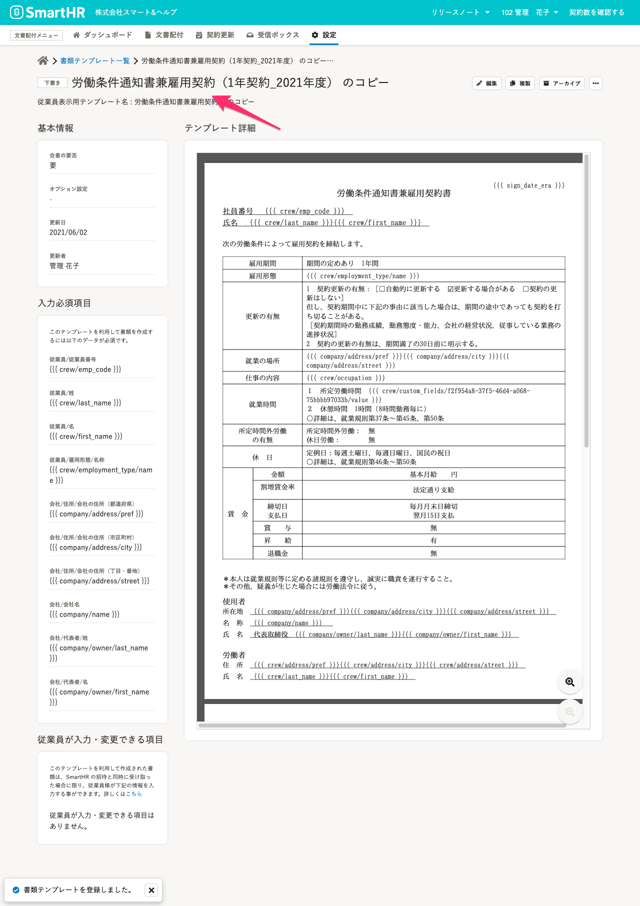
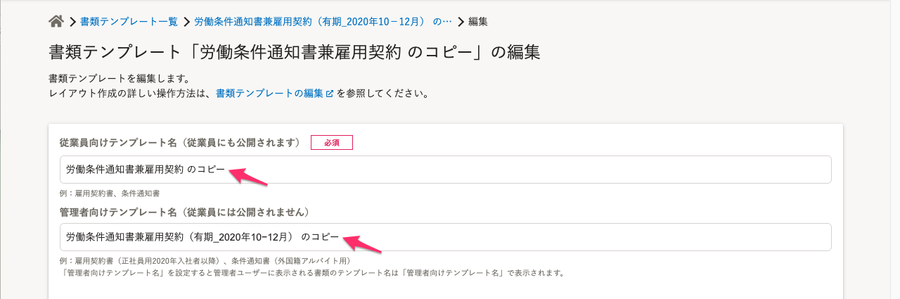

既存の書類テンプレートをコピーするには、複製機能を使用してください。

作成済みの書類テンプレートのレイアウトを活用して書類テンプレートを作成したいときや、使用中ステータスの書類テンプレートの書類タイプを変更したいときに、複製を利用してください。

:::related
[使用中の書類テンプレートの書類タイプは変更できますか？](https://knowledge.smarthr.jp/hc/ja/articles/360056793673)
:::

# 1\. 書類テンプレート詳細画面で［  複製］をクリック

書類テンプレート詳細画面右上の［  複製］をクリックします。

# 2\. \[OK\] をクリック

確認ダイアログが表示されるので、 **［OK］** をクリックします。

# 3\. 複製されたテンプレートの名前を変更

複製されたテンプレートのテンプレート詳細画面が表示されます。

テンプレート名は、「**"複製元のテンプレート名" + のコピー**」として作成されます。

 **［  編集］** をクリックし、編集画面でテンプレート名を変更してください。

従業員向けテンプレート名に加え、管理者向けテンプレート名を設定していた場合は、両方のテンプレート名に「のコピー」が追加されているので、合わせて編集してください。

