従業員情報としてSmartHRで保持している従業員項目以外の従業員ごとのデータを、CSVファイルを使って一括挿入するためのテンプレート変数を、 **「CSV挿入用テンプレート変数」** と言います。

CSV挿入用テンプレート変数の使い方は、大きく分けて2つのステップになります。

- 書類に挿入したい項目を、テンプレート変数として文書配付機能に登録する
- 依頼グループに対して、CSVファイルを一括挿入する

# CSV挿入用テンプレート変数を登録する

## 1\. ［CSV挿入用テンプレート変数］ 画面から、CSV挿入用テンプレート変数を登録

文書配付メニューから **［設定］** をクリックし、プルダウンリストにある **［CSV挿入用テンプレート変数］** をクリックすると、 **［CSV挿入用テンプレート変数］** 画面へ移動します。

 **［＋テンプレート変数を登録］** をクリックして、CSV挿入用テンプレート変数を登録します。

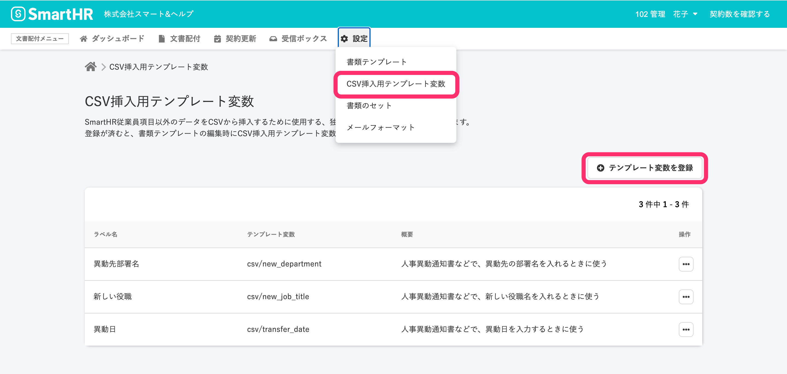

:::related
[CSV挿入用テンプレート変数を管理する](https://knowledge.smarthr.jp/hc/ja/articles/360054590074)
:::

## 2\. 書類テンプレートにCSV挿入用テンプレート変数を挿入する

書類テンプレート編集時にCSV挿入用テンプレート変数を挿入するには、従来のテンプレート変数と同様に、ツールバーの **［**  **SmartHRのデータを挿入する］** アイコンから利用します。

挿入箇所にカーソルを移動し、ツールバーの **［SmartHRのデータを挿入する］** アイコンをクリックすると、テンプレート変数の項目が表示されます。

従業員、会社、依頼日、署名日、の順にカーソルを下まで動かすと **［CSV挿入用テンプレート変数 > ］**  があります。

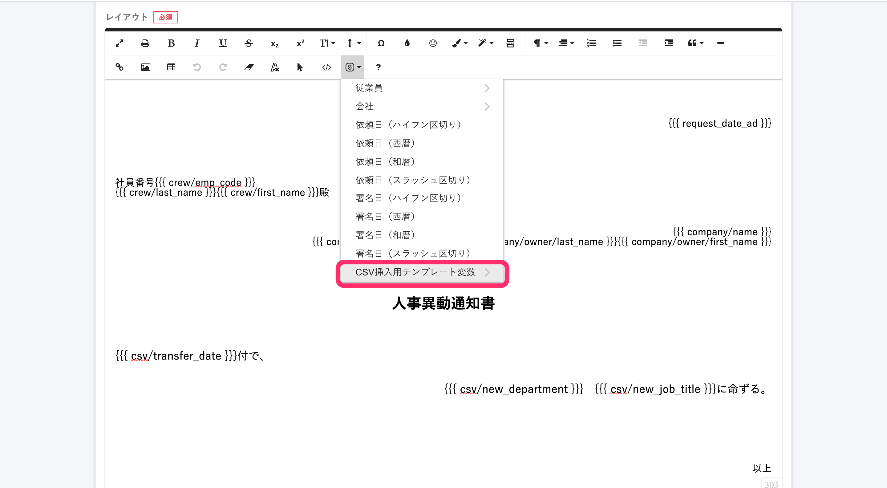

 **［CSV挿入用テンプレート変数 > ］** をクリックすると、登録済みのCSV挿入用テンプレート変数のラベル名が表示されます。

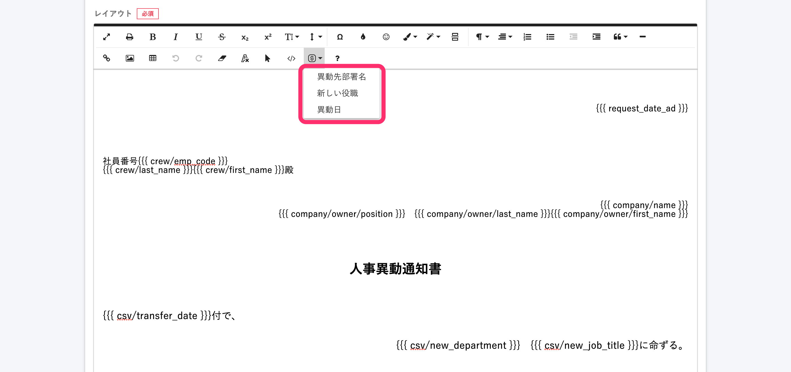

:::related
[テンプレート変数を使って書類テンプレートを作成する](https://knowledge.smarthr.jp/hc/ja/articles/360036818773)
:::

# 依頼グループに対してCSVファイルを挿入する

CSV挿入用テンプレート変数の一括挿入は、依頼グループごとに行ないます。

## 1\. 依頼グループに従業員を追加する

 **［依頼グループ詳細］** 画面で、 **［下書き］** タブにある **［依頼対象従業員を追加］** をクリックし、依頼する従業員を登録します。

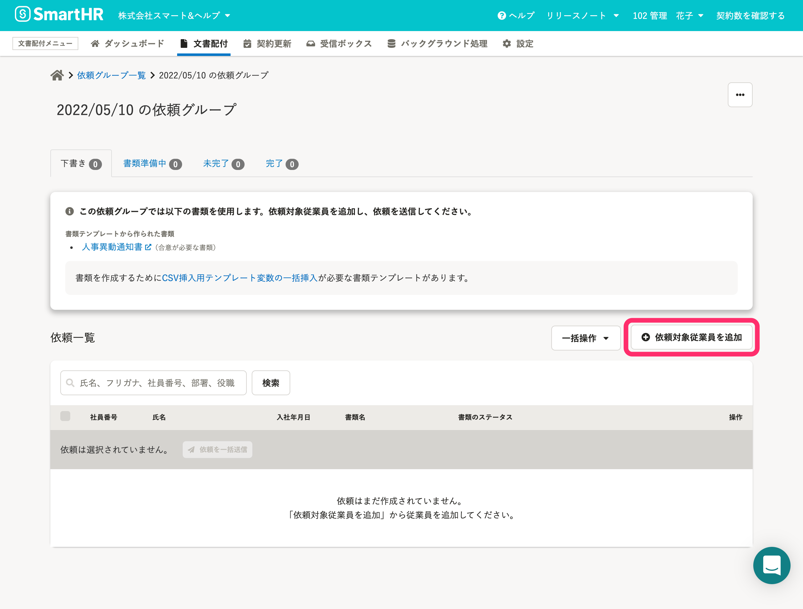

## 2\. ［CSV挿入用テンプレート変数の一括挿入］をクリック

依頼グループに従業員を追加すると、依頼に使用する書類にCSV挿入用テンプレート変数が使われている場合、依頼グループ詳細の従業員リストの上部に **［書類を作成するためにCSV挿入用テンプレート変数の一括挿入が必要な書類テンプレートがあります。］** と表示されます。

テキストリンクをクリックすると、 **［CSV挿入用テンプレート変数の一括挿入］** 画面に移動します。

なお、従業員ごとにCSV挿入用テンプレート変数で挿入するデータが挿入済みかどうかは、 **［書類のステータス］** で確認できます。書類ステータスで **［CSV挿入用テンプレート変数にデータが挿入されていません。］** というメッセージが表示されていると、従業員に対して依頼を送信できません。

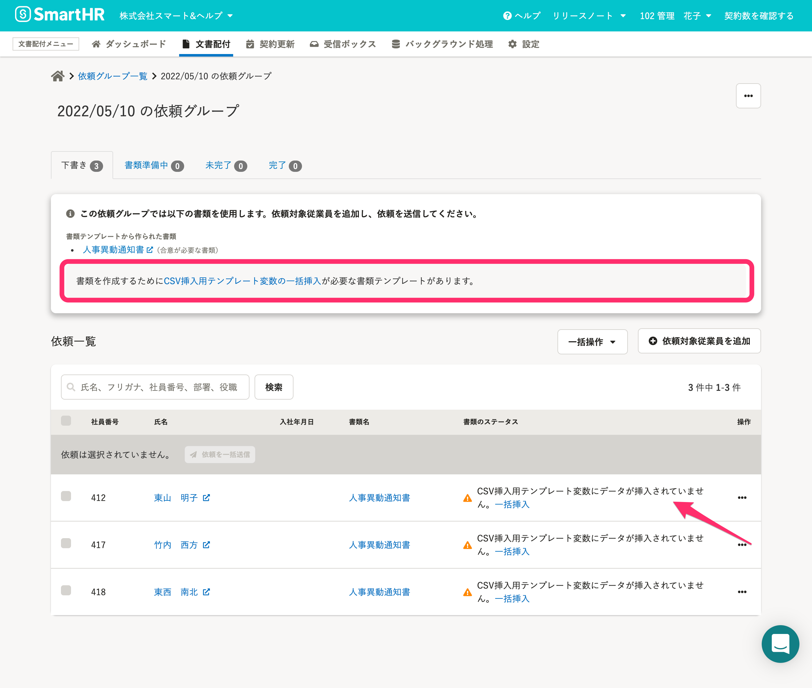

 **［依頼グループ詳細］** 画面の操作メニュー **［…］** からもCSV挿入用テンプレート変数への一括挿入の操作ができます。

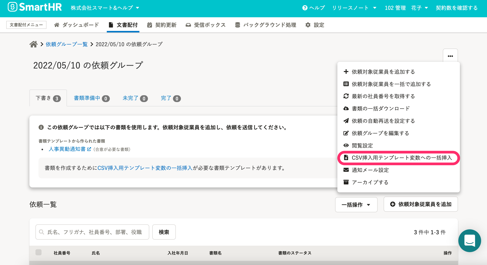

## 3\. ［CSV挿入用テンプレート変数の一括挿入］画面で、一括挿入用のCSVファイルを作成する

一括挿入用のCSVファイルを文書配付機能内で作成します。

 **［1. 一括挿入用のCSVファイルの作成］** の **［CSVファイルの作成］** をクリックすると、CSVファイルの作成がはじまり、 **［実行履歴］** に **［CSVファイルの作成］** が追加されます。

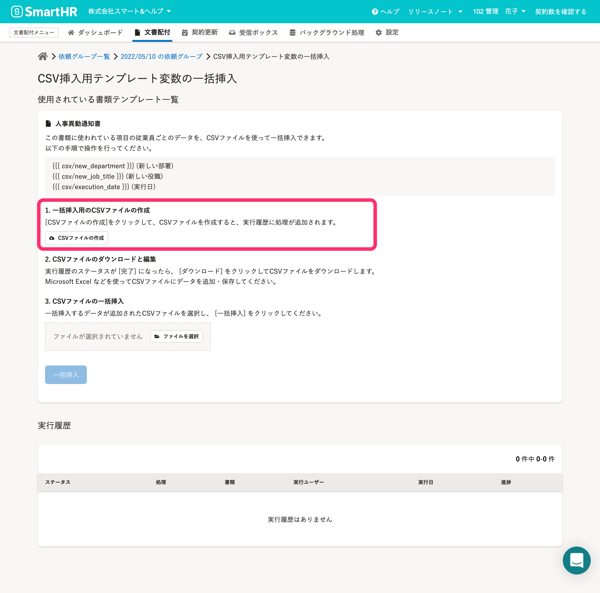

CSVファイルの作成中は、 **［実行履歴］** のステータスが **［実行中］** と表示されます。

しばらく時間をおいて、画面を再読み込み（ブラウザの更新ボタンをクリック）すると、ステータスが **［完了］** になります。

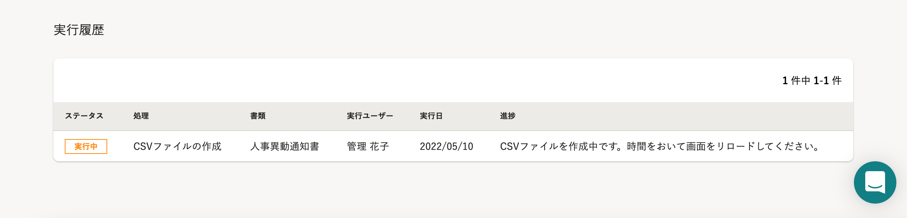

 **［実行履歴］** のステータスが **［完了］** になったら、 **［CSVファイルの作成が完了しました。テンプレートファイルをダウンロードできます。］** のテキストリンクから、CSVファイルをダウンロードします。

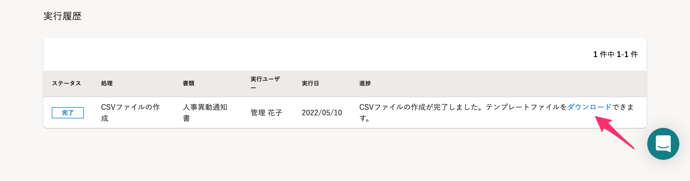

## 4\. ダウンロードしたCSVファイルを編集する

ダウンロードしたCSVファイルを、Microsoft Excel などを使って編集します。

CSVファイルのカラムのタイトルに、書類に使われているCSV挿入用テンプレート変数が入力されているので、従業員ごとのデータを追加し、保存してください。

CSV挿入用テンプレート変数と項目名の対応は、 **［CSV挿入用テンプレート変数の一括挿入］** 画面で、書類ごとに記載されています。

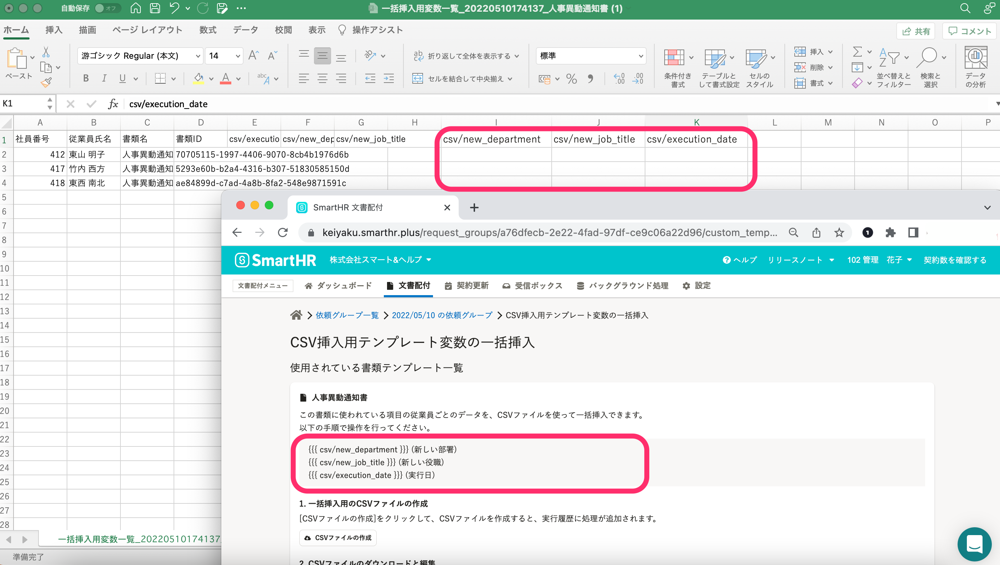

:::related
[CSV挿入用テンプレート変数の一括挿入で、一部の従業員に入力すべきデータがない時は？](https://knowledge.smarthr.jp/hc/ja/articles/360056530393)
:::

## 5\. CSVファイルの一括挿入

一括挿入するデータを入力、編集したCSVファイルを選択し、 **［一括挿入］** をクリックすると、一括挿入ががはじまり、 **［実行履歴］** に **［一括挿入］** が追加されます。

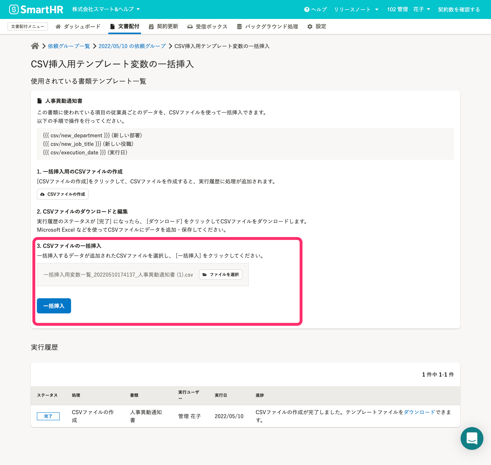

 **［実行履歴］** のステータスが **［完了］** になり、 **［一括挿入が完了しました。使用したCSVファイルはダウンロードできます。］** と表示されれば、CSV挿入用テンプレート変数の一括挿入は完了です。

# 依頼グループから、依頼を送る

## ［依頼グループ詳細］画面で、従業員を選択して［依頼を一括送信］をクリック

 **［依頼グループ詳細］** 画面に戻り、依頼を送る従業員を選択します。

従業員リストの **［書類名］** 欄の**書類名**をクリックすると、テンプレート変数で挿入した従業員ごとの項目が反映された書面を確認できます。

チェックボックスにチェックを入れ **［依頼を一括送信］** をクリックすると、従業員ごとの書類が作成され、従業員に送信されます。

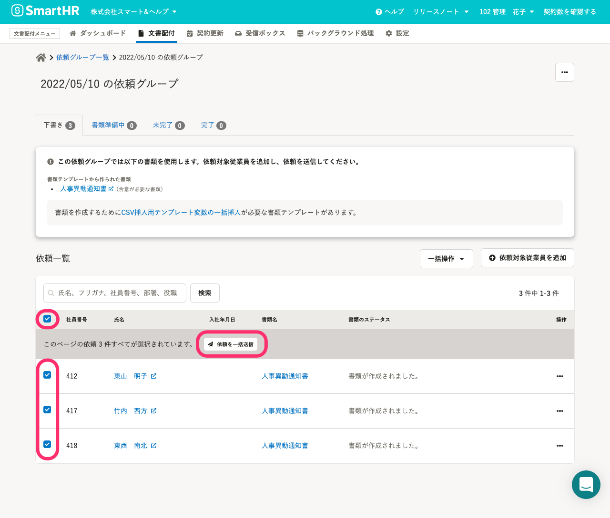

:::related
[依頼グループの作成（従業員に依頼を送信する手順）](https://knowledge.smarthr.jp/hc/ja/articles/360026105334)
:::
