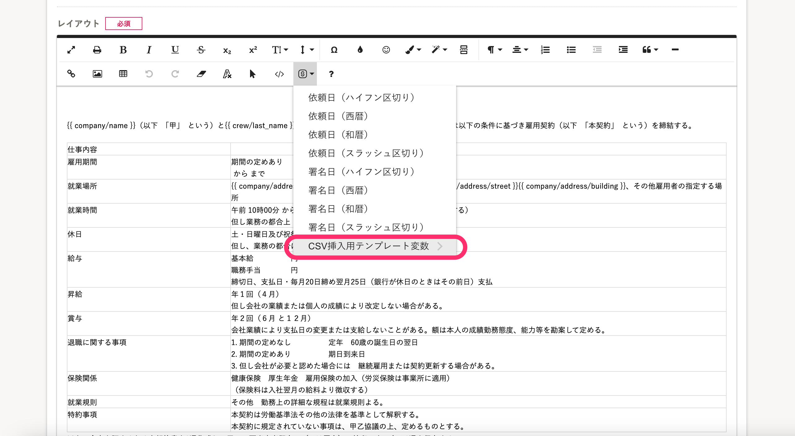
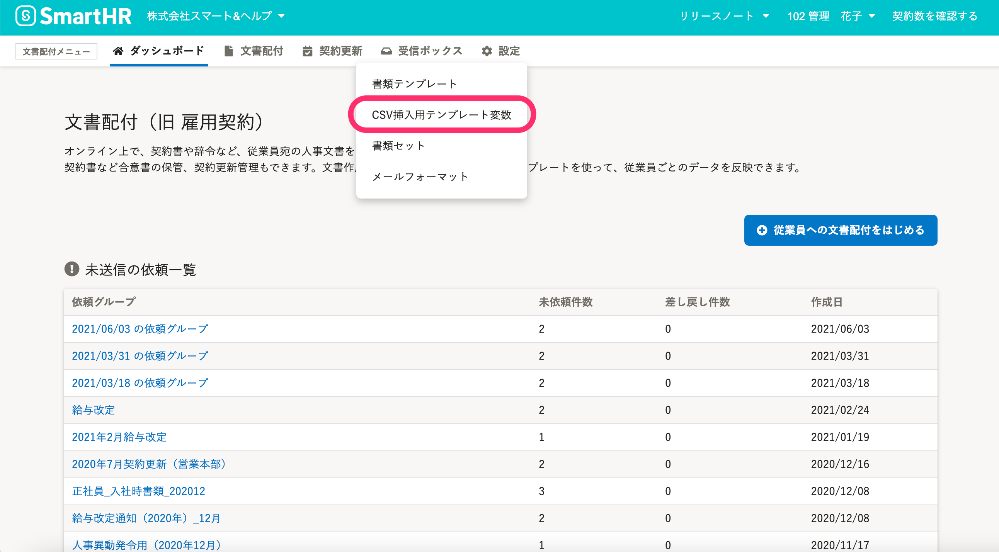
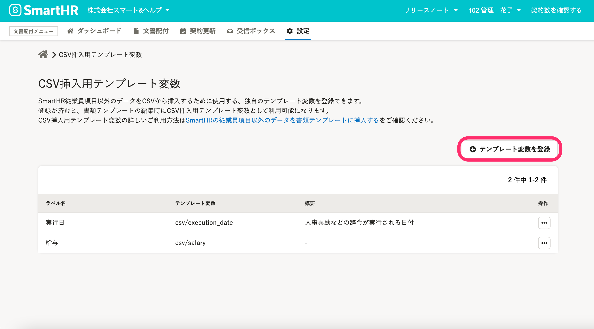
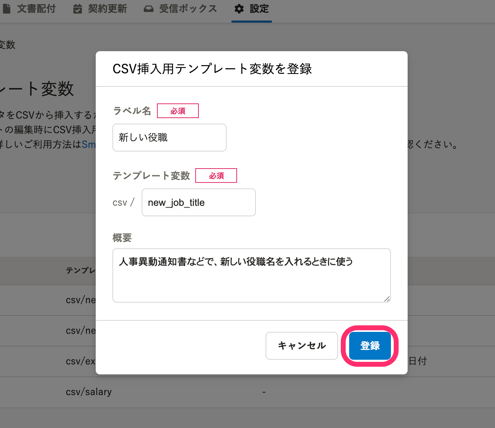
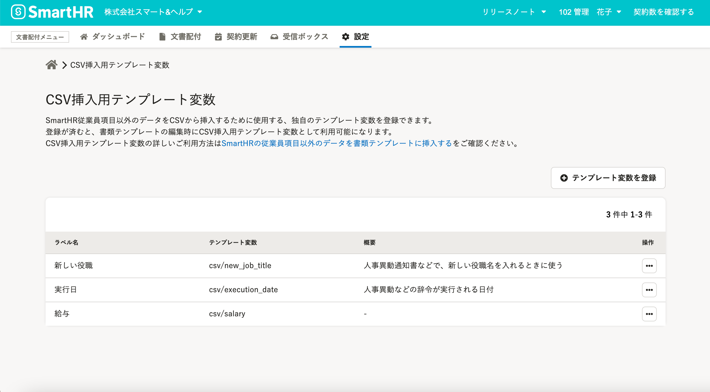
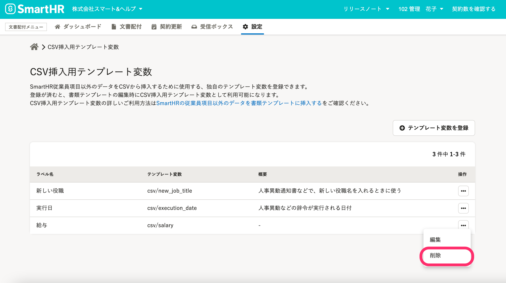
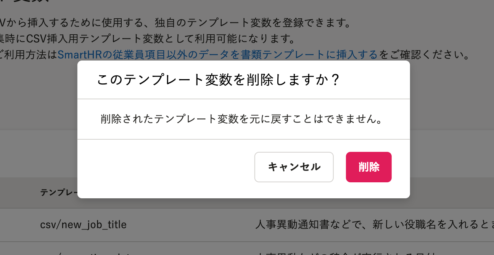

# CSV挿入用テンプレート変数とは

「CSV挿入用テンプレート変数」とは、SmartHRの従業員項目以外のデータを、書類テンプレートに挿入するために使用するテンプレート変数です。

使用するには、書類テンプレート作成前にあらかじめ文書配付機能内に登録する必要があります。

登録済みのCSV挿入用テンプレート変数は、従来のテンプレート変数と同様に、書類テンプレートエディターのツールバーにある、 **［SmartHRのデータを挿入する］** アイコンから挿入できます。

:::related
[SmartHRの従業員項目以外のデータを書類テンプレートに挿入する](https://knowledge.smarthr.jp/hc/ja/articles/360054592174)
[テンプレート変数を使って書類テンプレートを作成する](https://knowledge.smarthr.jp/hc/ja/articles/360036818773)
:::

# ［CSV挿入用テンプレート変数］の設定

## ［設定］>［CSV挿入用テンプレート変数］をクリック

文書配付メニューから **［設定］** をクリックし、プルダウンリストにある **［CSV挿入用テンプレート変数］** をクリックすると、 **［CSV挿入用テンプレート変数］** 画面へ移動します。

# ［CSV挿入用テンプレート変数］を登録する

## 1\. ［+テンプレート変数を登録］をクリック

 **［CSV挿入用テンプレート変数］** 画面で、 **［＋テンプレート変数を登録］** をクリックすると、 **［CSV挿入用テンプレート変数の登録］** 画面が表示されます。

## 2\. ラベル名とテンプレート変数を入力し、［登録］をクリック

ラベル名とテンプレート変数を入力し、 **［登録］** をクリックします。

任意で、テンプレート変数の用途を記しておく **［概要］** も設定できます。

:::alert
テンプレート変数に利用できる文字は、**半角英数字**と **アンダースコア（ \_ ）** のみです。
:::

## 3\. 一覧に追加されたことを確認する

 **［CSV挿入用テンプレート変数］** 一覧に追加されたことを確認します。

登録したCSV挿入用テンプレート変数は、操作メニュー **［…］** から編集できます。

# ［CSV挿入用テンプレート変数］を削除する

## 1\. ［...］>［削除］をクリック

 **［CSV挿入用テンプレート変数］** 一覧画面で、削除したいテンプレート変数の操作メニュー **［...］** から **［削除］** をクリックします。

## 2\. 削除確認画面の［削除］をクリック

 **［このテンプレート変数を削除しますか？］** という確認画面が表示されるので、 **［削除］** をクリックします。

