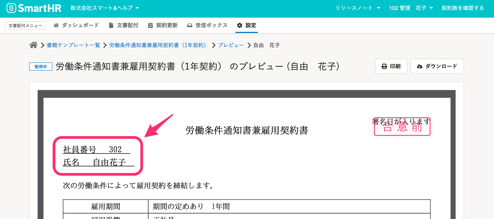

書類テンプレートのプレビュー機能を使用すると、依頼を送る前に従業員ごとに作成される配付書類の内容を確かめられます。

# 1\. ［設定］>［書類テンプレート］をクリック

画面上部の文書配付メニューから **［設定］** \> **［書類テンプレート］** をクリックして、書類テンプレート一覧を表示します。

# 2\. 確認したいテンプレートを選択

確認したいテンプレート名をクリックすると、テンプレートの詳細画面に移動します。

# 3\. ［...］メニュー >［  テンプレートのプレビュー］をクリック

テンプレート詳細画面右上の **［…］メニュー >［ テンプレートのプレビュー］** をクリックすると、従業員を選んでプレビューできる画面に移動します。

# 4\. ［この従業員でプレビュー］をクリック

結果を確認したい従業員の行にある、 **［この従業員でプレビュー］** をクリックすると、指定した従業員のデータが差し込まれた状態で書類のプレビューが表示されます。

選択した従業員によって、書類のプレビューで差し込まれるデータの内容が変わります。

:::related
[テンプレート変数を使って書類テンプレートを作成する](https://knowledge.smarthr.jp/hc/ja/articles/360036818773)
:::

# 5\. 書類のプレビューを確認する

該当従業員の情報が書類に反映されていることを確認します。

※ この書類は保存されません。
