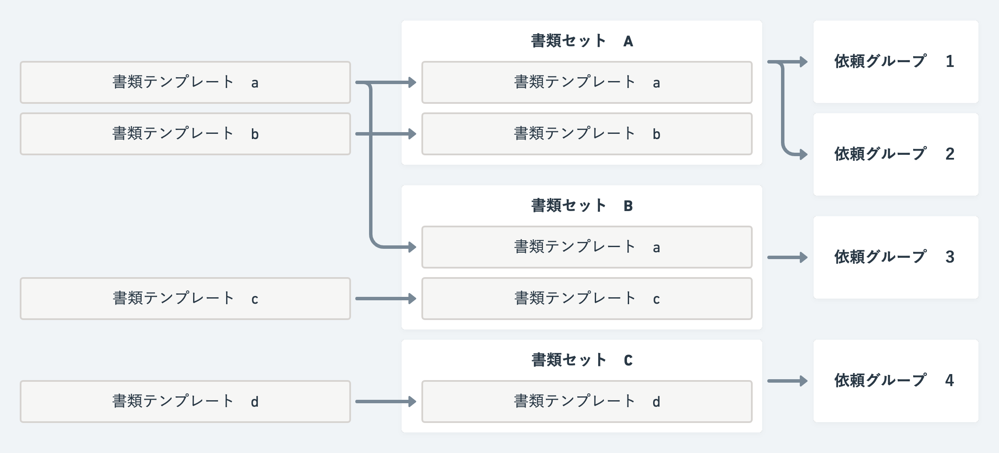
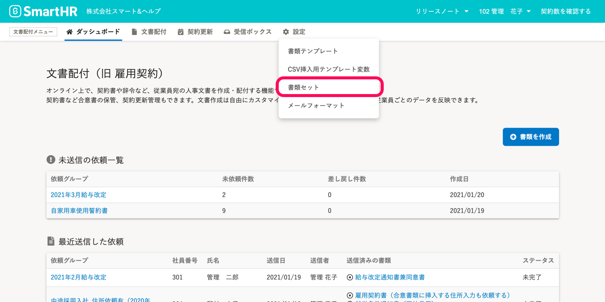
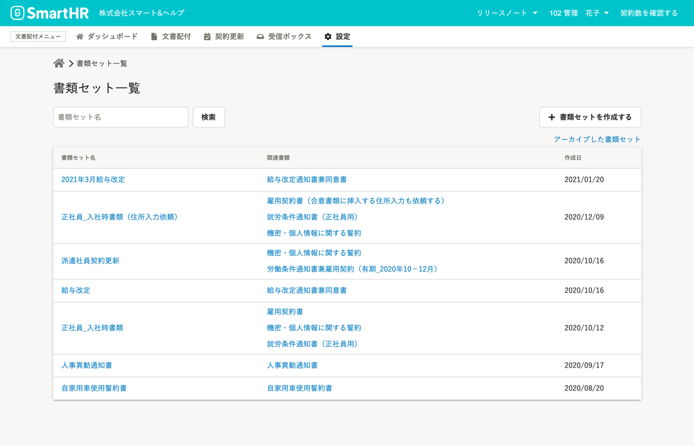
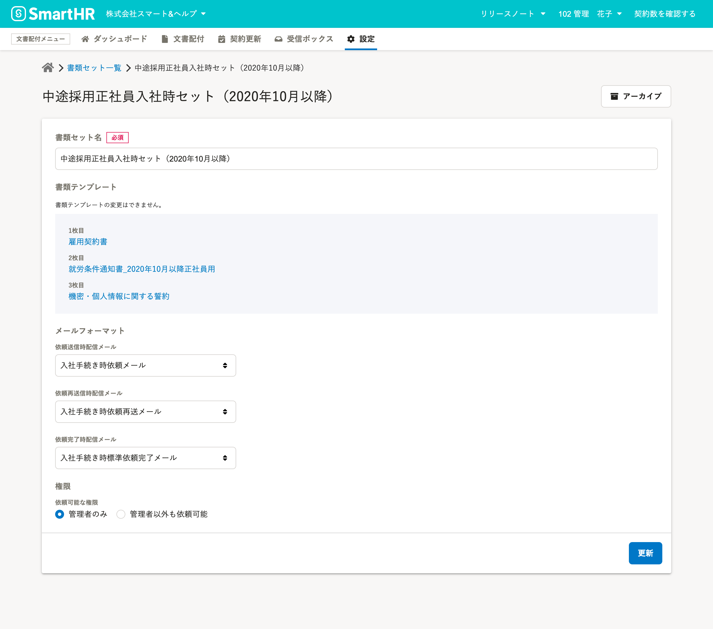

# 書類セットとは

**書類セット** とは、従業員に配付する書類を作成する際に使用する **書類テンプレート** をまとめたものです。

文書配付をするには、 **書類テンプレート** をあらかじめ **書類セット** として登録しておく必要があります。

書類セット作成後は、 **使用する書類テンプレートの入れ替えはできません**。（書類テンプレートの編集はできます。）

**書類テンプレート** は複数の **書類セット** に使用できます。

1つの **依頼グループ** につき、1つの **書類セット** を使用できます。**書類セット** は、複数の **依頼グループ** で何度でも使用できます。

# 書類セット一覧画面

文書配付メニューの **［設定］** から **［書類セット］** をクリックして、 **書類セット一覧** に移動します。

書類セット一覧画面では、 **書類セットを作成**できます。

使わなくなった書類セットは **アーカイブ** できます。

:::related
[書類セットを作成する](https://knowledge.smarthr.jp/hc/ja/articles/360026263933)
[不要な書類セットを整理する](https://knowledge.smarthr.jp/hc/ja/articles/360026104274)
[アーカイブした書類セットを元に戻す](https://knowledge.smarthr.jp/hc/ja/articles/360026262793)
:::

**書類セット名** をクリックすると、**書類セット詳細画面** に移動し、書類セットの設定を変更できます。

:::related
[通知メールを書類セットや依頼グループに紐付ける](https://knowledge.smarthr.jp/hc/ja/articles/360042985914)
:::
