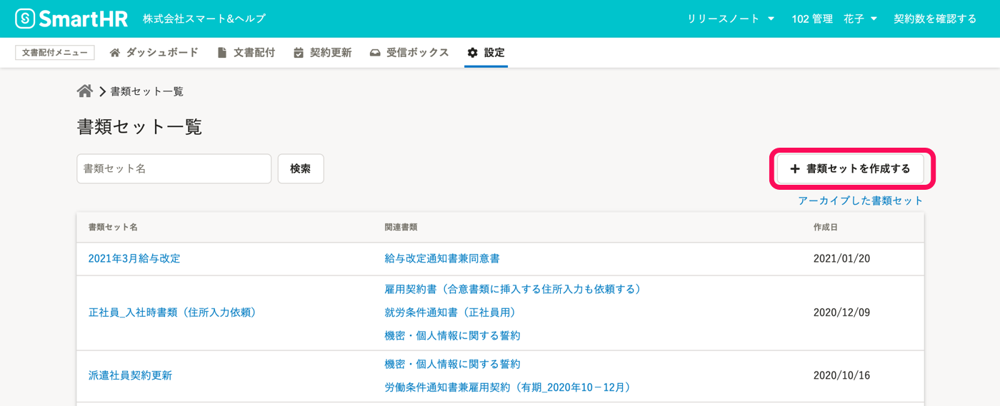
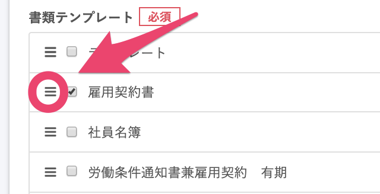
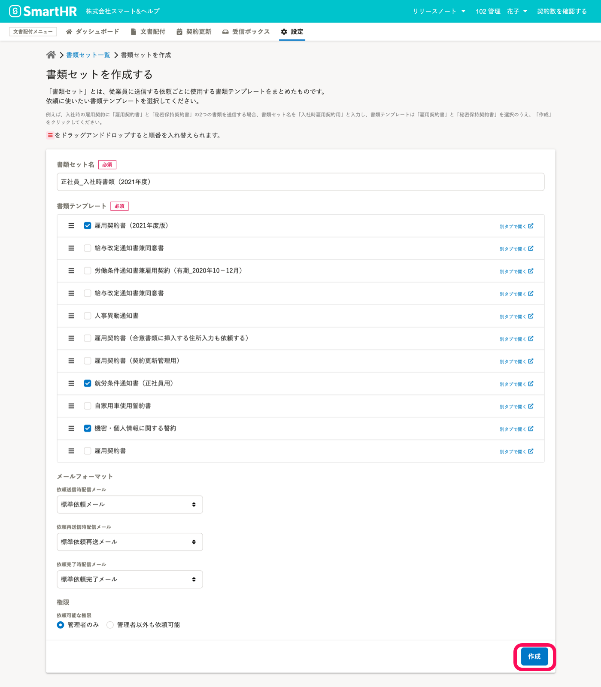

# \[書類セットを作成する\] 画面表示する

文書配付メニューの **\[設定\]** から **\[書類セット\]** をクリックして、 **書類セット一覧** に移動します。

**書類セット一覧** 画面右上の **\[書類セットを作成する\]**をクリックして、書類セットの作成画面を表示します。

# 各項目を設定し、 \[作成\] をクリック

## 1\. \[書類セット名\]を入力する

**\[書類セット名\]** を入力します。

書類セット名は、文書配付機能内での管理にのみ使用します。配付時に従業員には公開されません。

## 2\. 配付したい書類にチェックを入れる

一度の依頼でまとめて配付したい書類テンプレートにチェックを入れます。

:::tips
左端のマークをドラッグして並び替えると、従業員への配付時の並び順が変更できます。

:::

## 3\. メールフォーマットを選択する

依頼送信時・依頼再送時・合意完了時に配信するメールのフォーマットを選択してください。

配信するメールの内容は、依頼グループ作成後にも編集できます。

:::related
[通知メールを書類セットや依頼グループに紐付ける](https://knowledge.smarthr.jp/hc/ja/articles/360042985914)
:::

## 4\. 書類セット利用できる権限を設定する

**\[権限\]** で、依頼可能な権限を設定します。

:::related
[管理者権限以外のアカウントで文書配付機能を利用する](https://knowledge.smarthr.jp/hc/ja/articles/360026103954)
:::

## 5\. \[作成\] ボタンをクリックする

**\[作成\]** をクリックすると、書類セットが作成されます。

