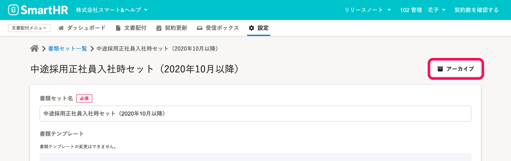

使用しなくなった書類セットを **アーカイブ** すると、依頼グループを作成する際に書類セット選択画面で非表示にできます。

# 1\. アーカイブしたい書類セットの［書類セット名］をクリック

文書配付メニューの **［設定］** から **［書類セット］** をクリックして、 **書類セット一覧** に移動します。

書類セット一覧画面で、アーカイブしたい書類セットの［ **書類セット名］** をクリックして、**書類セット詳細** に移動します。

# 2\. ［アーカイブ］をクリック

書類セット詳細画面右上にある  **［アーカイブ］**  をクリックすると、書類セットがアーカイブされます。

 **［書類セット一覧（アーカイブ済み）］** 画面に移動し、アーカイブした書類セットが一覧に追加されます。

:::related
[アーカイブした書類セットを元に戻す](https://knowledge.smarthr.jp/hc/ja/articles/360026262793)
:::
