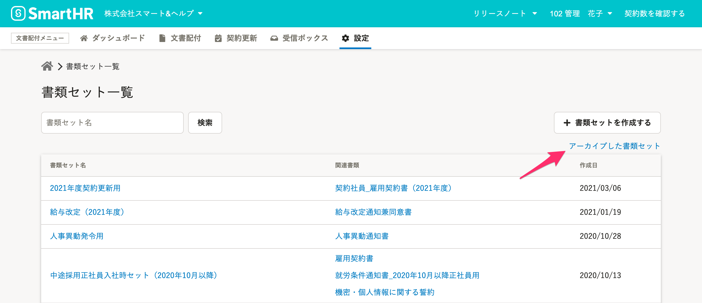
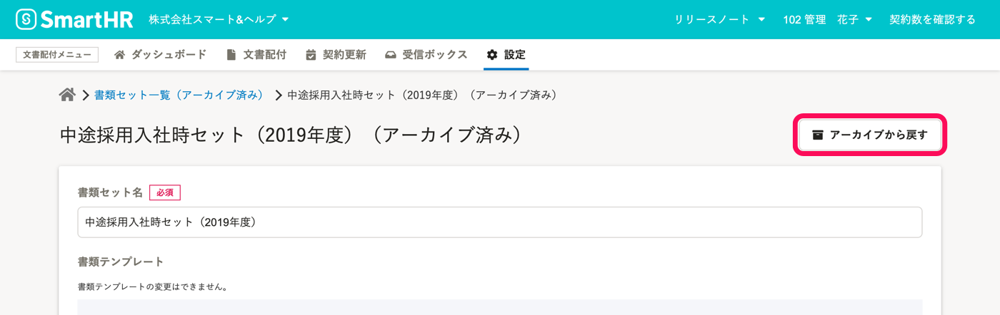

**アーカイブ済みの書類セット** を **書類セット一覧** に戻すと、再び使用できます。

# 1.［アーカイブした書類のセット］をクリック

文書配付メニューの **［設定］** から **［書類セット］** をクリックして、 **書類セット一覧** に移動します。

 **［書類のセット一覧］** 画面右上の **［アーカイブした書類セット］** をクリックして、  **書類セット一覧（アーカイブ済み）**  に移動します。

# 2\. 使用したい［書類セット名］をクリック

 **書類のセット一覧（アーカイブ済み）** 画面で、再び依頼に使用したい書類セットの **［書類セット名］** をクリックして、**書類セット詳細**に移動します。

# 3.［アーカイブから戻す］ をクリック

書類セット詳細画面右上にある **［アーカイブから戻す］** をクリックすると、書類セットが書類セット一覧に戻されます。

 **［書類セット一覧］** 画面に移動し、アーカイブされていた書類セットが一覧に追加されます。

