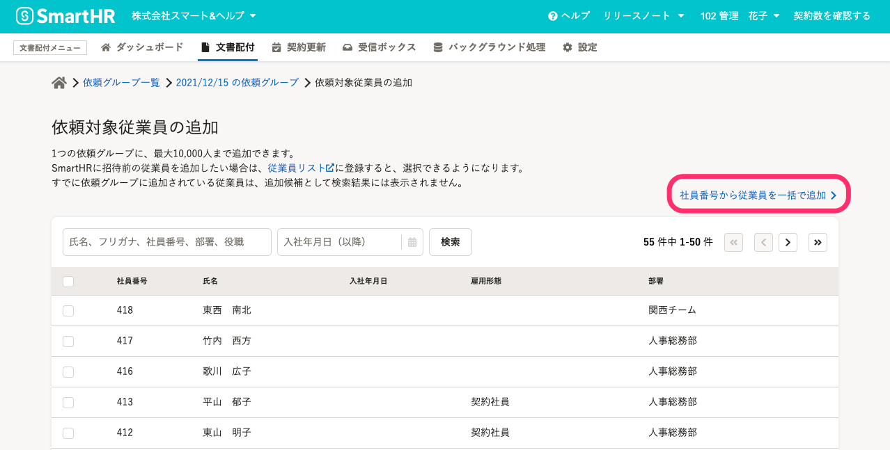
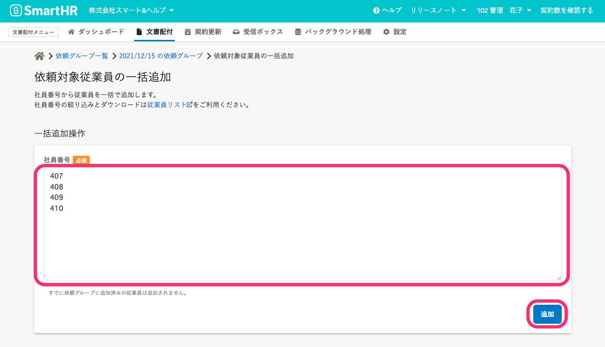
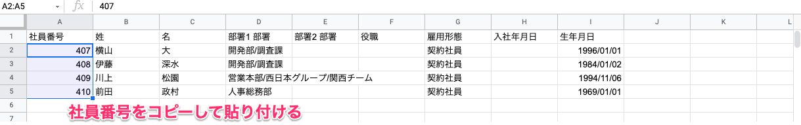
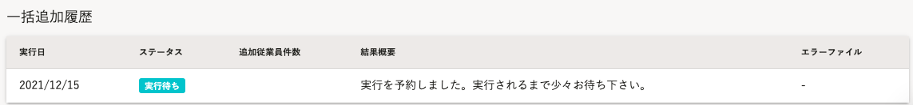
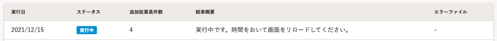
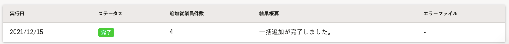
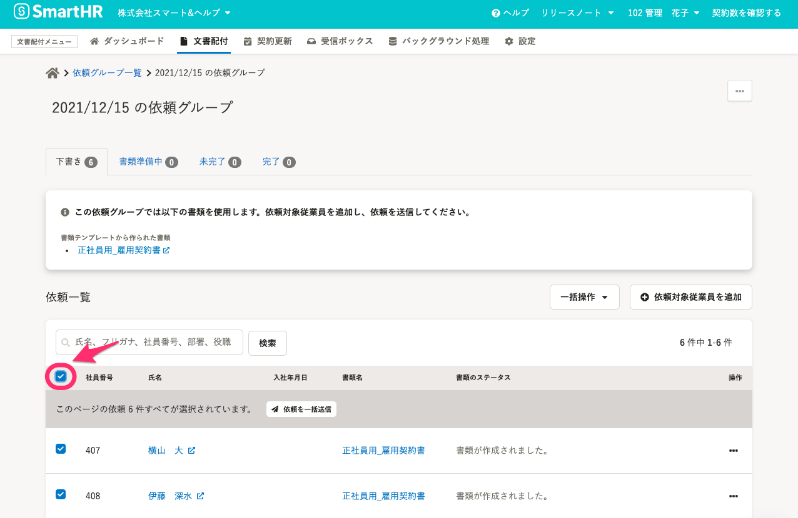
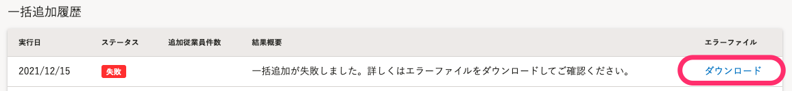
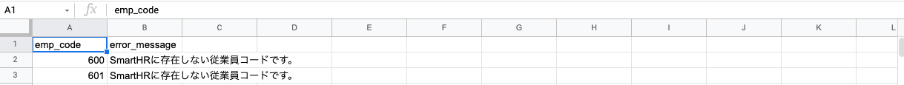
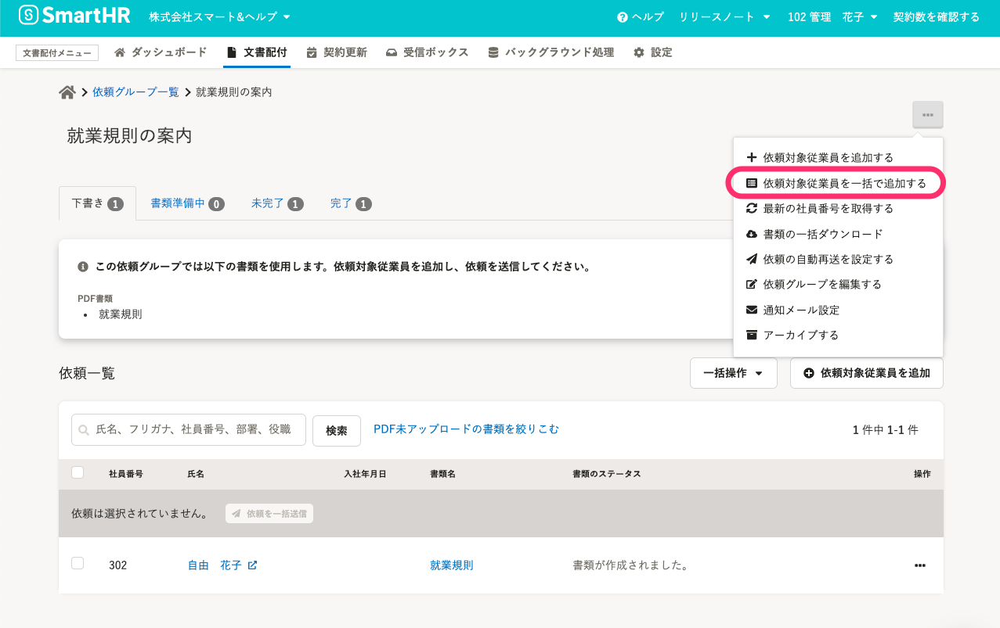

社員番号を使って、依頼グループに従業員をまとめて追加する方法を説明します。

:::alert
1つの依頼グループに追加できる従業員は、10,000人までです。
10,000人を超える場合は、複数の依頼グループを作成してください。
:::

# 依頼グループの作成時に依頼対象従業員を一括追加する

## 1\. 依頼グループを作成する

 **［ダッシュボード］** 画面の **［+ 従業員への文書配付をはじめる］** から依頼グループを作成し、依頼グループ名の設定を完了すると、 **［依頼対象従業員の追加］** 画面に移動します。

詳しい手順は、[従業員へ文書配付をする](https://knowledge.smarthr.jp/hc/ja/articles/360026105334)の「依頼グループを作成する」を参照してください。

## 2\. ［依頼対象従業員の追加］画面の［社員番号から従業員を一括で追加 ］をクリック

 **［依頼対象従業員の追加］** 画面の右上にある **［社員番号から従業員を一括で追加］** をクリックして、  **［依頼対象従業員の一括追加］** 画面に移動します。

## 3\. ［社員番号］を入力し、［追加］をクリック

 **［依頼対象従業員の一括追加］** 画面の **［社員番号］** 入力フォームに、追加したい従業員の社員番号を**1行に1つずつ**入力して、 **［追加］** をクリックします。

:::tips
社員番号リストは、SmartHR本体の従業員情報のダウンロードファイルからコピーして貼り付けると便利です。
 **［依頼対象従業員の一括追加］** 画面上部にある **［従業員リスト］** のリンクから、SmartHR の従業員リスト画面に移動して、ダウンロードができます。

[フィルタ機能を使って、条件に合致する従業員リストを表示させる](https://knowledge.smarthr.jp/hc/ja/articles/360040965373)
[従業員情報、家族情報の登録データをダウンロードする](https://knowledge.smarthr.jp/hc/ja/articles/360026106394)
:::

## 4\. ［一括追加履歴］のステータスが［完了］になったことを確認する

一括追加の実行が予約されると、 **［依頼対象従業員の一括追加］** 画面の下部にある **［一括追加履歴］** に進行ステータスが表示されます。

しばらく時間をおいて、ブラウザの更新ボタンをクリックすると、ステータスが **［完了］** になります。

ステータスが **［完了］** になると、 **［依頼グループ詳細］** 画面の **［下書き］** タブに従業員が追加されます。

以降は、[従業員に依頼を送信する](https://knowledge.smarthr.jp/hc/ja/articles/360026105334) の手順に沿って、依頼を送信します。

:::tips
 **［社員番号］** 項目の左側にあるチェックボックスをクリックすると、 **［下書き］** タブに追加されているすべての従業員を選択できます。

:::

## 一括追加に失敗した場合

 **ステータスに［失敗］** と表示された場合は、［ **エラーファイル］** 項目に表示される［ **ダウンロード］** をクリックして、エラー詳細が書かれたファイルをダウンロードしてください。

エラーファイルの内容を確認し、エラーの原因を解消して、最初からやり直してください。

なお、1つの依頼グループで、一人の従業員に対して送れる依頼は1回限りです。

# 既存の依頼グループに依頼対象従業員を一括追加する

依頼する従業員を追加したい［ **依頼グループ詳細］** 画面を表示し、画面右上のメニューから **［依頼対象従業員を一括で追加する］** をクリックすると、 **［依頼対象従業員の一括追加］** 画面に移動します。

依頼対象従業員の追加手順は「2. ［社員番号］を入力し、［追加］をクリック」以降と同様です。

