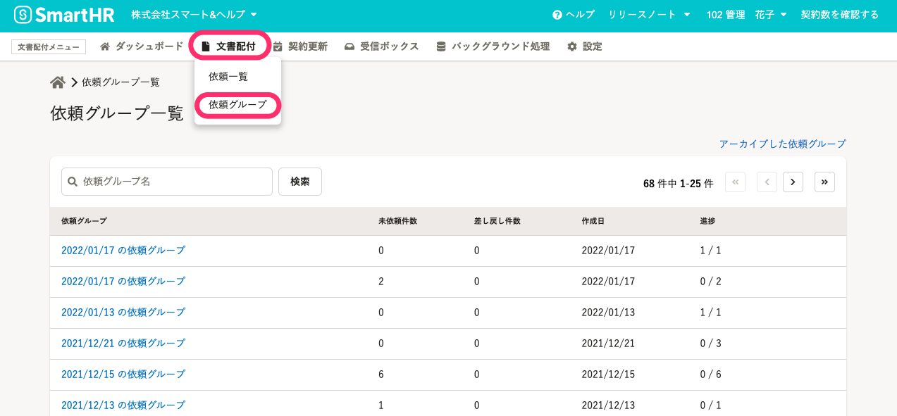
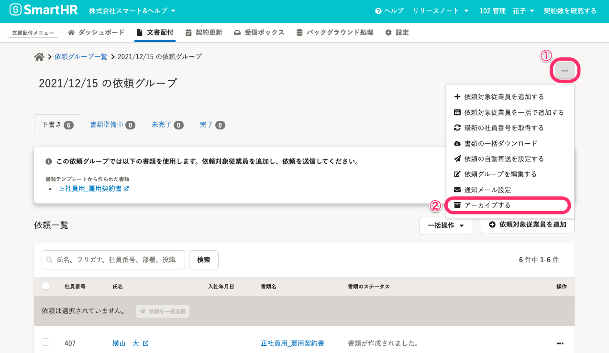
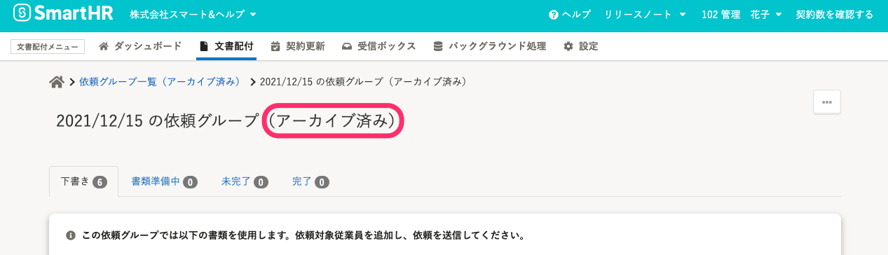
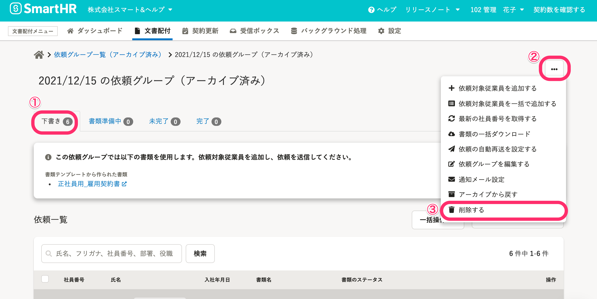
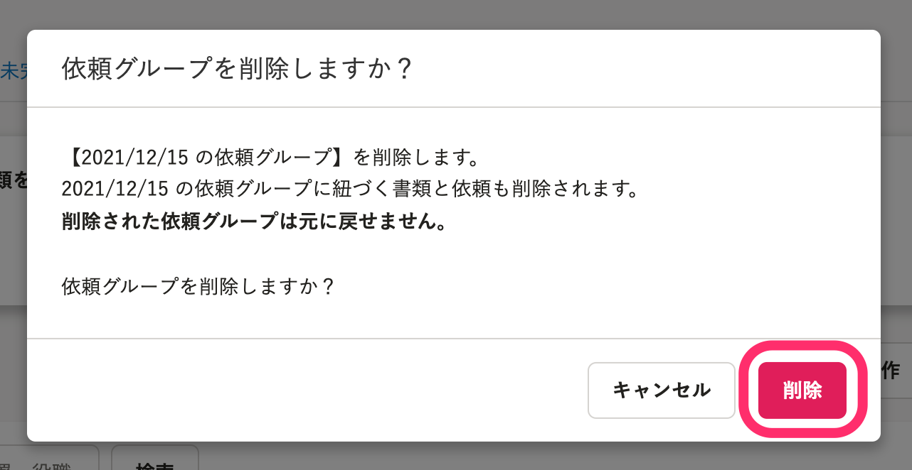
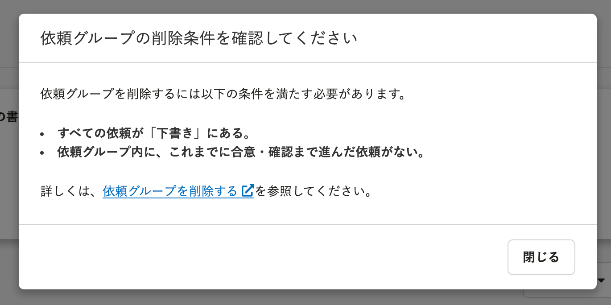

このページでは、依頼グループを削除する方法について説明します。

依頼グループ削除の操作ができるのは、**管理者権限アカウントのみ**です。

# 依頼グループの削除条件

依頼グループを削除する場合、以下の条件を満たす必要があります。

1.  対象の依頼グループが「アーカイブ済み」になっている
2.  すべての依頼が「下書き」タブにある
3.  依頼グループ内に、これまでに合意・確認まで進んだ依頼がない

:::alert
依頼グループ内に、合意・確認まで進んだ依頼がある場合、**依頼グループを削除することはできません。**
:::

# 1\. ［依頼グループ一覧］から、削除したい依頼グループを選択する

文書配付メニューから **［文書配付］>［依頼グループ］** をクリックして、 **［依頼グループ一覧］** を表示します。

 **［依頼グループ一覧］** から、削除したい **［依頼グループ］** をクリックして、依頼グループ詳細画面に移動します。

# 2\. \[...\] メニュー >［アーカイブする］をクリック

 **［依頼グループ詳細］** 画面右上の **［...］** メニューから、 **［アーカイブする］** をクリックします。

依頼グループがアーカイブされると、依頼グループ名の横に「（アーカイブ済み）」と表示されます。

# 3\. \[...\] メニュー >［削除する］をクリック

アーカイブ済みの **［依頼グループ詳細］** 画面の **「下書き」タブ** を開き、右上の **［...］** メニューから **［削除する］** をクリックすると、削除確認のダイアログが表示されます。

# 4\. ［削除］をクリック

内容を確認し、 **［削除］** をクリックすると依頼グループを削除します。

:::tips
依頼グループの削除条件を満たしていない場合、 **「依頼グループの削除条件を確認してください」** というダイアログが表示されます。
削除の条件を満たしているか確認してください。

:::
