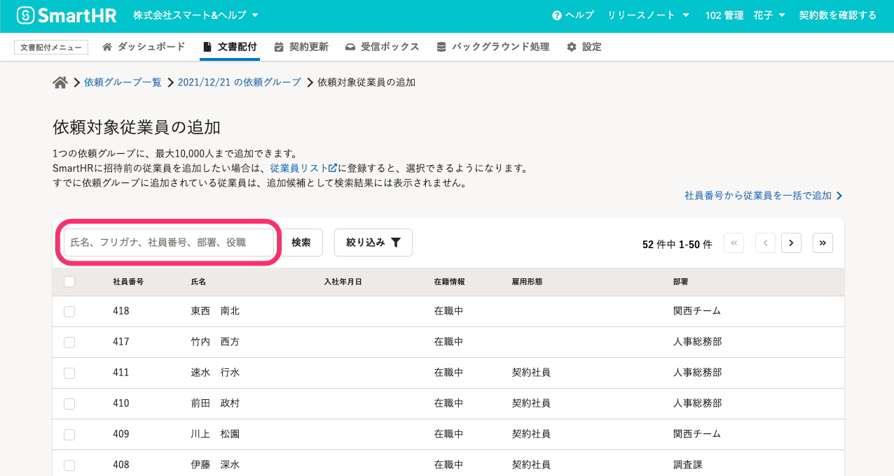
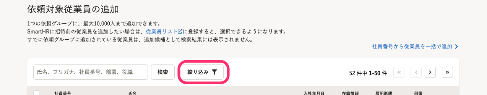
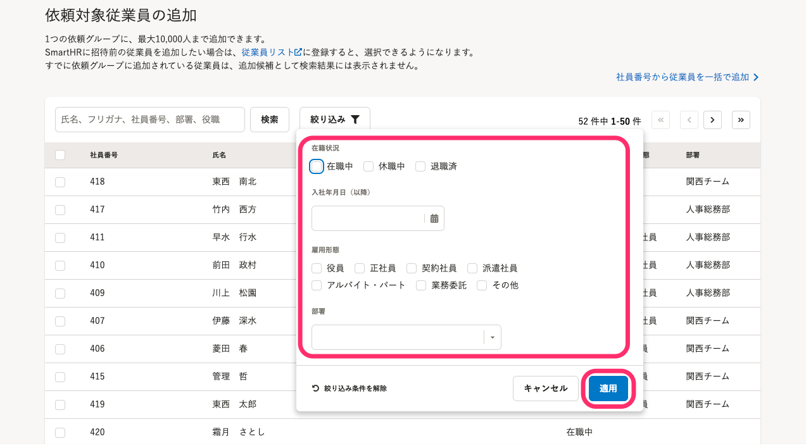
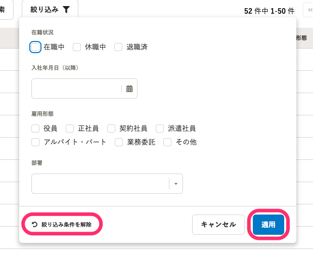

［依頼対象従業員の追加］画面では、氏名・フリガナ・社員番号・部署・役職のいずれかによる検索と、従業員一覧の在籍状況・入社年月日・雇用形態・部署での絞り込みができます。

# 氏名、フリガナ、社員番号、部署、役職のいずれかで検索する

## 1\. 氏名、フリガナ、社員番号、部署、役職のいずれかを入力

検索フォームに氏名、フリガナ、社員番号、部署、役職のいずれかを入力します。

## 2\. ［検索］をクリック

 **［検索］** をクリックすると、入力した内容を含む従業員が表示されます。

# 在籍状況、入社年月日、雇用形態、部署で絞り込む

## 1\. ［絞り込み］をクリック

 **［絞り込み］** をクリックして、パネルを開きます。

## 2\. 条件を指定し［適用］をクリック

 **［在籍状況（［在職中］［休職中］［退職済］）］**  **［入社年月日（以降）］［雇用形態］［部署］** を指定して、絞り込みができます。

絞り込み表示したい条件を指定し **［適用］** をクリックすると、条件に合致した従業員のみが表示されます。

:::tips
 **［絞り込み条件を解除］** \>  **［適用］** をクリックすると、設定した条件をすべて解除できます。

:::
