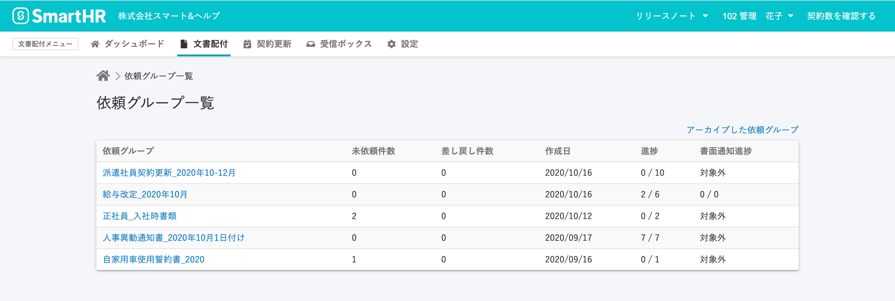
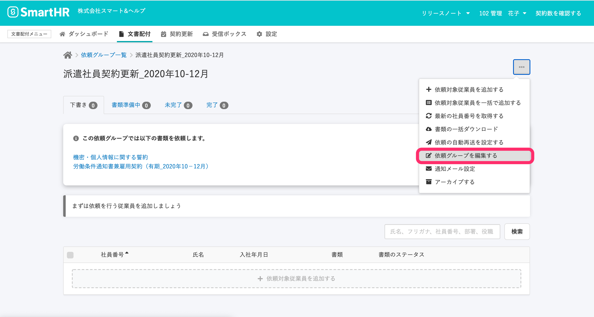
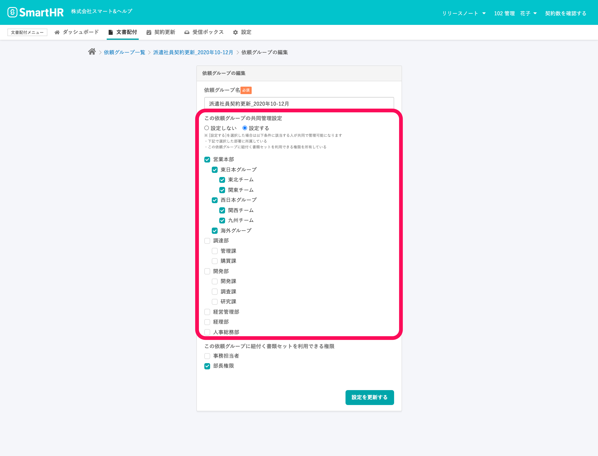
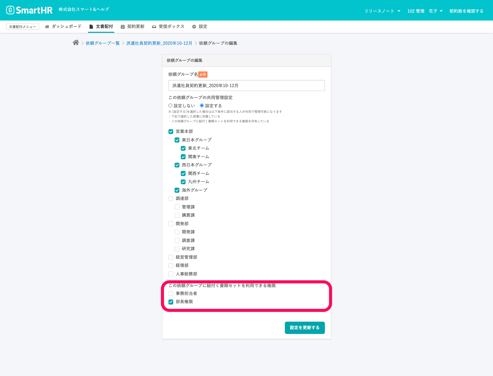

**依頼グループ** の **共同管理設定** を使用すると、SmartHRの管理者権限以外のアカウントも依頼グループを閲覧できるようになります。

共同管理設定では、依頼グループを共同管理する部署を指定します。

**\[従業員関連\] の \[操作できる範囲\]** で共同管理対象部署の従業員に対して権限を持つアカウントが、依頼グループ内で操作できる範囲の従業員の依頼ステータスを確認できるようになります。

共同管理設定で権限を付与できるSmartHRの権限の条件は以下になります。

- 事務担当者
- **\[従業員関連\] の \[操作できる範囲\]**が **\[本人\] 以外** に設定されている**カスタム権限**

# \[依頼グループの編集\] 画面で \[依頼グループの共同管理設定\] を有効にする

## 1\. 依頼グループから \[依頼グループ詳細\] を表示

文書配付メニューの **\[文書配付\]** から **\[依頼グループ\]** をクリックして、**\[依頼グループ一覧\]** へ移動します。

**\[依頼グループ一覧\]** で、共同管理したい依頼グループをクリックして、**\[依頼グループ詳細\]** を表示します。

## 2\. \[依頼グループ詳細\] で \[依頼グループを編集する\] をクリック

**\[依頼グループ詳細\]** 画面右上のメニューから **\[依頼グループを編集する\]** をクリックして、 **\[依頼グループの編集\]** を表示します。

## 3\. \[この依頼グループの共同管理設定\] で共同管理対象の部署を設定する

**\[依頼グループの編集\]** の **\[この依頼グループの共同管理設定\]** の **\[設定する\]** をクリックすると、部署名一覧が表示されます。

依頼グループ内で共同管理の対象にする **部署名** のチェックボックスにチェックを入れ、**\[設定を更新する\]** をクリックします。

# \[この依頼グループに紐付く書類セットを利用できる権限\] を設定する

## \[この依頼グループに紐づく書類セットを利用できる権限\] とは

管理者以外のアカウント権限のユーザーが、**従業員に依頼を送るには書類セットの利用権限が必要**です。

依頼グループの共同管理設定をすると、 **\[従業員関連\] の \[操作できる範囲\]** で共同管理対象部署の従業員に対して権限を持つアカウントが依頼グループを閲覧できるようになりますが、依頼の送信などの操作はできません。

依頼を送信するために、**この依頼グループに紐付く書類セットを利用できる権限**を付与します。

## \[この依頼グループに紐づく書類セットを利用できる権限\] を付与する

**\[この依頼グループに紐付く書類セットを利用できる権限\]** の設定は、管理者権限のアカウントしか操作できません。

**\[この依頼グループに紐付く書類セットを利用できる権限\]** の項目で、**この依頼グループを使って依頼を送信するアカウントの権限** のチェックボックスをクリックします。

書類セットを利用できるようにしたい権限名のチェックボックスにチェックを入れ、**\[更新\]** をクリックして設定を保存します。

:::related
[管理者権限以外のアカウントで文書配付機能を利用する](https://knowledge.smarthr.jp/hc/ja/articles/360026103954)
:::
