PDF書類にPDFファイルを一括アップロードする手順を説明します。

同じ1つの書類を依頼グループ内のすべての従業員にアップロードする方法と、別々の書類を一括でアップロードする方法があります。

依頼グループへの依頼対象従業員の追加や書類作成後の依頼については、[従業員へ文書配付をする](https://knowledge.smarthr.jp/hc/ja/articles/360026105334)をご覧ください。

# 同じPDFファイルを一括アップロードする方法

## 1\. 依頼グループ画面の［  同じPDFファイルを一括アップロード］をクリック

**依頼グループ画面** の依頼一覧の右上にある **［一括操作］** から **［ 同じPDFファイルを一括アップロード］** をクリックすると、 **［同じPDFファイルの一括アップロード］** ダイアログが表示されます。

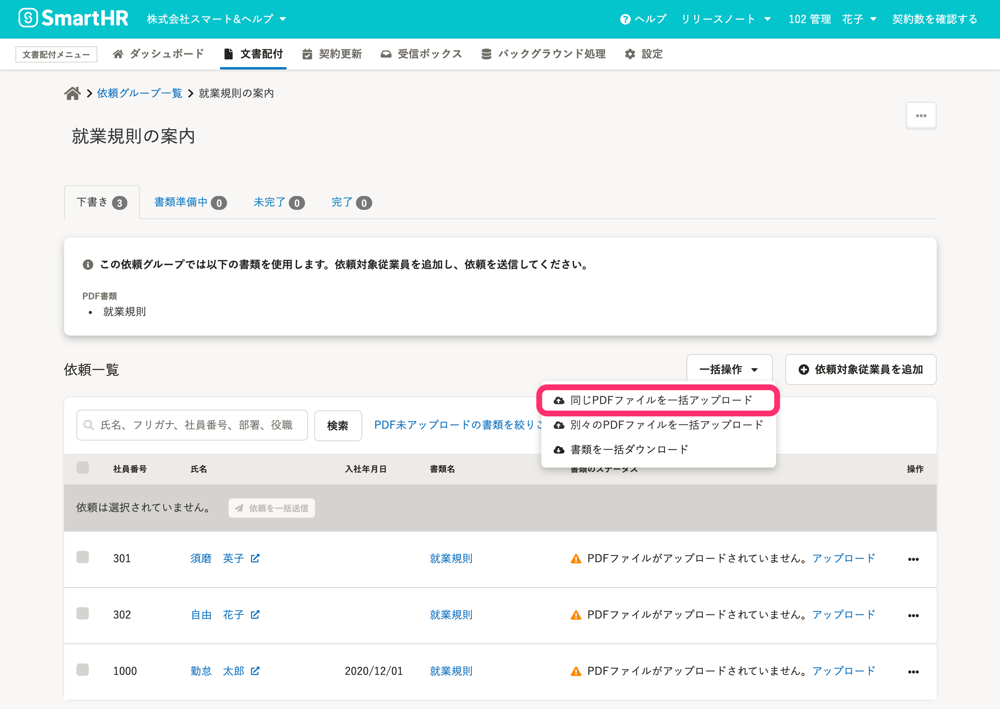

## 2.［同じPDFファイルの一括アップロード］ダイアログで［ファイルを選択］をクリック

 **［同じPDFファイルの一括アップロード］** ダイアログで、アップロードしたいPDFファイルをドラッグ＆ドロップするか、 **［ファイルを選択］** をクリックしてファイルを選択します。

選択できるファイルは1つです。

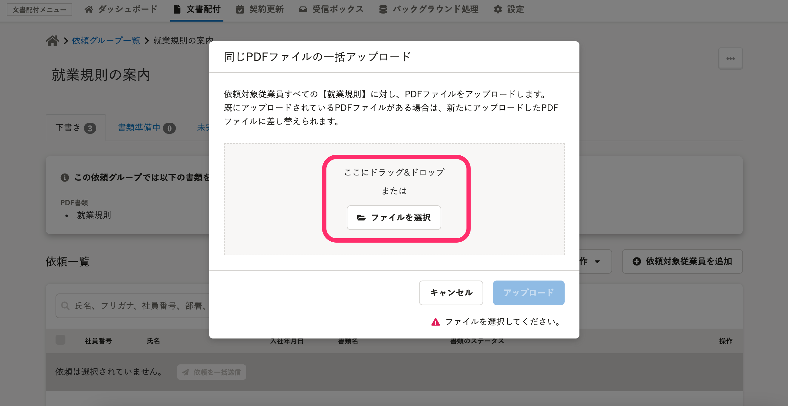

## 3\. ファイル名を確認し、［アップロード］をクリック

ファイル名を確認し **［アップロード］** をクリックすると、アップロードの実行ダイアログが表示されます。

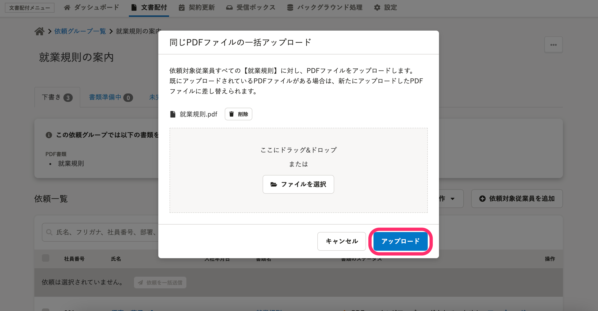

:::tips
アップロード済みのPDFファイルがある状態で同じPDFファイルのアップロードを行なった場合、新しくアップロードしたファイルに差し替えられます。
バックグラウンド処理の実行中は**依頼グループ画面**の上部に「**PDFファイルの一括アップロードが実行中です**」と表示されます。
バックグラウンド処理の詳細を確認するには、 **［バックグラウンド処理詳細］** のリンクをクリックしてください。
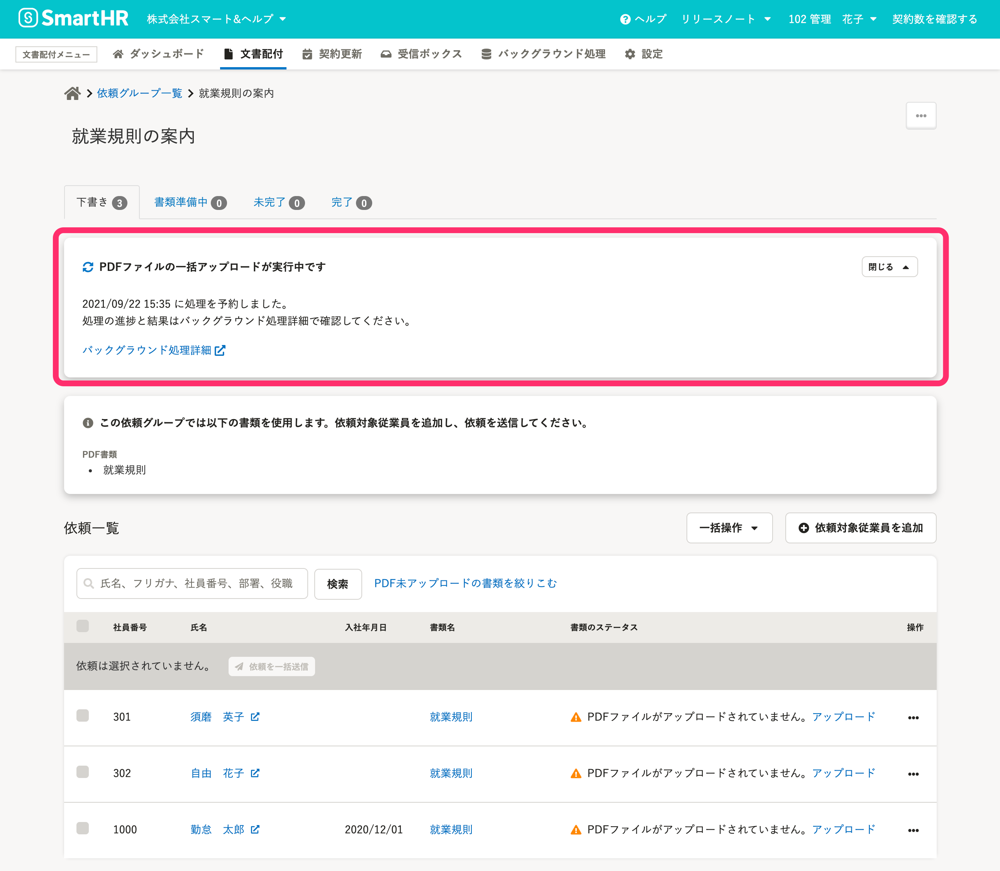
バックグラウンド処理詳細画面には、画面上部の文書配付メニューの **［ バックグラウンド処理］** からバックグラウンド処理一覧画面を表示し、処理名をクリックしても移動できます。
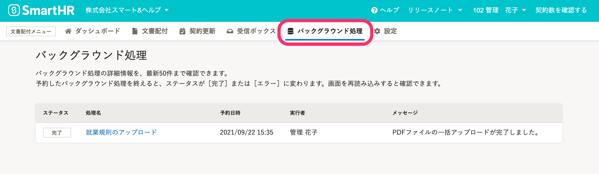
:::

## 4\. 書類のステータスが「書類が作成されました。」になったら、依頼を送信できます

PDFファイルのアップロードが完了すると、**依頼グループ画面**の依頼一覧の **［書類のステータス］** が［**書類が作成されました。**］に変わります。

アップロードしたPDFファイルの内容を確認するには、 **［書類名］** をクリックして、プレビュー画面を表示してください。

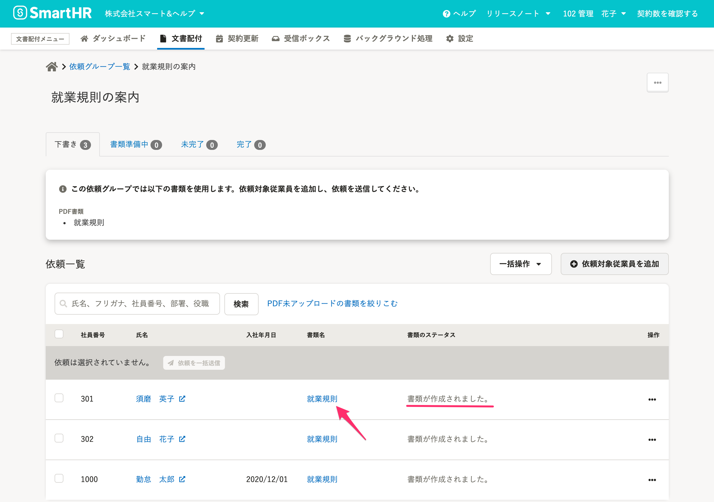

# 別々のPDFファイルを一括アップロードする方法

## PDFファイルの準備

PDF書類にPDFファイルの一括アップロードをするには、PDFファイルの名前を変更しておく必要があります。

一括アップロードをする前にPDFファイルを用意しておくと、作業がスムーズです。

ファイル名のルール
**{社員番号} + @ (半角アットマーク) + {任意のワード}**
 _例：社員番号が2002の従業員用のファイルの場合：「2002@入社のしおり.pdf」_ 

## 1\. 依頼グループ画面の［  別々のPDFファイルを一括アップロード］をクリック

**依頼グループ画面** の依頼一覧の右上にある **［一括操作］** から **［ 別々のPDFファイルを一括アップロード］** をクリックすると、PDFファイルの一括アップロード画面が表示されます。

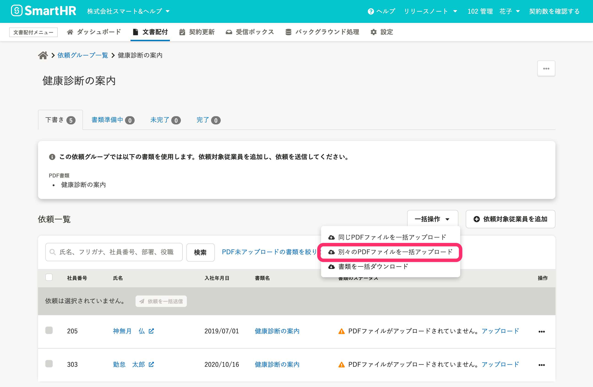

## 2\. PDFファイルの一括アップロード画面で［ ファイルを追加］をクリック

**PDFファイルの一括アップロード画面** で、アップロード先の依頼グループとアップロード先PDF書類を確認してください。

 **［ ファイルを追加］** をクリックして、ファイルの追加ダイアログを表示します。

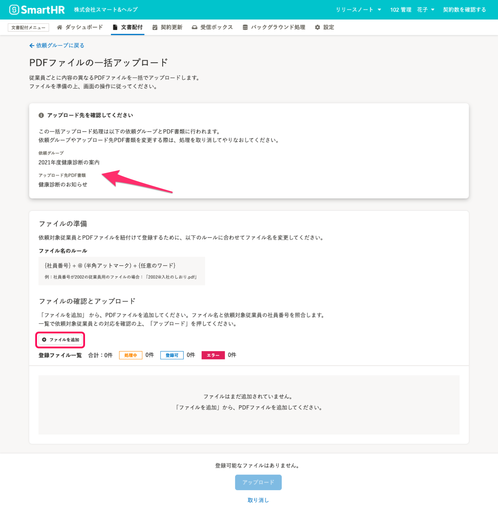

## 3\. ファイルの追加ダイアログからファイルを追加する

アップロードする**すべてのファイル**を選択して、 **［追加］** をクリックします。

 **［追加］をクリックする前にファイルを選択し直す** と、前に選択した分のファイルは追加されないので、気をつけてください。

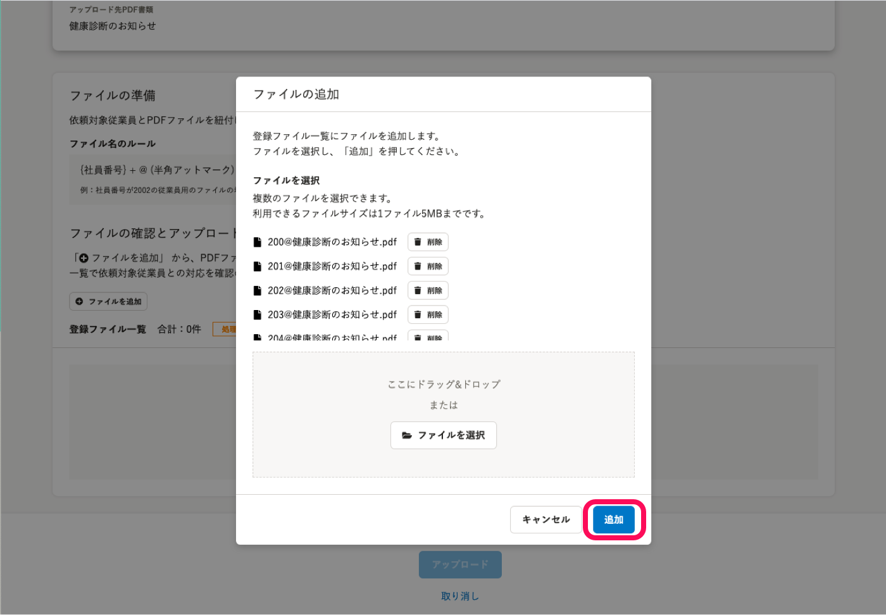

 **［追加］** をクリックするとダイアログが閉じて、登録ファイル一覧にファイル名と登録判定のステータス、送付先の従業員の社員番号と氏名が表示されます。

:::alert
登録判定の［処理中］のファイルがあるときにブラウザを更新して画面を再読み込みすると、登録ファイル一覧への追加からやり直しになるので、注意してください。
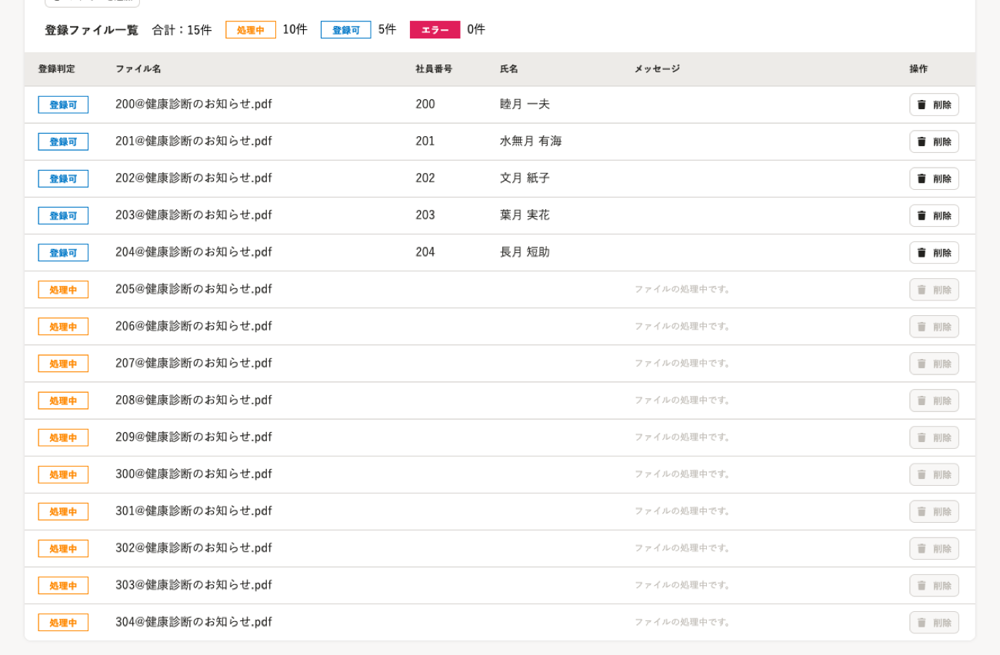
:::

### 誤ったファイルを登録ファイル一覧に追加してしまった場合は、［削除］をクリック

誤ったファイルを追加してしまった場合は、 **［削除］** をクリックし、**登録ファイル一覧から削除**してください。

削除を済ませてから、正しいPDFファイルを追加します。

同じ社員番号がファイル名に含まれたPDFファイルが登録ファイル一覧に追加済みの場合、PDFファイルを追加できません。

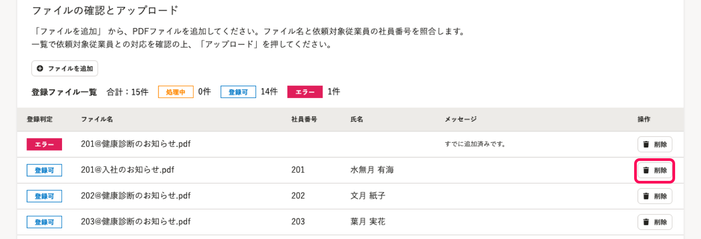

:::related
[Q. PDFファイルの一括アップロード画面でエラーが表示されたら？](https://knowledge.smarthr.jp/hc/ja/articles/4402948144153)
:::

## 4\. ファイル名を確認し、［アップロード］をクリック

**登録ファイル一覧** のファイル名と送付先の従業員を確認します。

 **［アップロード］** をクリックすると、アップロードの実行ダイアログが表示されます。

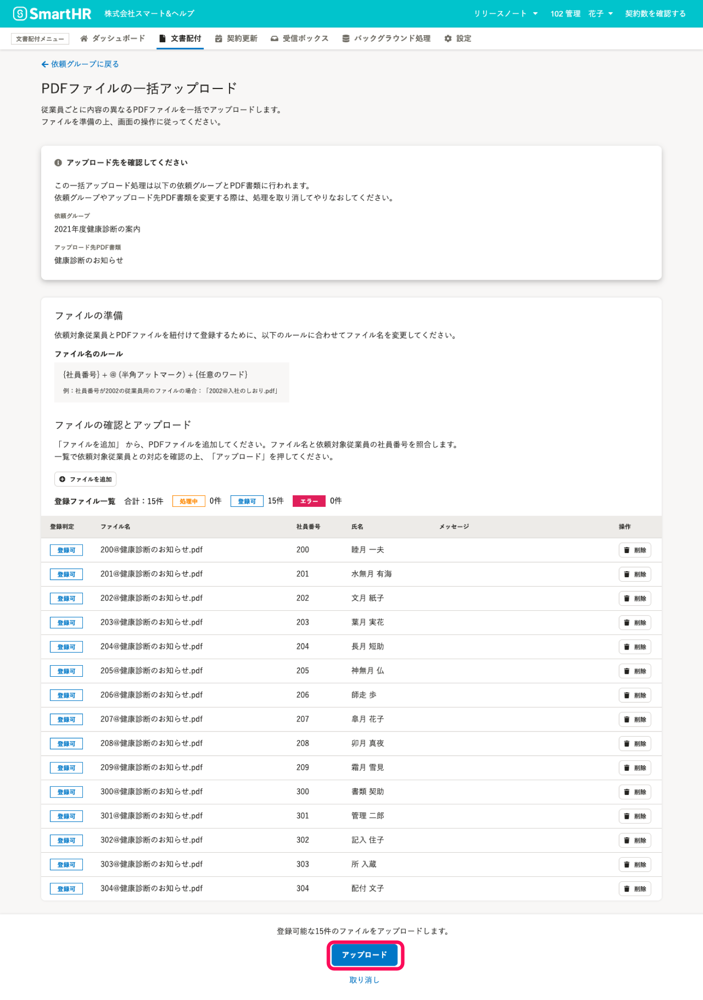

PDFファイルのアップロードはバックグラウンド処理で実行されます。

登録ファイル一覧で［登録可］のステータスのすべてのファイルが、**アップロードされるファイル** として扱われます。

ファイル名を確認の上、 **［実行］** をクリックすると、バックグラウンド処理を受け付けます。

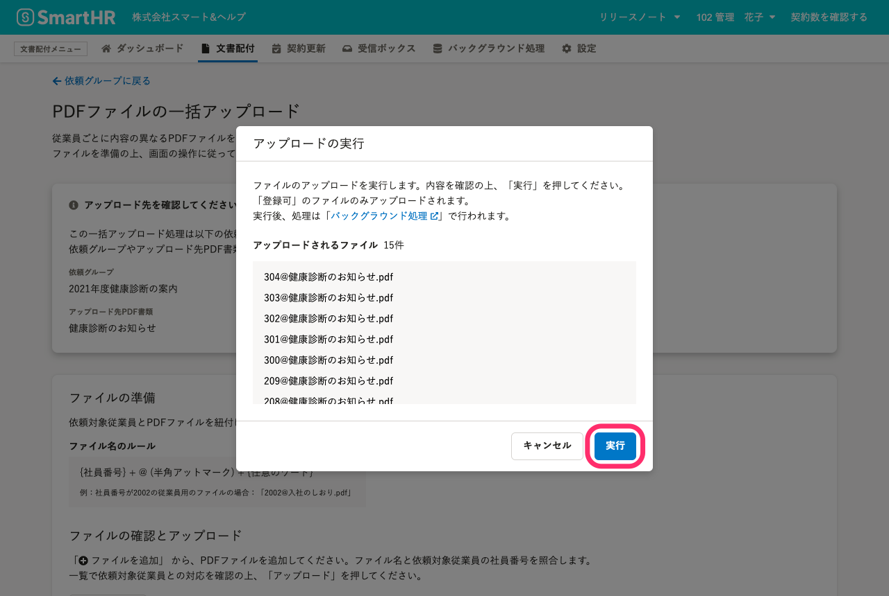

バックグラウンド処理の実行中は **依頼グループ画面** の上部に「**PDFファイルの一括アップロードが実行中です**」と表示されます。

バックグラウンド処理の詳細を確認するには、 **［バックグラウンド処理詳細］** のリンクをクリックしてください。

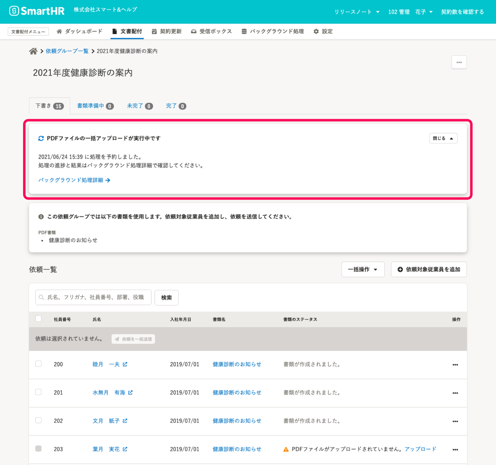

 バックグラウンド処理詳細画面には、画面上部の文書配付メニューの **［ バックグラウンド処理］** からバックグラウンド処理一覧画面を表示し、処理名をクリックしても移動できます。

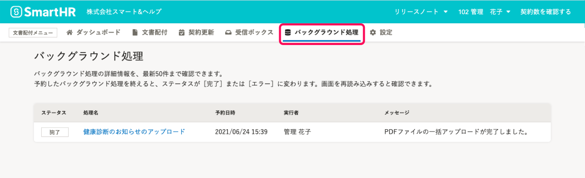

## 5\. 書類のステータスが「書類が作成されました。」になったら、依頼を送信できます

PDFファイルのアップロードが完了すると、**依頼グループ画面** の依頼一覧の **［書類のステータス］** が［**書類が作成されました。**］に変わります。

アップロードしたPDFファイルの内容を確認するには、 **［書類名］** をクリックして、プレビュー画面を表示してください。

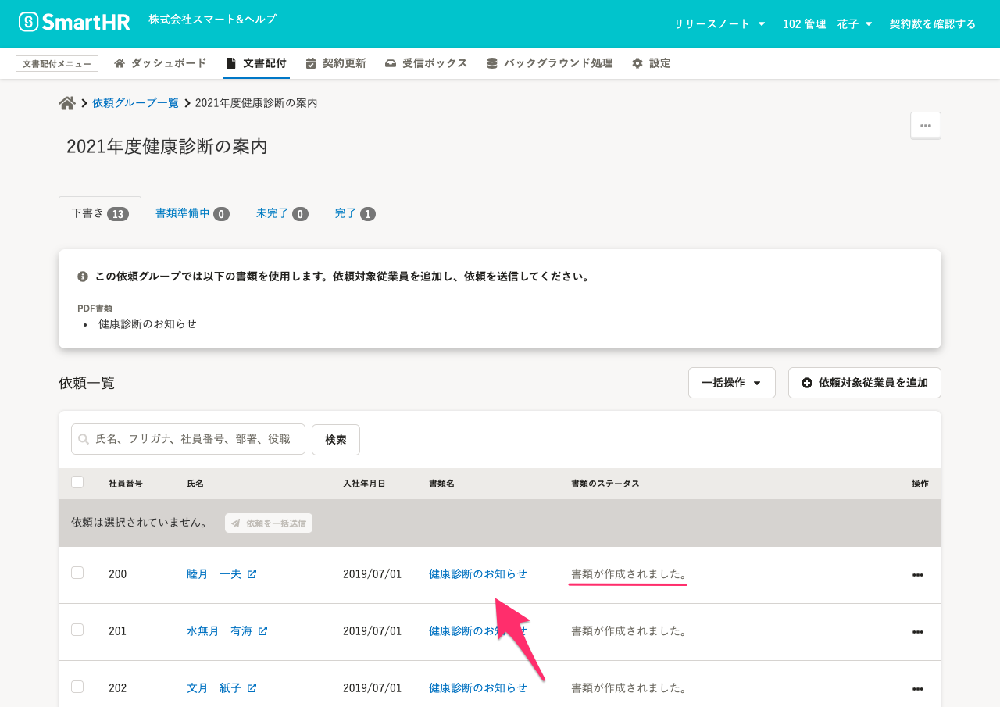

:::related
[Q. 一括アップロードしたPDFファイルを差し替えるには？](https://knowledge.smarthr.jp/hc/ja/articles/4402782759065)
:::
