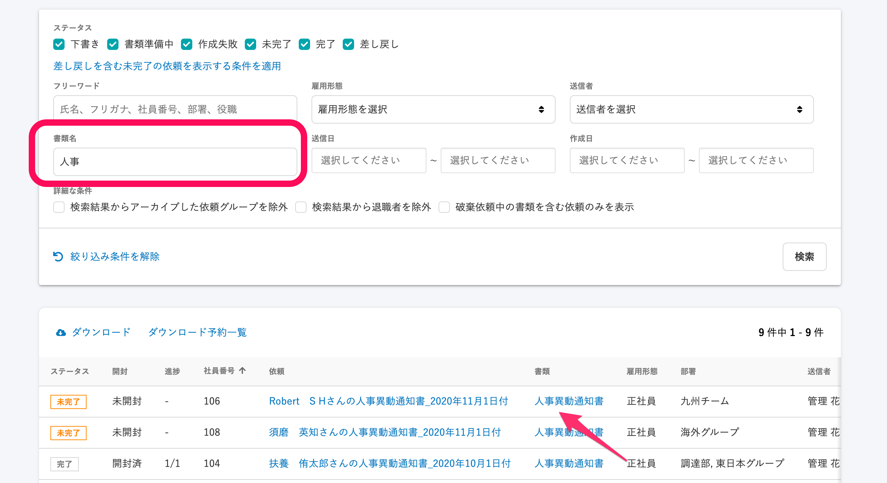

文書配付機能の**\[依頼一覧\]** では、従業員ごとに送信する依頼の進捗管理ができます。

さまざまな条件から依頼を抽出し、紐付いている依頼グループや書類の閲覧ができます。

文書配付メニューから **\[文書配付\]** をクリックし、プルダウンリストにある **\[依頼一覧\]** をクリックすると、 **\[依頼一覧\]** 画面が表示されます。

# 依頼を検索する

条件を設定して **\[検索\]** ボタンをクリックすると、条件設定パネルの下に条件に合う依頼が一覧表示できます。

:::tips
**\[絞り込み条件を解除\]** をクリックすると設定した条件をすべて解除できます。
条件を解除して、 **\[検索\]** をクリックしてください。

:::

## 依頼ステータスを選択する

依頼ステータスは、**下書き**、**書類準備中**、**作成失敗**、**未完了**、**完了**、**差し戻し** があります。

| ステータス名 | 意味 |
| --- | --- |
| 下書き | 依頼を送信する前の状態 |
| 書類準備中 | 従業員のSmartHRへの招待が完了していないために、依頼の送信ができていない状態 |
| 作成失敗 | 書類テンプレートで必須項目に設定された情報が SmartHR に未登録のため書類の作成に失敗している状態 |
| 未完了 | 依頼を送信し、従業員の確認・合意を待っている状態 |
| 完了 | 従業員の確認・合意が済み、文書配付の一連の過程が完了した状態 |
| 差し戻し | 従業員が依頼を差し戻した状態 |

:::tips
**\[差し戻しを含む未完了の依頼を表示する条件を適用\]** をクリックすると、 **\[未完了\]** と **\[差し戻し\]** を選択した状態になります。そのまま **\[検索\]** をクリックして、依頼が差し戻され、完了していない依頼のみを表示できます。

:::

## 氏名や社員番号、部署名で検索する

フリーワードの入力フォームに、氏名、フリガナ、社員番号、部署名、役職を入力して検索できます。

## 雇用形態を選択する

プルダウンリストからSmartHRに登録されている雇用形態を選択できます。

:::related
[雇用形態のマスターデータを管理する](https://knowledge.smarthr.jp/hc/ja/articles/360026105714)
:::

## 送信者を選択する

プルダウンリストから、今まで依頼を送信したことのあるアカウントを選択できます。

## 書類名で検索する

フリーワードの入力フォームに、書類名を入力して依頼を検索できます。

部分一致検索が可能です。

書類名は、 **\[管理者向けテンプレート名\]** が使用されますが、未設定の場合は \[従業員向けテンプレート名\] が用いられます。

:::related
[書類テンプレートを作成する](https://knowledge.smarthr.jp/hc/ja/articles/360026263953)
:::

## 送信日で検索する

依頼を送信した日、期間を指定して依頼を絞り込めます。

## 作成日で検索する

依頼を作成した日（依頼グループに従業員を追加した日）、期間を指定して依頼を絞り込めます。

## アーカイブや退職者、破棄依頼中を条件にする

**\[詳細な条件\]** として、**\[検索結果からアーカイブした依頼グループを除外\]** と **\[検索結果から退職者を除外\]** 、**\[破棄依頼中の書類を含む依頼のみを表示\]** も用意しています。

# 依頼を確認する

依頼は、デフォルトでは作成日の新しい順（降順）で一覧表示されます。

並び順は、 **\[社員番号\]** 、 **\[送信日\]** 、 **\[作成日\]** の昇順／降順に変更できます。

（依頼一覧の表は横に長いので、画面を右にスクロールしてください。）

依頼一覧を右スクロールした状態

## 依頼グループを確認する

それぞれの **\[依頼\]** 項目の依頼名をクリックすると、該当の依頼グループ画面へ移動します。

## 書類の内容を確認する

それぞれの **\[書類\]** 項目にある書類名をクリックすると、該当の書類の閲覧画面を表示します。

1回の依頼で複数の書類を送信している場合、マウスオーバーで書類名が表示されます。

# 依頼一覧をダウンロードする

依頼ステータスなど、一覧に表示した内容をCSVファイルに書き出してダウンロードできます。

ダウンロードできる項目は以下の通りです。

- 社員番号
- 従業員氏名
- 従業員氏名カナ
- ステータス
- 合意済み書類数
- 全書類数
- 依頼グループ
- 書類
- 雇用形態
- 部署
- 役職
- 送信者
- 送信日
- 書面通知
- 開封ステータス
- 備考

ダウンロード対象の依頼は、依頼一覧の表示と同じように条件抽出してください。

CSVファイルの中身は、依頼一覧画面に表示した並び順で書き出されます。

## 1\. \[ダウンロード\] をクリック

依頼表示画面の左上にある **\[ダウンロード\]** をクリックすると、ダウンロードが予約され、**\[依頼一覧CSVのダウンロード\]** 画面へ遷移します。

予約したダウンロードは、黄色くハイライトされます。

ステータスとクラウドマークの項目に **\[作成中\]** と表示されます。

## 2\. 画面を更新し、\[ダウンロード\] のリンクをクリック

ブラウザの更新ボタンをクリックして画面をリロードします。

CSVへの書き出しが完了し、ダウンロード可能になると、ステータスが \[作成完了\] に変わって、右側のクラウドマークの項目に **\[ダウンロード\]** のリンクが表示されます。

**\[ダウンロード\]** をクリックすると、CSVファイルをダウンロードできます。

:::tips
**\[ダウンロード予約一覧\]** 画面は、**\[依頼一覧\]** 画面からいつでもアクセスできます。

:::
