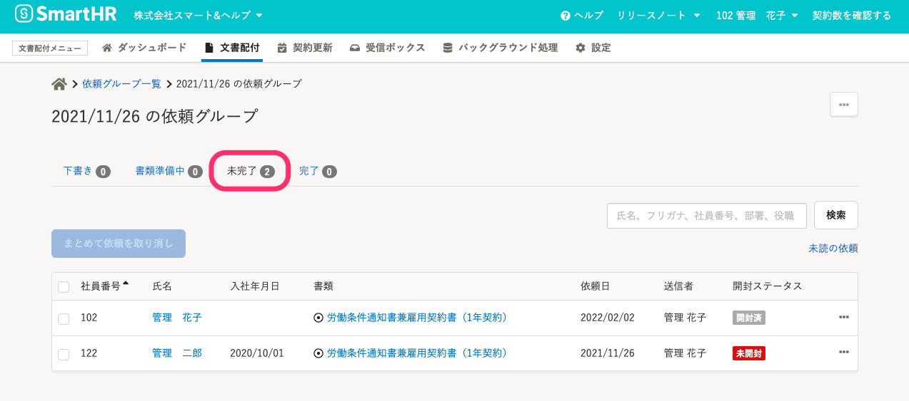
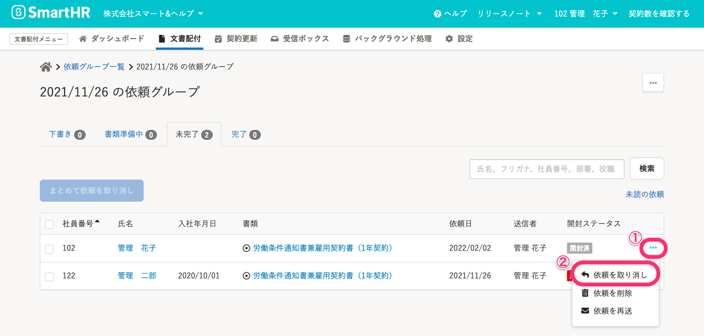
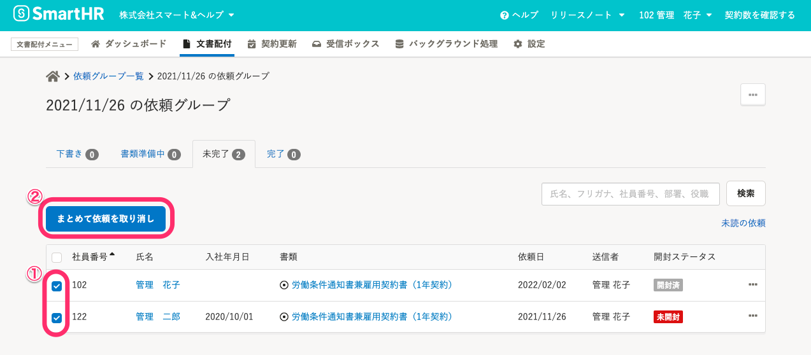
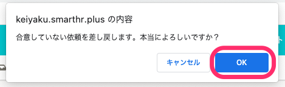
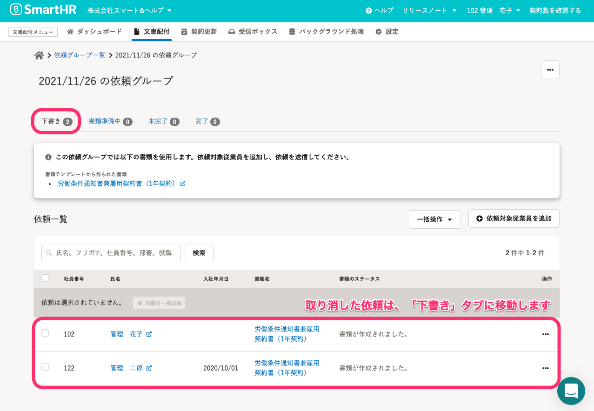

# 1\. 依頼グループ詳細画面の「未完了」タブをクリック

依頼グループ詳細画面の **「未完了」** タブをクリックします。

# 2\. 依頼を取り消したい従業員を選択して、［依頼を取り消し］をクリック

## **特定の従業員への依頼を取り消したい場合**

依頼を取り消したい従業員の **［…］>［依頼を取り消し］** をクリックすると、確認ダイアログが表示されます。

## **複数の従業員への依頼を同時に取り消したい場合**

複数の従業員への依頼を取り消す場合は、 **［社員番号］** 横のチェックボックスにチェックを入れ、［ **まとめて依頼を取り消し］** をクリックすると、確認ダイアログが表示されます。

# 3\. ［OK］をクリック

確認ダイアログに **「合意していない依頼を差し戻します。本当によろしいですか？」（** 複数の依頼を取り消す場合は **「選択された依頼を差し戻します。本当によろしいですか？」）** と表示されるので、 **［OK］** をクリックすると依頼が取り消されます。

# 4\. 取り消した依頼が［下書き］タブに移動していることを確認する

依頼の取り消しを行なうと、該当の依頼は［ **下書き］** タブに移動し、依頼前の状態に戻ります。

:::tips
依頼の取り消しを行なうと、従業員には「人事文書に関する依頼が取り消されました」というメールが通知されます。
[【一覧】文書配付機能の通知メールの内容](https://knowledge.smarthr.jp/hc/ja/articles/360035821993)
:::
