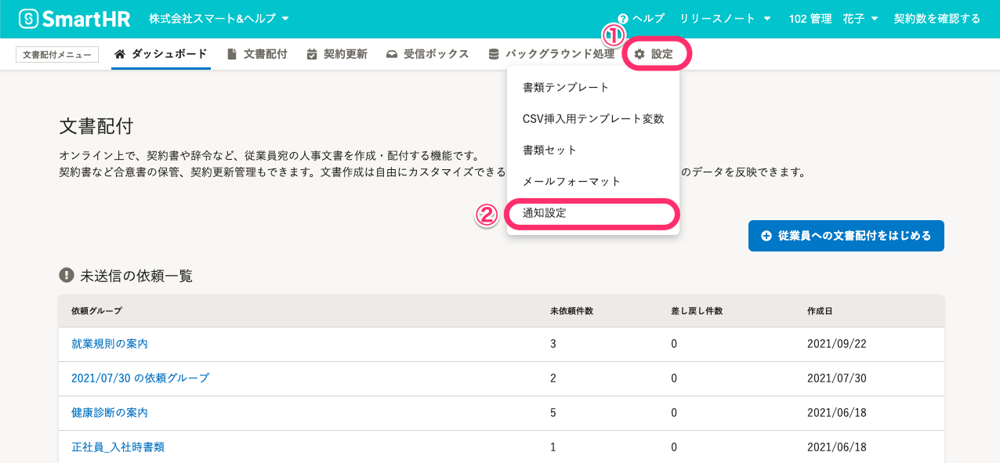
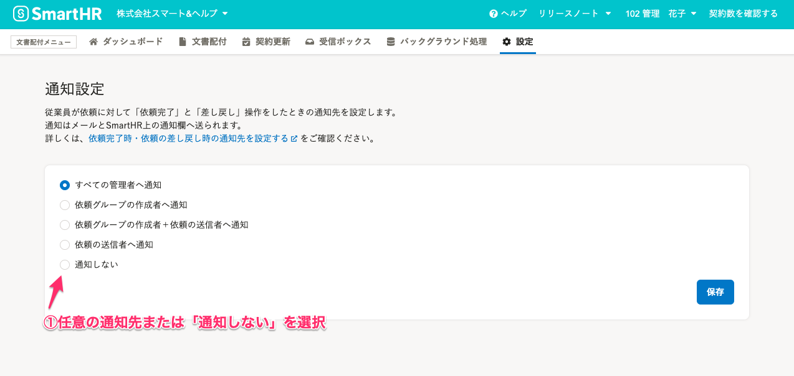
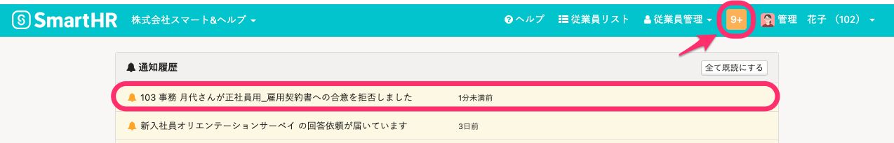

従業員への依頼完了時および依頼の差し戻し時の通知先を設定ができます。

# 通知の設定方法

## 1\. 文書配付メニューの［設定］>［通知設定］をクリック

文書配付メニューの **［設定］** \> **［通知設定］** をクリックし、通知設定画面へ移動します。

## 2\. 任意の通知範囲を選択し、［保存］をクリック

任意の通知先または「通知しない」を選択し、 **［保存］** をクリックします。

管理者権限のアカウントのみ、通知設定が可能です。

初期設定では、「すべての管理者」に通知する設定になっています。

### 設定できる通知先

| **設定名** | **通知先** |
| --- | --- |
| すべての管理者へ通知 |   SmartHRの管理者権限が付与されているアカウントに通知します。  文書配付の依頼ができるアカウント権限があっても、SmartHRの管理者権限がない場合は通知されませんので注意してください。   |
| 依頼グループの作成者へ通知 |   依頼グループを作成したアカウントのみに通知します。   |
| 依頼グループの作成者＋依頼の送信者へ通知 |   依頼グループを作成したアカウントと、依頼の送信をしたアカウントのみに通知します。   |
| 依頼の送信者へ通知 |   依頼の送信をしたアカウントのみに通知します。   |
| 通知しない | すべてのアカウントに通知しません。 |

# 通知の確認方法

登録しているメールアドレスまたはトップページの **［通知履歴］** から、通知の内容を確認できます。

:::related
[【一覧】文書配付機能の通知メールの内容](https://knowledge.smarthr.jp/hc/ja/articles/360035821993)
:::
