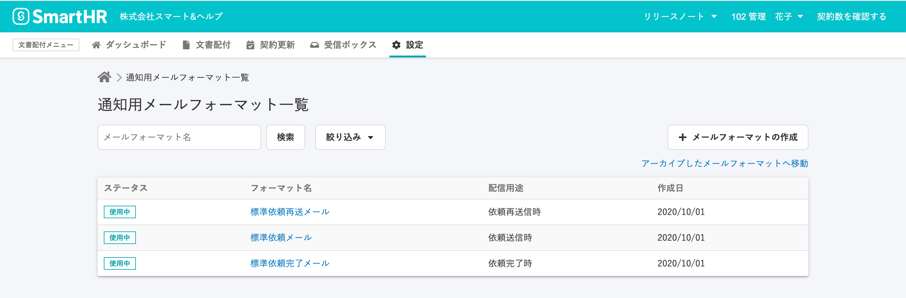
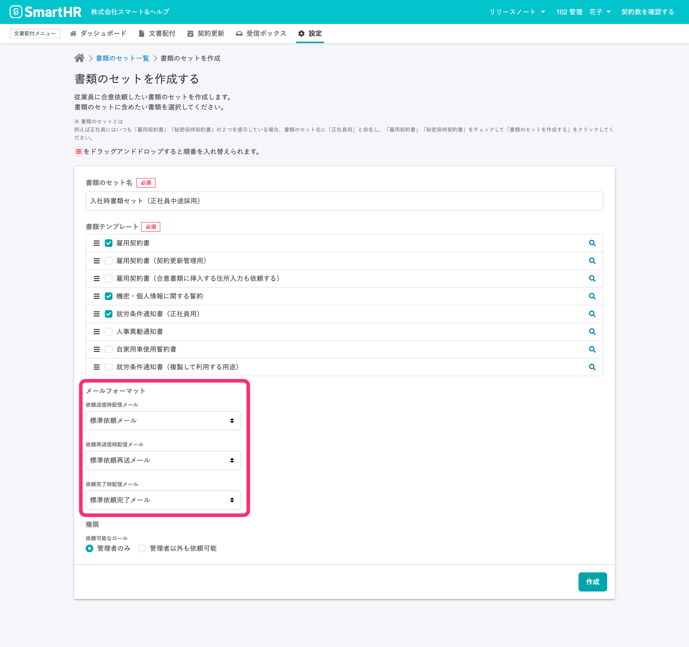
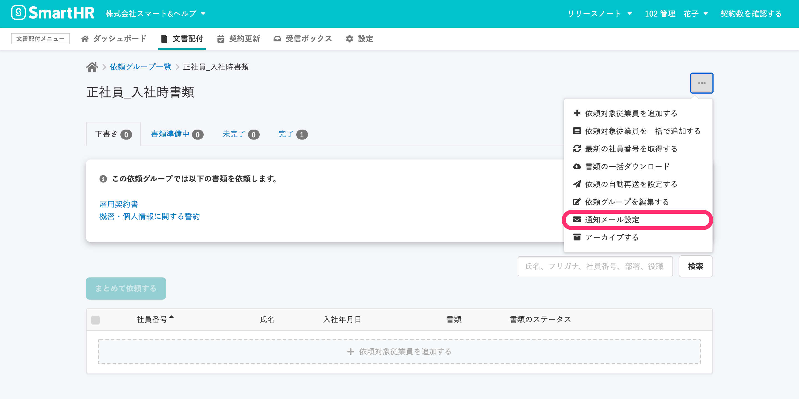
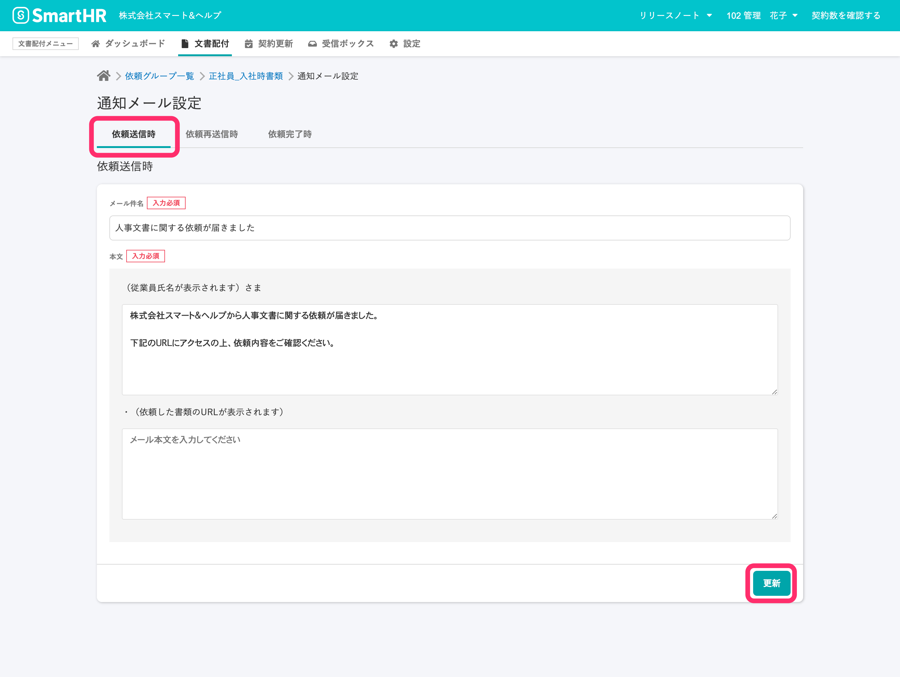

文書配付機能では、依頼送信時・依頼再送信時・依頼完了時に従業員が受け取るメールの内容をカスタマイズし、複数登録できます。

登録したメールフォーマットは書類のセットや依頼グループごとに設定できます。

# メールフォーマットが登録できる通知メール

メールフォーマットを編集し、複数のパターンを登録できるのは以下のメールです。

- 依頼送信時に、従業員が受け取るメールの件名と本文
- 依頼再送信時に、従業員が受け取るメールの件名と本文
- 依頼完了時に、従業員が受け取るメールの件名と本文

文書配付メニューの **\[設定\]** から **\[メールフォーマット\]** をクリックすると、**\[通知用メールフォーマット一覧\]** へ移動します。

:::related
[通知メールのフォーマットを作成・編集する](https://knowledge.smarthr.jp/hc/ja/articles/360043502353)
:::

その他の通知メールは、システム標準のメールのみです。

:::related
[【一覧】文書配付機能の通知メールの内容](https://knowledge.smarthr.jp/hc/ja/articles/360035821993)
:::

# 書類セットにメールフォーマットを設定する

従業員への通知用メールフォーマットは、書類セットに紐付けます。

**\[書類のセットを作成する\]** 画面で、登録済みのメールフォーマットをプルダウンリストから選択し設定します。

**\[標準メールフォーマット\]** があらかじめ選択されています。

:::related
[書類のセットを作成する](https://knowledge.smarthr.jp/hc/ja/articles/360026263933)
:::

# 依頼グループごとに通知メールを編集する

## 1\. \[依頼グループ詳細\] 画面右上のメニューから \[通知メール設定\] 画面を表示する

**\[依頼グループ詳細\]** 画面右上のメニューから **\[通知メール設定\]** をクリックすると、 **\[通知メール設定\]** 画面に移動し、メールの内容を編集できます。

依頼グループ作成のタイミングでは、使用している書類のセットに紐付けられたメールフォーマットが適用されています。

## 2\. 配信用途を選択し、メールの内容を編集して \[更新\] をクリック

通知メール設定画面で、内容を変更したいメールの配信用途を選択してください。

**\[依頼送信時\]** 、 **\[依頼再送信時\]** 、 **\[依頼完了時\]** 、それぞれ書類セットに紐付いたメールフォーマットの内容が反映されているので、適宜編集します。

編集を終えたら、画面右下の **\[更新\]** をクリックして、変更内容を保存してください。

:::related
[従業員に依頼を送信する](https://knowledge.smarthr.jp/hc/ja/articles/360026105334)
:::
