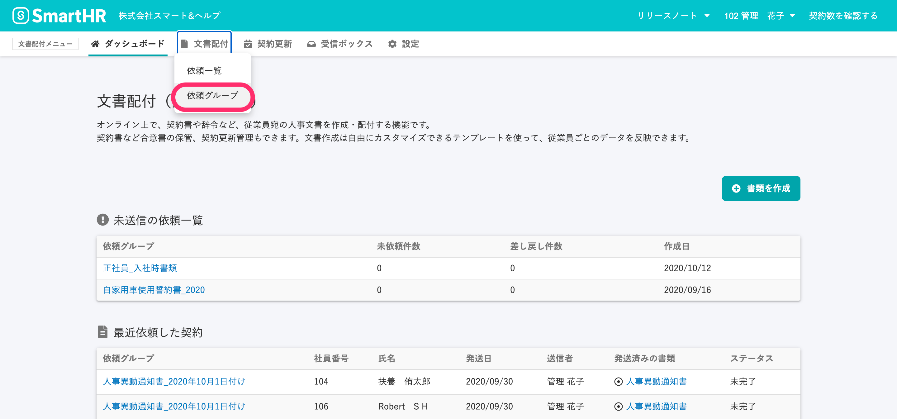
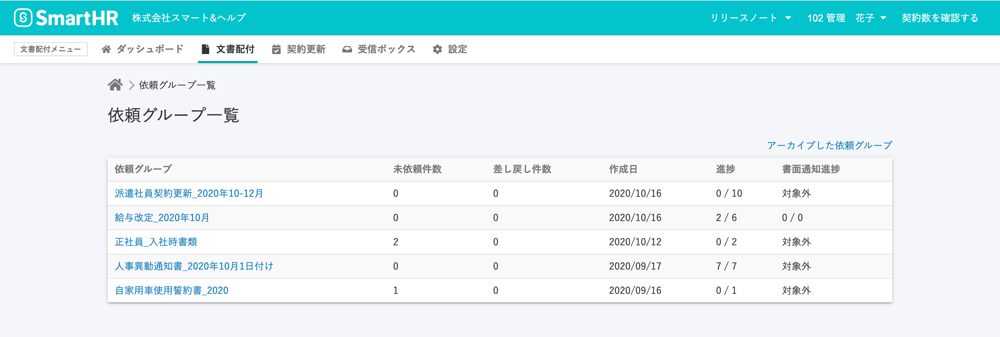
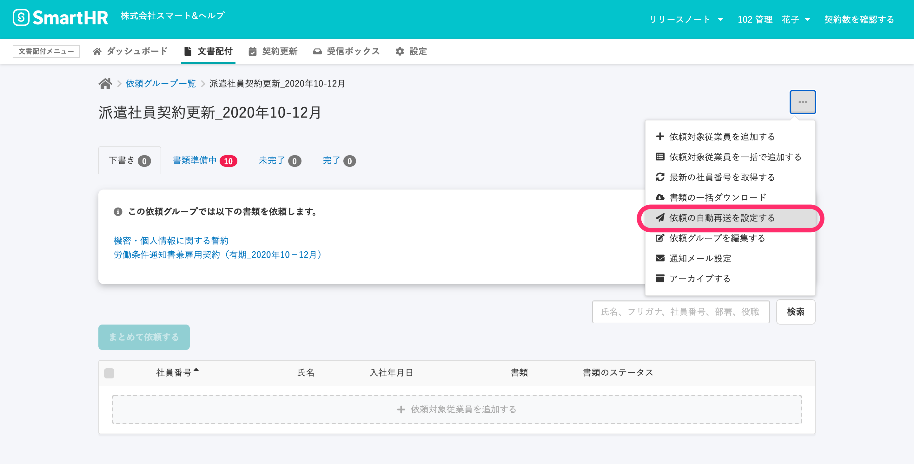
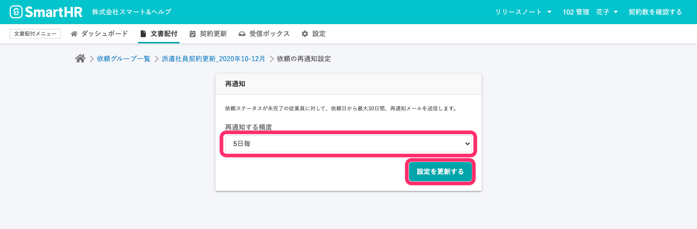
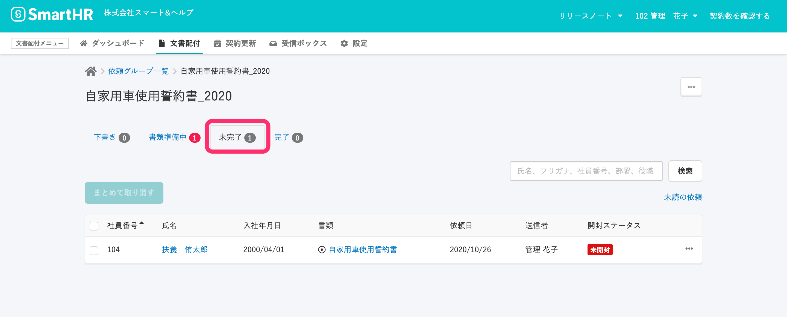
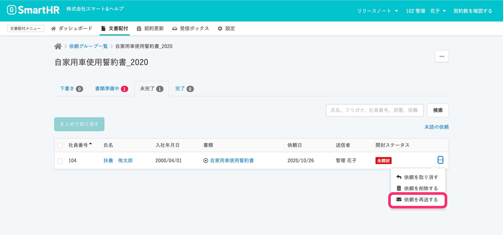

文書配付機能で依頼を送った従業員のうち、操作を完了していない従業員に対して再通知（リマインド）できます。

再通知には2種類あり、それぞれ通知先とタイミングが異なります。

- **依頼グループに対して自動再送を設定する**：再通知の設定は依頼の前後を問わず、いつでも変更可能です。
- **従業員ごとに再通知する：**依頼送信後に再通知を行います。

:::related
[【一覧】文書配付機能の通知メールの内容](https://knowledge.smarthr.jp/hc/ja/articles/360035821993)
[通知メールのフォーマットを作成・編集する](https://knowledge.smarthr.jp/hc/ja/articles/360043502353)
:::

# 依頼グループに対して自動再送を設定する

## 1\. 再通知を設定したい依頼グループの \[依頼グループ詳細画面\] を表示

文書配付メニューの **\[文書配付\]** から **\[依頼グループ\]** をクリックして、**\[依頼グループ一覧\]** へ移動します。

**\[依頼グループ一覧\]** 画面で、依頼の再通知を設定したい依頼グループ名をクリックして、**\[依頼グループ詳細\]** 画面を表示します。

## 2\. \[依頼グループ詳細\] 画面で \[依頼の自動再送を設定する\] をクリック

依頼グループ詳細画面右上のメニューから **\[依頼の自動再送を設定する\]** をクリックすると、 **\[依頼の再通知設定\]** 画面が表示されます。

## 3\. \[再通知する頻度\] を選択し、 \[設定を更新する\] をクリック

**\[依頼の再通知設定\]** 画面で、**\[再通知する頻度\]** をプルダウンリストから選択し、**\[設定を更新する\]** ボタンをクリックすると、再通知が設定されます。

頻度は以下から選べます。

- 1ヵ月後に1度だけ
- 3週間後に1度だけ
- 2週間毎
- 1週間毎
- 5日毎
- 3日毎
- 2日毎
- 1日毎

依頼送信時の設定が **\[設定しない\]** としていた場合でも、後から頻度を設定すると、指定の頻度で再通知可能です。

# 従業員ごとに再通知する

## 1\. \[依頼グループの詳細画面\] の\[未完了\] のリストを表示する

文書配付メニューの **\[文書配付\]** から **\[依頼グループ一覧\]** をクリックして、 **\[依頼グループ一覧\]** へ移動し、依頼の再通知をしたい従業員がいる依頼グループ名をクリックして、**\[依頼グループ詳細\]** 画面を表示します。

**\[依頼グループ詳細\]** 画面で、 **\[未完了\]** タブをクリックして、依頼が未完了の従業員リストを表示します。

## 2\. 再通知したい従業員に対して \[依頼を再送する\] をクリック

再通知したい従業員の行の右端にあるメニュー から **\[依頼を再送する\]** をクリックすると、すぐに従業員に再通知メールが送信されます。

