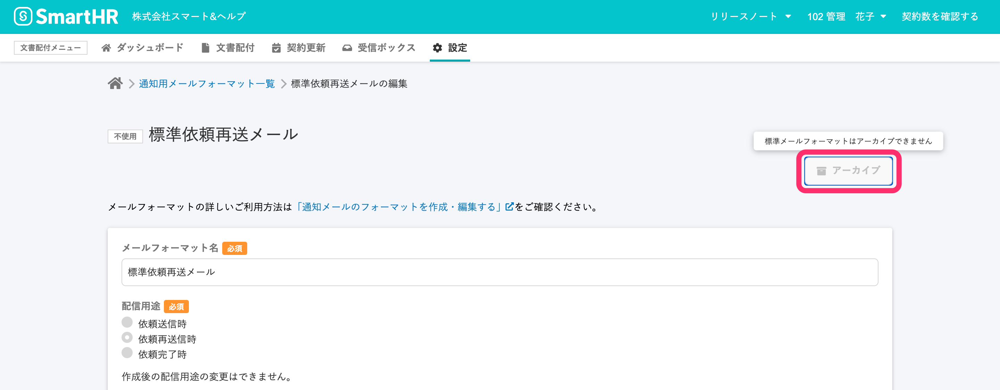

文書配付機能の、依頼送信時・依頼再送信時・依頼完了時に従業員が受け取るメールのフォーマットを作成・編集できます。

登録したメールフォーマットを書類セットや依頼グループごとに設定し、従業員に配信できます。

:::related
[通知メールを書類のセットや依頼グループに紐付ける](https://knowledge.smarthr.jp/hc/ja/articles/360042985914)
:::

# メールフォーマットを作成する

## 1\. \[メールフォーマットの作成\] をクリック

文書配付メニューから **\[設定\]** をクリックし、プルダウンリストにある **\[メールフォーマット\]** をクリックすると、**\[通知用メールフォーマット一覧\]** へ移動します。

**\[通知用メールフォーマット一覧\]** 画面右上の **\[+ メールフォーマットの作成\]** をクリックすると、 **\[メールフォーマットの作成\]** 画面に移動します。

## 2\. メールフォーマット名・配信用途・メール件名・本文を入力し、 \[作成\] をクリック

**\[メールフォーマットの作成\]** 画面で、 **\[メールフォーマット名\]** ・ **\[配信用途\]** ・ **\[メール件名\]** ・ **\[本文\]** を入力します。

画面右下の **\[作成\]** をクリックするとメールフォーマットが登録され、 **\[通知用メールフォーマット一覧\]** 画面に移動します。

## メールフォーマットの設定項目

### メールフォーマット名

管理用のメールフォーマット名です。従業員には表示されません。

### 配信用途

**\[依頼送信時\]** 、 **\[依頼再送信時\]** 、 **\[依頼完了時\]** の、いずれのタイミングの通知メールかを選択します。

配信用途を指定すると、 **\[メール件名\]** と **\[本文\]** にシステム標準メールの件名と本文が自動的に反映されます。

:::related
[【一覧】文書配付機能の通知メールの内容](https://knowledge.smarthr.jp/hc/ja/articles/360035821993)
:::

### メール件名

従業員が受け取るメールの件名です。

### 本文

従業員が受け取るメールの本文です。

送り先の従業員の氏名と依頼した書類の情報は自動で挿入されます。

# メールフォーマットを編集する

## 1\. 編集したいフォーマット名をクリック

**\[通知用メールフォーマット一覧\]** 画面で、編集したいフォーマット名をクリックすると、**\[任意のメールフォーマット名の編集\]** 画面に移動します。

## 2\. 内容を編集し、 \[更新\] をクリック

メールフォーマットの編集画面で、**\[メールフォーマット名\]** ・ **\[メール件名\]** ・ **\[本文\]** を編集します。

:::alert
**\[配信用途\]** は、メールフォーマット作成後は変更できません。
:::

画面右下の **\[更新\]** をクリックするとメールフォーマットが登録され、 **\[通知用メールフォーマット一覧\]** 画面に移動します。

# メールフォーマットをアーカイブする

## 1\. アーカイブしたいフォーマット名をクリック

**\[通知用メールフォーマット一覧\]** 画面で、アーカイブしたいフォーマット名をクリックすると、**\[任意のメールフォーマット名の編集\]** 画面に移動します。

## 2\. メールフォーマット編集画面右上の \[アーカイブ\] をクリック

**\[任意のメールフォーマット名の編集\]** 画面右上にある **\[アーカイブ\]** をクリックすると、フォーマットがアーカイブされ、一覧画面から非表示になります。

:::alert
**\[使用中\]** ならびに、標準メールフォーマットはアーカイブできません。

:::

アーカイブ済みのメールフォーマットを確認したいときは、 **\[通知用メールフォーマット一覧\]** 画面右上にある **\[アーカイブしたメールフォーマットへ移動\]** をクリックしてください。

:::tips
**\[アーカイブした通知用メールフォーマット一覧\]** 画面で、フォーマット名をクリックしてフォーマット編集画面へ移動し、編集画面右上の **\[アーカイブから戻す\]** をクリックすると、再度 **\[通知用メールフォーマット一覧\]** 画面に表示されるようになります。
:::
