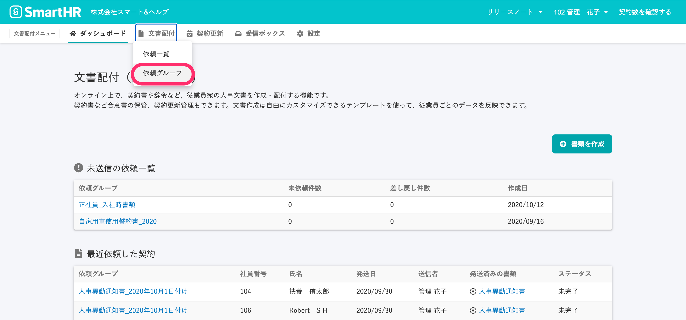

依頼グループ機能を使って、依頼ステータスが **\[完了\]** になった文書を一括ダウンロードできます。

# 1.メニューから \[文書配付\] > \[依頼グループ\] をクリック

文書配付メニューから **\[文書配付\]** をクリックし、プルダウンリストにある **\[依頼グループ\]** をクリックして、**\[依頼グループ一覧\]** へ移動します。

# 2\. \[依頼グループ\] > 対象の依頼グループ名 をクリック

**\[依頼グループ一覧\]** 画面で、ダウンロードしたい書類を使った依頼グループ名をクリックして、**\[依頼グループ詳細\]** 画面を表示します。

# 3\. \[...\] メニュー > \[書類の一括ダウンロード\] をクリック

依頼グループ詳細画面右上のメニューから **\[書類の一括ダウンロード\]** をクリックすると、 **\[一括ダウンロードの予約\]** 画面が表示されます。

# 4\. \[完了\] を選択し、\[予約する\] をクリック

**\[依頼のステータス\]** のプルダウンリストから **\[完了\]** を選択し、 **\[予約する\]** をクリックすると、ダウンロードファイルの作成がはじまります。

# 5\. 時間をおいて、画面を更新する

**\[一括ダウンロード予約\]** 画面の依頼グループ欄に作成予約日時が表示されます。

しばらく経ったら、ブラウザの再読み込みボタンをクリックして、画面を更新してください。

# 6\. \[ダウンロード\] をクリック

ステータスに **\[ダウンロード\]** のリンクが表示されていたら、ダウンロードの準備が完了しています。

 **\[ダウンロード\]** をクリックすると、複数のPDFをまとめたzipファイルのダウンロードが実行されます。

