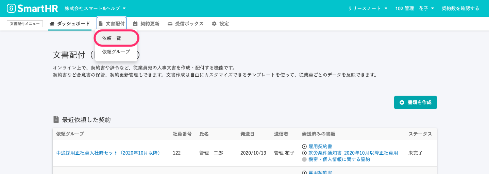
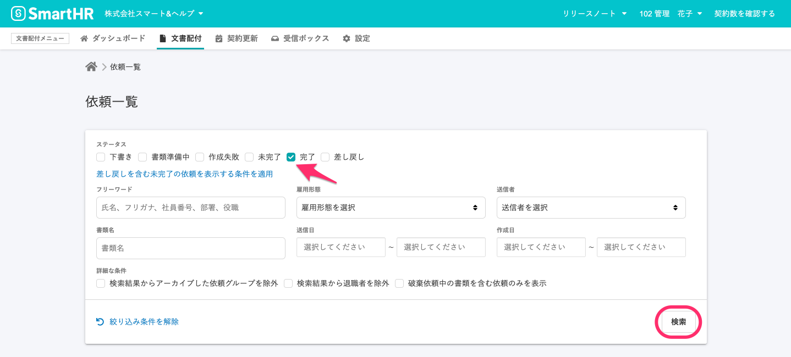
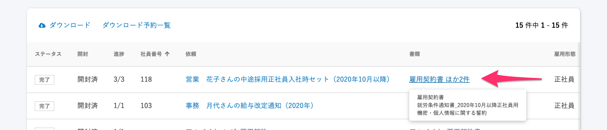
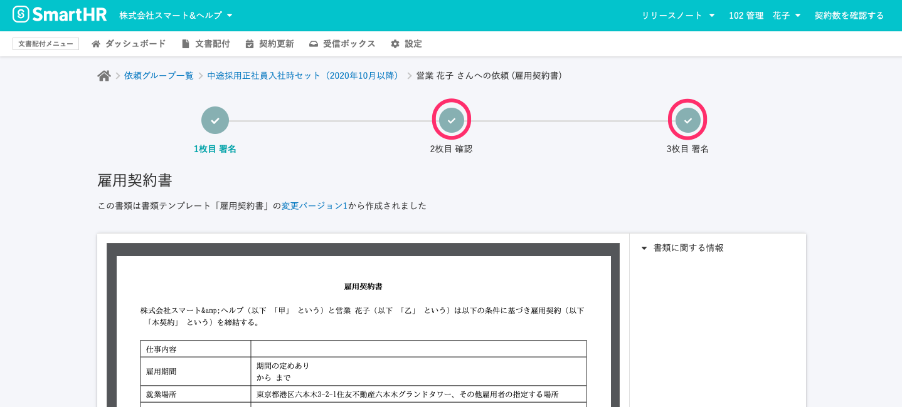
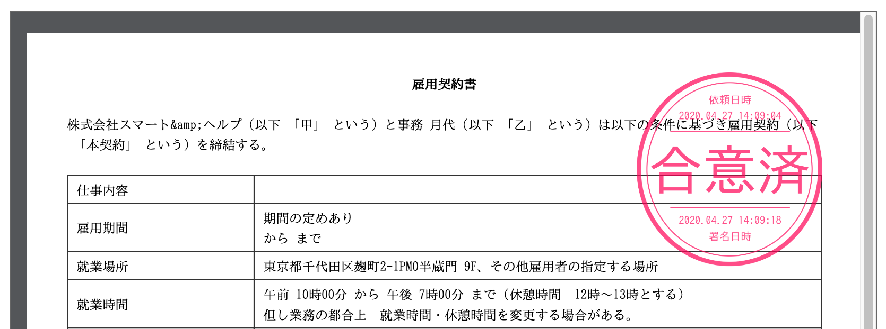
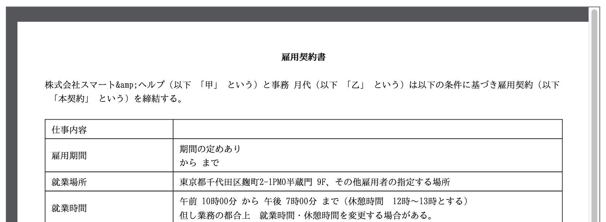

**合意済み書類** のPDFファイルに、**合意済マーク** を表示せずに入手するには、**書類詳細画面** からダウンロードします。

:::alert
[依頼グループから一括ダウンロードした合意済み書類のPDFファイル](https://knowledge.smarthr.jp/hc/ja/articles/360026103674)と、従業員宛の依頼完了通知メールに添付される合意済み書類のPDFファイルには、**合意済マーク** が表示されます。
:::

# 書類詳細画面で \[合意マークを表示する\] のチェックを外して、ダウンロードする

## 1\. 画面上部のメニューから \[依頼一覧\] 画面に移動

文書配付メニューから **\[文書配付\]** をクリックし、プルダウンリストにある **\[依頼一覧\]** をクリックして、 **\[依頼一覧\]** 画面へ移動します。

## 2\. ダウンロードしたい書類を含んだ依頼をクリック

検索パネルで **\[ステータス\]** の項目を **\[完了\]** のみにチェックした状態で **\[検索\]** をクリックして、完了済みの依頼のみを抽出します。

必要に応じて、書類名や従業員氏名などの条件を追加して、検索できます。

依頼一覧の **\[書類\]** の項目の書類名には、依頼に使用した書類のうち1つの名前を表示しています。

カーソルを合わせると詳細を表示します。

ダウンロードしたい書類が含まれている **\[書類名\]** をクリックすると、**書類詳細画面** に移動します。

## 3\. \[合意マークを表示する\] のチェックボックスを確認して、 \[ダウンロード\] をクリックする

書類詳細画面で表示する書類を切り替えるには、画面上部の **\[✓\]** をクリックします。

PDFファイルをダウンロードしたい書類に切り替えます。

画面下の **\[合意マークを表示する\]** のチェックボックスのチェックを外して、 **\[ダウンロード\]** をクリックします。

| \[合意マークを表示する\]　のチェック有 | \[合意マークを表示する\]　のチェック無 |
| --- | --- |
|  |  |
