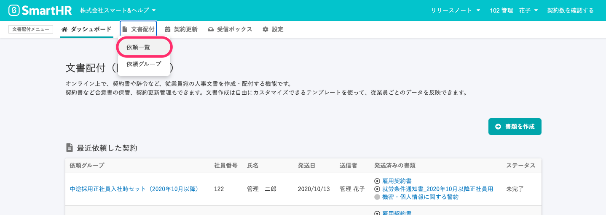
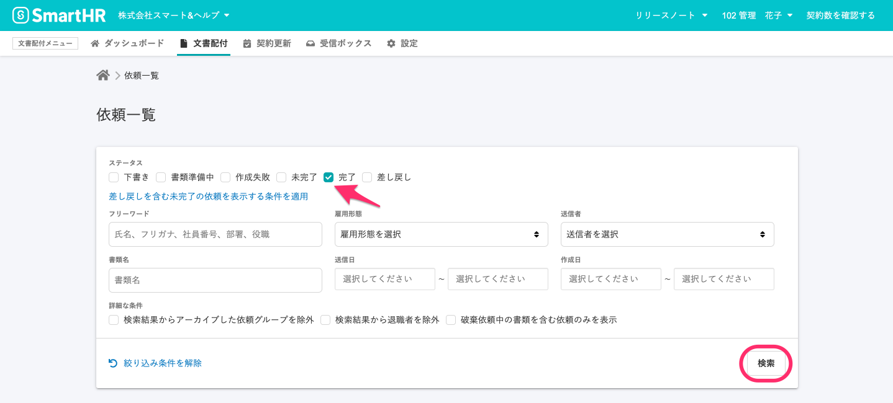
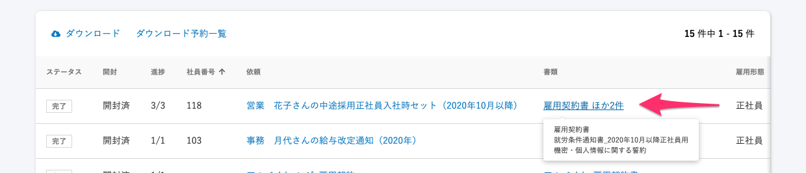
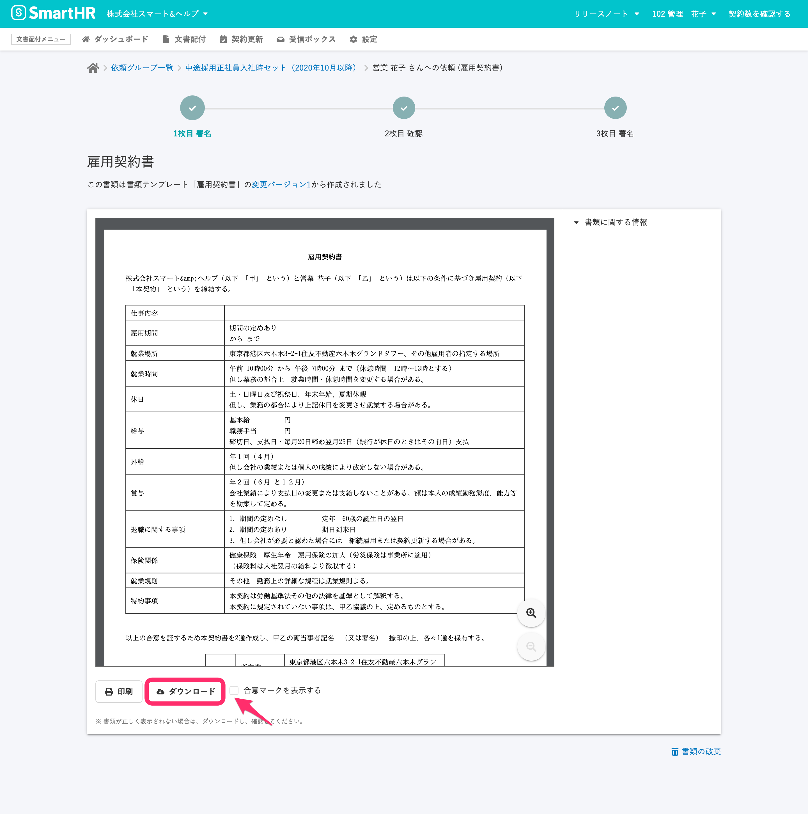

依頼が完了した書類のPDFファイルを、管理者として、**書類詳細画面** から個別ダウンロードする方法を説明します。

PDFファイルは、**依頼グループ画面** から一括ダウンロードもできます。

:::related
[依頼が完了した書類のPDFを一括ダウンロードする](https://knowledge.smarthr.jp/hc/ja/articles/360026103674)
:::

# 1\. 画面上部のメニューから \[依頼一覧\] 画面に移動

文書配付メニューから **\[文書配付\]** をクリックし、プルダウンリストにある **\[依頼一覧\]** をクリックして、 **\[依頼一覧\]** 画面へ移動します。

# 2\. ダウンロードしたい書類を含んだ依頼をクリック

検索パネルで **\[ステータス\]** の項目を **\[完了\]** のみにチェックした状態で **\[検索\]** をクリックして、完了済みの依頼のみを抽出します。

必要に応じて、書類名や従業員氏名などの条件を追加して、検索できます。

依頼一覧の **\[書類\]** の項目の書類名には、依頼に使用した書類のうち1つの名前を表示しています。

カーソルを合わせると詳細を表示します。

ダウンロードしたい書類が含まれている **\[書類名\]** をクリックすると、**書類詳細画面** に移動します。

# 3\. 書類詳細画面で表示する書類を切り替える

依頼時に複数の書類を送付している場合は、 **書類詳細画面** 上部の **\[✓\]** をクリックして、表示する書類を切り替えます。

画面下の **\[ダウンロード\]** をクリックします。

