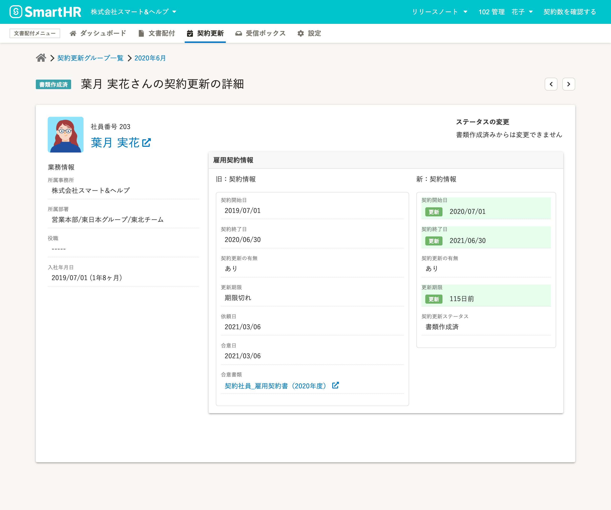
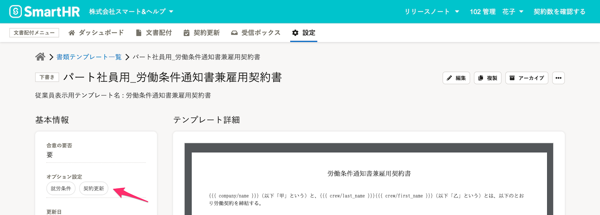
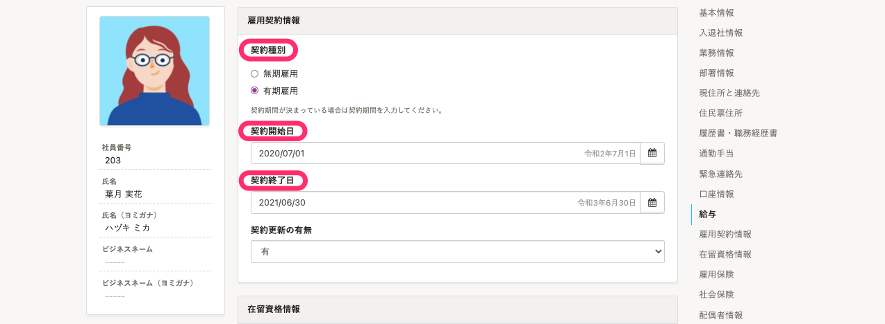
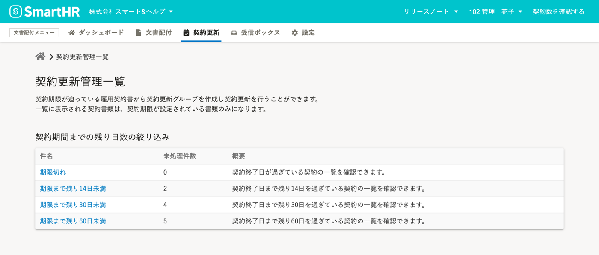
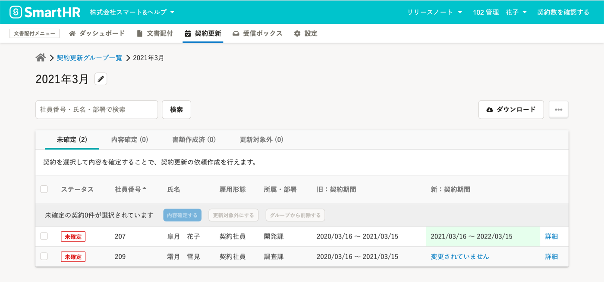

**契約更新管理**とは、有期雇用契約における合意書類の契約期間を把握し、契約更新時期の見落としを防ぎ、必要な契約更新の依頼を作成する機能です。

# 初回の契約時にすること

## 1\. 書類テンプレートを作成し、契約更新管理を設定する

契約更新管理に使用する **書類テンプレート** を作成し、契約更新管理を有効化します。

:::related
[書類テンプレートに契約更新管理を設定する](https://knowledge.smarthr.jp/hc/ja/articles/360036496394)
:::

## 2\. 依頼先従業員の［雇用契約情報］をSmartHRの従業員情報に登録する

SmartHRの従業員情報で、 **［雇用契約情報］** の項目グループの中にある、 **［契約種別］** を「有期雇用」とし、 **［契約開始日］** と **［契約終了日］** を登録しておきます。

ここでの操作をスキップし、従業員との合意後に［契約更新管理項目］を登録することも可能です。

:::related
[従業員情報を追加・登録する](https://knowledge.smarthr.jp/hc/ja/articles/360026266493)
[契約更新管理を有効にした書類に、自動的に契約更新管理項目を登録する](https://knowledge.smarthr.jp/hc/ja/articles/900005768523)
:::

## 3\. 従業員に依頼を送信する

契約更新設定を有効にした書類テンプレートを使って、依頼を送信します。

[従業員に依頼を送信する](https://knowledge.smarthr.jp/hc/ja/articles/360026105334)

## 4\. 契約更新管理項目を確認、登録する

合意済み書類詳細画面で  **［契約更新管理項目］** を確認します。

登録できていない場合は、 **［契約管理項目］** を登録します。

:::related
[合意済み書類に契約更新管理項目を登録する](https://knowledge.smarthr.jp/hc/ja/articles/900004817206)
[合意済み書類に契約更新管理項目を一括登録する](https://knowledge.smarthr.jp/hc/ja/articles/360036501574)
:::

# 契約更新時にすること

## 1\. 契約更新管理一覧画面で契約期間までの残り日数を確認

文書配布メニューの **［契約更新］** から **［契約更新管理］** をクリックすると、 **［契約期限管理一覧］** が表示され、契約終了日が近い契約を確認できます。

## 2\. ［契約更新グループ］を作成する

 **［契約更新グループ］** に契約更新が必要な従業員を追加することで、まとめて更新処理ができます。

## 3\. 契約更新グループから依頼を作成

:::related
[契約更新管理機能を使って、契約更新の依頼をする](https://knowledge.smarthr.jp/hc/ja/articles/360037164034)
:::
