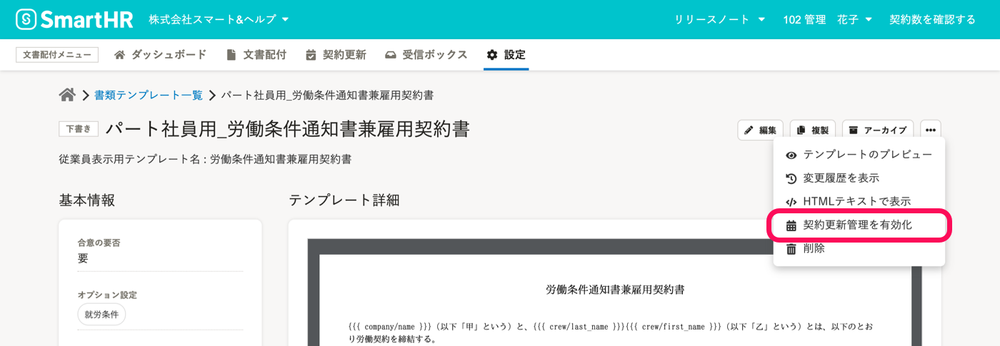
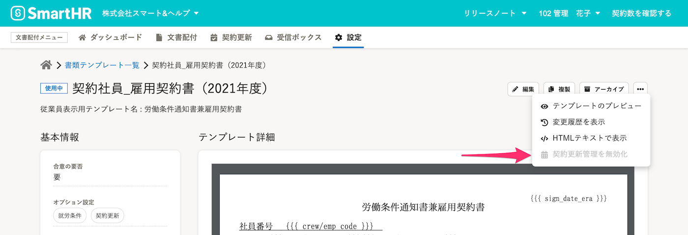

ここでは、書類テンプレートにオプション設定 **［契約更新］** を適用する手順を説明します。

# 1\. 契約更新管理に使用する書類テンプレートを作成

文書配付メニューの **［設定］** から **［書類テンプレート］** をクリックして、 **書類テンプレート一覧** に移動します。

 **［＋テンプレートの作成］** から、**書類テンプレート** を登録します。

:::related
[書類テンプレートを作成する](https://knowledge.smarthr.jp/hc/ja/articles/360026263953)
:::

# 2\. \[契約更新管理を有効にする\] をクリック

書類テンプレート一覧画面で、契約更新管理を使用したい書類テンプレートの  **［テンプレート名］**  をクリックして、 **書類テンプレート詳細** に移動します。

書類テンプレート詳細画面右上の［…］メニューから **［ 契約更新管理を有効化］** をクリックして、契約更新管理を有効化します。

 **［オプション設定］** に **［契約更新］** が追加されます。

:::tips
### 書類テンプレートから作成された書類が合意されると、設定は無効化できなくなります。
書類テンプレートから作成した書類に従業員が合意し、書類ステータスが **［完了］** になると、契約更新管理の無効化はできません。

:::
