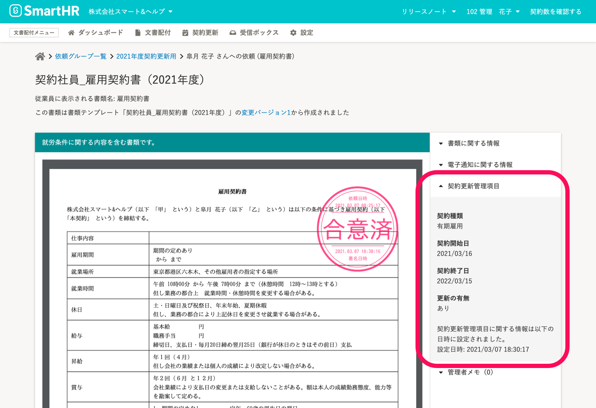

契約更新管理機能を利用するには、合意済み書類に契約更新項目を登録しておく必要があります。

ここでは、従業員に書類を送信する前に **従業員情報** を登録しておいて、**契約更新管理項目を自動的に適用する** 手順を説明します。

# 1\. 依頼先従業員の［雇用契約情報］をSmartHRの従業員情報に登録する

SmartHRの従業員情報で、 **［雇用契約情報］** の項目グループの中にある、 **［契約種別］** を「有期雇用」とし、 **［契約開始日］** と **［契約終了日］** を登録しておきます。

:::related
[従業員情報を追加・登録する](https://knowledge.smarthr.jp/hc/ja/articles/360026266493)
:::

# 2\. 契約更新管理を有効にした書類テンプレートを使って依頼を送信する

契約更新管理を有効にしたテンプレートを使って **書類セット** を作成し、依頼を行ってください。

:::related
[書類テンプレートに契約更新管理を設定する](https://knowledge.smarthr.jp/hc/ja/articles/360036496394)
[書類セットを作成する](https://knowledge.smarthr.jp/hc/ja/articles/360026263933)
[従業員に依頼を送信する](https://knowledge.smarthr.jp/hc/ja/articles/360026105334)
:::

# 3\. 合意済み書類の［契約更新管理項目］を確認

合意済み書類詳細画面右側にある  **［▼契約更新管理項目］** をクリックすると、情報を確認できます。

:::alert
登録した契約管理項目は、変更できません。
契約管理項目を変更する場合は、合意済みの書類を破棄の上、再度、書類への合意の依頼からやり直してください。
[合意済み書類を破棄する](https://knowledge.smarthr.jp/hc/ja/articles/360046547474)
:::
