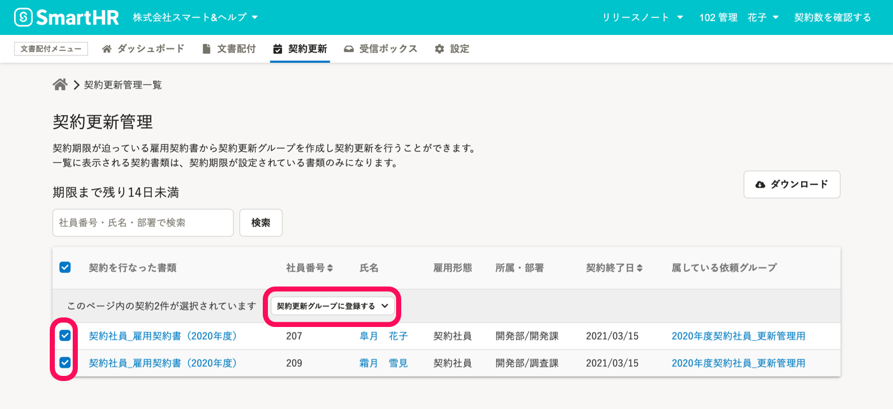

契約更新管理とは、有期雇用契約における合意書類の契約期間を把握し、契約更新時期の見落としを防ぎ、必要な契約更新の依頼を作成する機能です。

:::alert
この機能を活用するには、書類テンプレートへの契約更新管理の設定や、合意書類に対する契約更新項目の管理が必要です。
詳しくは下記のページをご覧ください。
[契約更新管理機能とは](https://knowledge.smarthr.jp/hc/ja/articles/900004817086)
:::

# 1\. 契約更新グループに追加する

文書配布メニューの  **［契約更新］**  から  **［契約更新管理］**  をクリックして **契約期限管理一覧** 画面を表示します。

 **［件名］** のリンクをクリックして、期限が迫っている合意済みの契約の一覧を表示します。

契約更新が必要な契約を選択し、  **［契約更新グループに登録する］** をクリックすると、契約更新グループの追加パネルが表示されます。

グループ名を選んで **［登録する］** をクリックすると、 契約更新グループに追加されます。

:::tips
契約更新グループは、上記画面で表示されたパネル上でそのまま新規作成し、選択することもできます。

また、**契約更新グループ** 画面にある **［＋新しく契約更新グループを作成する］** からの新規作成も可能です。

:::

# 2.［雇用契約情報］を更新する

更新処理をするには、まず従業員の雇用契約情報を更新する必要があります。

従業員情報の雇用契約情報の登録内容が更新されていない場合、**契約更新グループ** 画面の **［新：契約期間］** の列に  **［変更されていません］** と表示されます。

 **［変更されていません］** をクリックして、**従業員情報** 画面の［ **雇用契約情報］** 項目へ移動し、従業員項目を更新します。

:::related
[従業員情報を個別に更新する](https://knowledge.smarthr.jp/hc/ja/articles/360036957193)
[複数の従業員情報・家族情報を一括で更新する](https://knowledge.smarthr.jp/hc/ja/articles/360026265333)
:::

雇用契約情報を更新すると、**契約更新グループ** 画面の **［新：契約期間］** に情報が反映されます。

 **［詳細］** をクリックすると表示される、**従業員ごとの契約更新の詳細** 画面でも、契約情報を確認できます。

# 3\. 契約更新をする契約を選択し、［内容確定する］をクリック

**契約更新グループ詳細** 画面で、 **［新：契約期間］** の情報が正しいことを確認したら、表の左側にあるチェックボックスにチェックを入れ、 **［内容確定する］** をクリックします。

 **［内容確定］** タブに移動すると、ステータスを変更した契約を確認できます。

# 4.［契約更新の依頼を作成する］をクリック

**契約更新グループ詳細** 画面の **［内容確定］** タブをクリックし画面を切り替えます。

表の左側にあるチェックボックスにチェックを入れて **［契約更新の依頼を作成する］** をクリックすると、書類セットの選択パネルが表示されます。

書類セットを選んで、 **［依頼を作成する］** をクリックすると、**依頼グループ詳細** 画面へ移動して、通常と同じ手順で従業員に依頼を送信できます。

依頼グループ名は書類セットの名前が使用されます。

必要に応じて、依頼グループ詳細画面のメニューから変更してください。

:::related
[従業員へ文書配付をする](https://knowledge.smarthr.jp/hc/ja/articles/360026105334)
:::

## 契約更新グループ内のステータスの意味

| **ステータス** | **説明** |
| --- | --- |
| 未確定 |   新しい契約内容の変更が必要です。   |
| 内容確定 |   新しい契約内容が確定している状態です。  ステータスを「未確定」に戻すことができます。   |
| 書類作成済み |   既に書類が作成されている状態です。   |
| 更新対象外 | 契約更新対象外の場合に利用します。 |

:::tips
ステータスの変更は一括取消しが可能です。
該当の契約更新グループから **\[…\] > 一括操作ログ** を選択して、取り消してください。

※ 直近の一括操作のみ取り消すことが可能です。ただし、依頼送信や合意済みの場合は取り消すことができません。
:::
