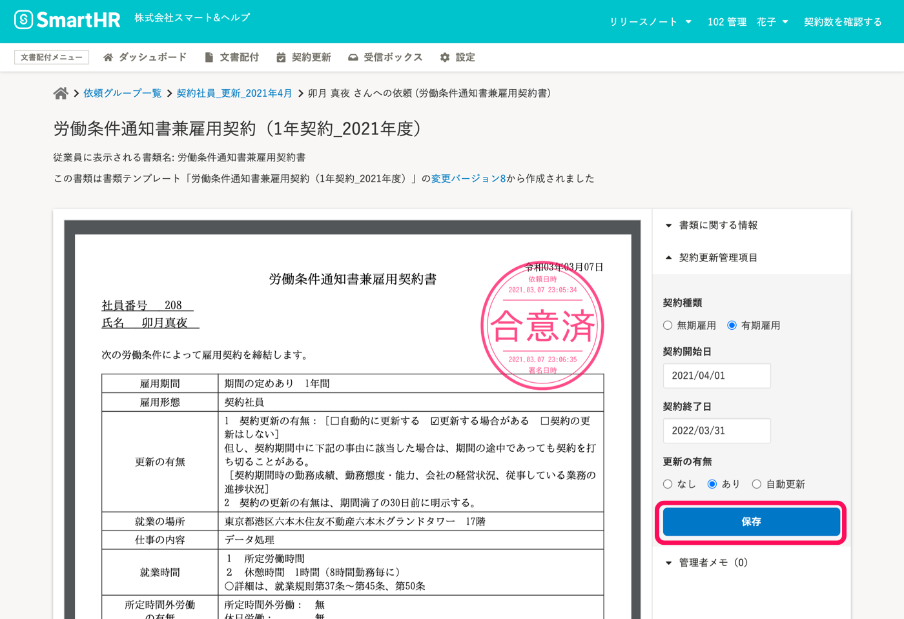
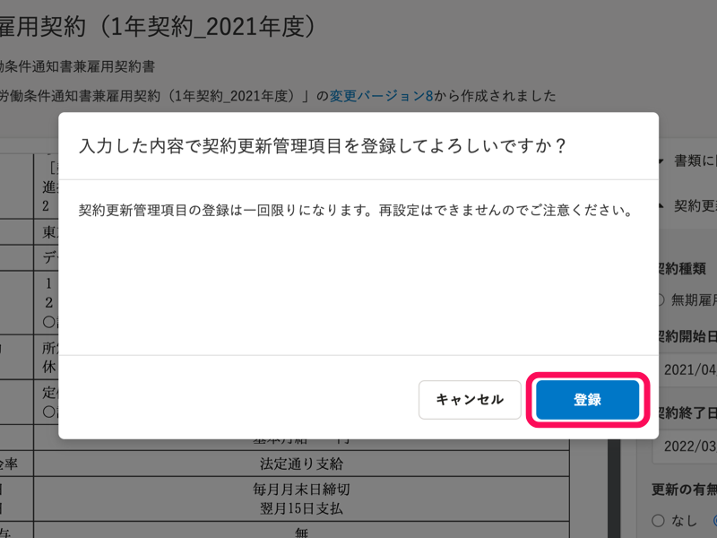

契約更新管理機能を利用するには、合意済み書類に **［契約更新管理項目］** を登録しておく必要があります。

ここでは、合意済み書類に対して、契約更新管理項目を個別に登録する方法を説明します。

# 契約管理項目が未登録になるケース

契約更新管理が設定された書類テンプレートを使った場合でも、従業員情報の **［雇用契約情報］** が未登録の従業員との合意書類には、契約更新管理項目が保存されません。

:::related
[書類テンプレートに契約更新管理を設定する](https://knowledge.smarthr.jp/hc/ja/articles/360036496394)
[契約更新管理を有効にした書類に、自動的に契約更新管理項目を登録する](https://knowledge.smarthr.jp/hc/ja/articles/900005768523)
[合意済み書類に契約更新管理項目を一括登録する](https://knowledge.smarthr.jp/hc/ja/articles/360036501574)
:::

# 1\. 合意済み書類詳細画面を表示する

文書配付メニューの **［文書配付］** から **［依頼一覧］** をクリックして、 **依頼一覧** に移動します。

依頼一覧の **［書類］**  の項目から、契約更新管理をする合意済み書類をクリックして、 **合意済み書類詳細** に移動します。

書類詳細画面は、 **［ダッシュボード］** の **［最近送信した依頼］** の **［送信済みの書類］** からも表示できます。

# 2\. ［▼契約更新管理項目］をクリック

合意済み書類詳細画面右側にある  **［▼契約更新管理項目］** をクリックして、設定画面を開きます。

# 3\. 項目を入力し、［保存］をクリック

 **［契約種類］** 項目で **［有期雇用］** を選択すると、 **［契約開始日］** 、 **「契約終了日］** 、 **［更新の有無］** の項目が表示されます。

それぞれの項目を入力し、 **［保存］** をクリックすると、確認画面が表示されます。

 **［登録］** をクリックすると、 **［契約更新管理項目］** が保存されます。

:::alert
登録した契約更新管理項目は、変更できません。
契約更新管理項目を変更する場合は、合意済みの書類を破棄の上、再度、書類への合意の依頼からやり直してください。
[合意済み書類を破棄する](https://knowledge.smarthr.jp/hc/ja/articles/360046547474)
:::
