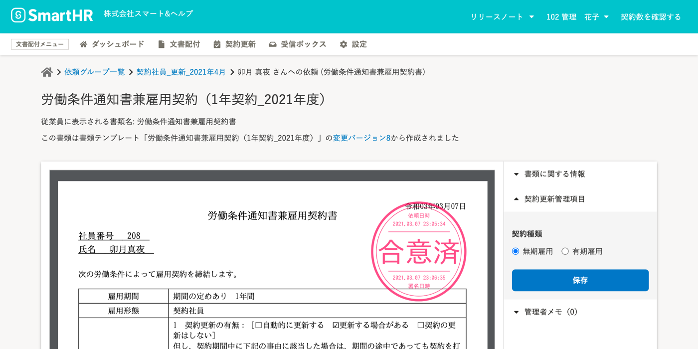
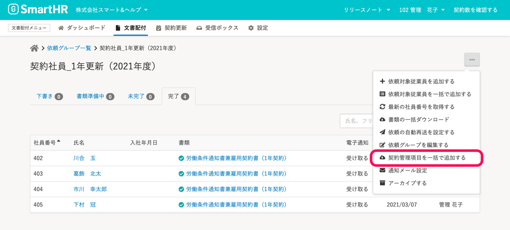
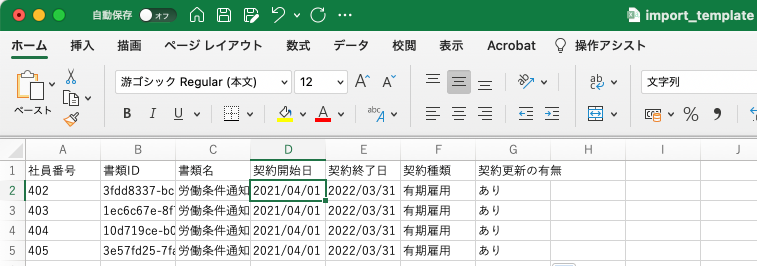

契約更新管理機能を利用するには、合意済み書類に **［契約更新管理項目］** を登録しておく必要があります。

ここでは、**同じ依頼グループにある複数の合意済み書類** に対して、契約更新管理項目を一括登録する方法を説明します。

# 契約管理項目が未登録になるケース

契約更新管理が設定された書類テンプレートを使った場合でも、従業員情報の **［雇用契約情報］** が未登録の従業員との合意書類には、契約更新管理項目が保存されません。

:::related
[書類テンプレートに契約更新管理を設定する](https://knowledge.smarthr.jp/hc/ja/articles/360036496394)
[契約更新管理を有効にした書類に、自動的に契約更新管理項目を登録する](https://knowledge.smarthr.jp/hc/ja/articles/900005768523)
[合意済み書類に契約更新管理項目を登録する](https://knowledge.smarthr.jp/hc/ja/articles/900004817206)
:::

# 1\. 依頼グループ詳細画面を表示する

文書配付メニューの **［文書配付］** から **［依頼グループ］** をクリックして、 **依頼グループ一覧** に移動します。

依頼グループ一覧画面で、契約更新管理をする合意済み書類を管理する  **［依頼グループ］**  をクリックして、 **依頼グループ詳細** に移動します。

# 2.［契約管理項目を一括で追加する］をクリック

依頼グループ詳細画面右上にある［...］メニューから **［契約管理項目を一括追加する］** をクリックすると、 **契約管理項目の一括登録** 画面が表示されます。 

# 3\. CSVファイルに契約管理項目を入力する

契約管理項目の一括登録画面で、 **［ファイルをダウンロード］**  をクリックし、一括登録用のCSVファイルをダウンロードします。

ダウンロードしたCSVファイルに、契約管理項目を入力します。

### CSVファイルから登録できる契約管理項目

| 項目名 |   フォーマットに 記入済み   | 必須 | 説明・記入例 |
| --- | --- | --- | --- |
| 社員番号 | ◯ |   |   |
| 書類ID | ◯ | ◯ | **ダウンロードしたCSVファイルに記載されている文字列を変更しないでください** |
| 書類名 | ◯ |   |   |
| 契約開始日 |   |   | （例）2019/10/09 |
| 契約終了日 |   |   | （例）2019/10/09 |
| 契約種類  |   | ◯ | **有期雇用** または、 **無期雇用** |
| 契約更新の有無 |    |   ◯   |   **あり** ・ **自動更新** ・ **なし**　のいずれか   |

:::alert
- **書類ID** をキーに情報を取り込みます。
- 一度登録すると変更・更新はできませんのでご注意ください。
- 必須カラム以外は空欄でも構いませんが、CSVから削除するとエラーになります。
:::

# 4\. CSVファイルをアップロードする

契約管理項目の一括登録画面で、  **［ファイルをアップロード］** をクリックして、CSVファイルを選択します。

ファイルを選択し終えたら  **［一括登録を行なう］** をクリックします。

契約管理項目の一括登録画面の下部にある **［実行結果一覧］** にアップロードの結果が表示されます。

:::alert
登録した契約更新管理項目は、変更できません。
契約更新管理項目を変更する場合は、合意済みの書類を破棄の上、再度、書類への合意の依頼からやり直してください。
[合意済み書類を破棄する](https://knowledge.smarthr.jp/hc/ja/articles/360046547474)
:::
