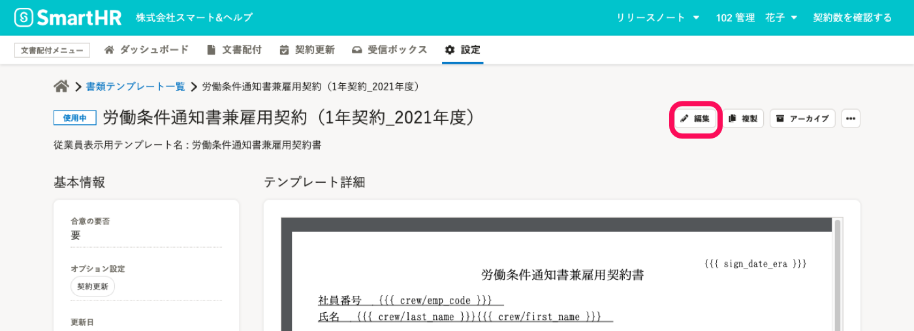
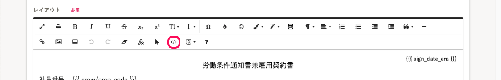
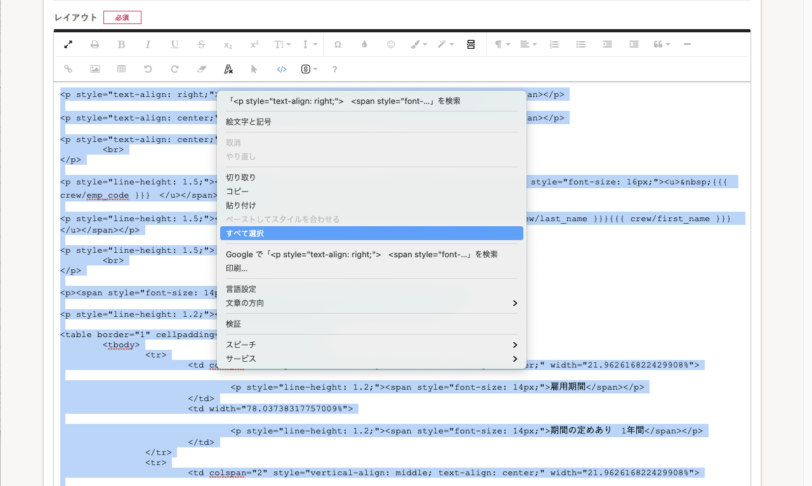

# HTMLタグ表示を使用してコピー＆ペーストしてください。

グループ企業はじめ、複数の企業アカウントを使って文書配付機能を利用している場合の書類テンプレートの複製方法を紹介します。

書類テンプレート編集画面でレイアウトエリア上で全選択してコピーし、別の企業アカウントの編集画面でペーストしても、書式が保持されません。

HTMLタグ表示画面上でのコピー＆ペーストを推奨しています。

## 1\. 書類テンプレート詳細画面で［  編集］をクリック

書類テンプレート一覧画面で複製したいテンプレートを選んで詳細画面を表示し、右上の **［  編集］** をクリックし、書類テンプレート編集画面を表示します。

## 2\. ツールバーの ［  ］ アイコンをクリックして、HTMLタグ表示に切り替える

書類テンプレート編集画面で、レイアウトエリアのツールバーの   **アイコン**をクリックして、 **HTMLタグ表示** に切り替えます。

## 3\. HTMLの内容をすべて選択しコピーする

レイアウト画面に表示された内容を **すべて選択** して、コピーしてください。

コピーした内容は、テキストエディタ、メモ帳などにプレーンテキストとしてコピーしておくことをおすすめします。

## 4\. 複製先のテンプレート作成画面でコピーした内容をペーストする

複製先の企業アカウントでSmartHRにログインし、書類テンプレート作成・編集画面を表示します。

レイアウトを **HTMLタグ表示** にして、3 でコピーした内容をすべてペーストしてください。

:::related
[書類テンプレートを作成する](https://knowledge.smarthr.jp/hc/ja/articles/360026263953)
[書類テンプレートをHTMLで編集する](https://knowledge.smarthr.jp/hc/ja/articles/360037608913)
:::

# システム従業員項目以外のテンプレート変数を使用している場合

:::alert
システム標準項目以外のテンプレート変数は、企業アカウント間では共有できません。
カスタム項目をテンプレート変数で挿入している場合は、テンプレート変数を挿入し直す必要があります。
:::

テンプレート変数で挿入できるシステム標準項目は、 [【一覧】書類テンプレートに挿入できるシステム標準項目](https://knowledge.smarthr.jp/hc/ja/articles/360061384674) で確認してください。

:::related
[SmartHRの従業員項目を書類テンプレートに挿入する](https://knowledge.smarthr.jp/hc/ja/articles/360036818773)
:::
