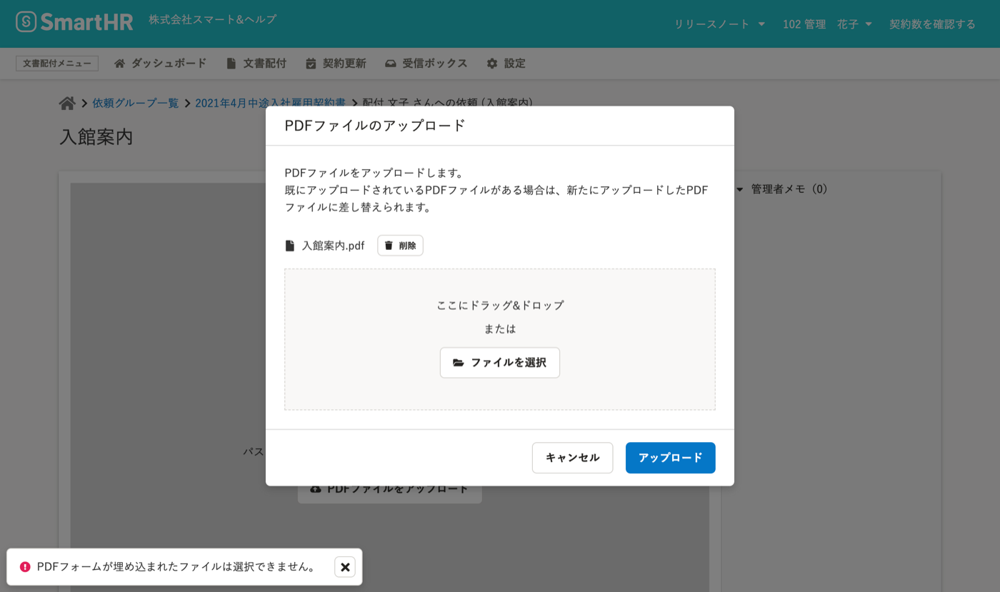

# A.テキスト・画像以外の情報(音声・動画・フォーム・注釈等)を含むPDFファイルはアップロードできません

一部のPDFファイルは、文書配付機能で利用できません。

エラーメッセージが表示された場合は、PDFファイルを作成し直してください。

## PDF書類として送信できないPDFファイル

- ファイルサイズが5MBを超えるPDFファイル
    
- 暗号化されたPDFファイル
    
- 電子署名が付与されたPDFファイル
    
- テキスト・画像以外の情報(音声・動画・フォーム・注釈等)を含むPDFファイル
