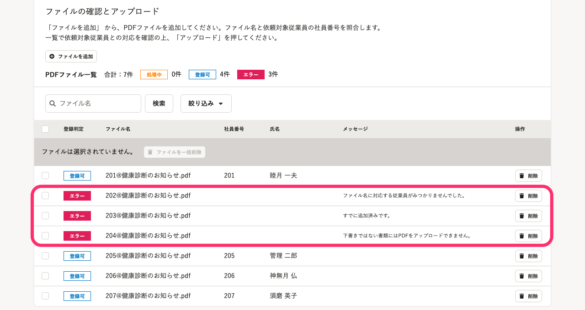

# A. エラーメッセージの内容に応じて、依頼対象従業員の確認や、正しいファイルを再度アップロードしてください。

:::alert
登録ファイル一覧にエラーが表示されている画面を再読み込みすると、エラーの表示が消えるので注意してください。
:::

別々のPDFファイルの一括アップロード画面で、登録ファイル一覧にPDFファイルを追加しようとした時にエラーになることがあります。

ここでは、エラーメッセージの内容と対応方法を紹介します。

## 表示されるエラーメッセージと対応方法

### すでに追加済みです。

登録ファイル一覧に、すでにPDFファイルが追加されている場合に表示されます。

### ファイル名に対応する従業員がみつかりません。

依頼グループの依頼対象従業員の中に、ファイル名で指定した社員番号の従業員が含まれいない場合に表示されます。依頼グループで依頼対象従業員が追加されているか確認してください。

もしくは、ファイル名に社員番号が含まれていない場合に表示されます。

### 下書きではない書類にはPDFをアップロードできません。

下書き状態ではない書類（依頼送信済み）に対してファイルを追加しようとした場合に表示されます。依頼グループの下書きタブ以外に依頼対象従業員が移動していないか確認してください。

### 追加先の書類がまだ作成されていません。

依頼グループに依頼対象従業員の追加処理が終わっていない場合に表示されます。依頼グループの依頼一覧で［書類のステータス］が「書類を作成中。」になっている状態です。

書類のステータスが「PDFファイルがアップロードされていません。」に変わってからファイルをアップロードしてください。

## エラーファイルを削除したい場合

エラーファイルを削除したい場合は、下記のヘルプページをご確認ください。

:::related
[PDF書類にPDFファイルをまとめてアップロードする](https://knowledge.smarthr.jp/hc/ja/articles/4402741674393)
:::
