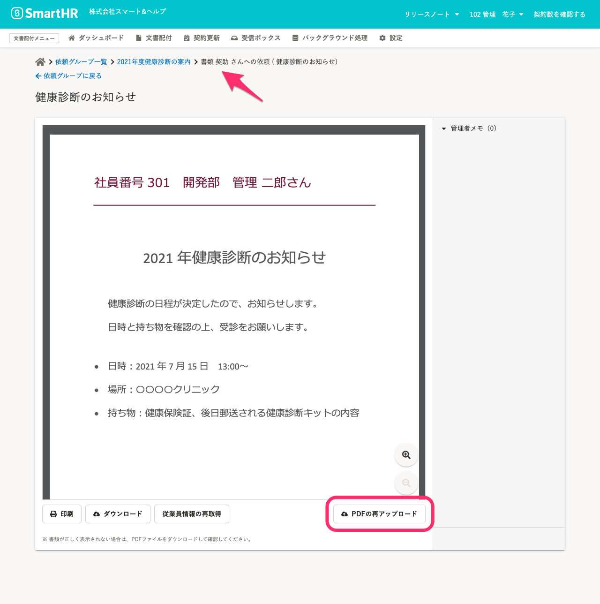
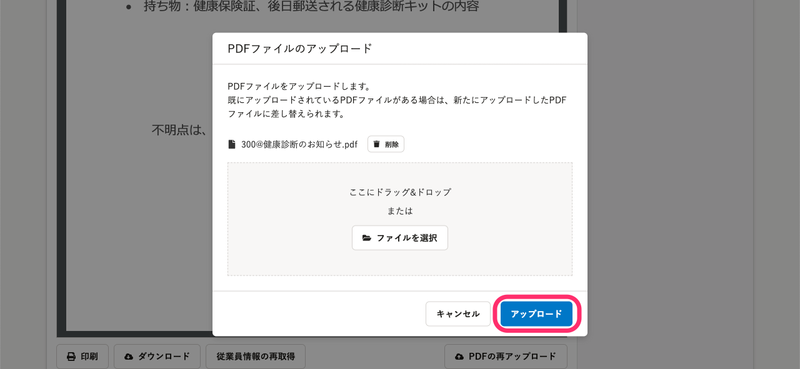
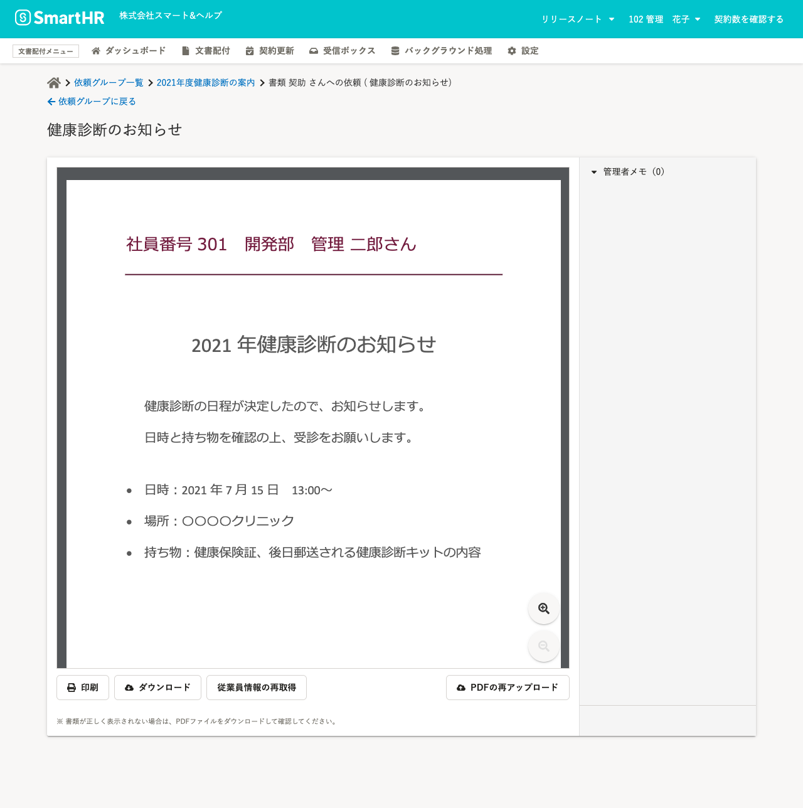
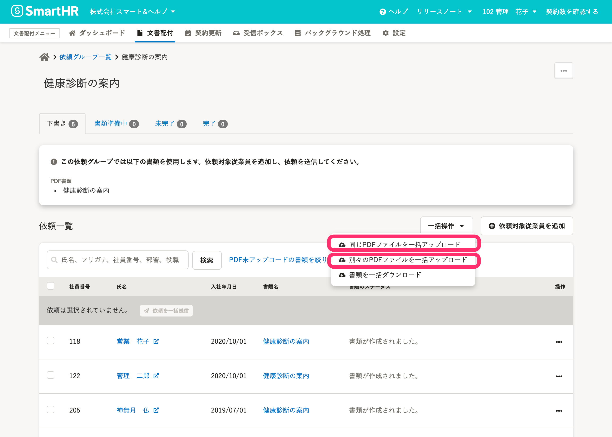

# A. PDFファイルをアップロードし直してください。

PDF書類にPDFファイルを一括アップロードした際に、間違いがあった場合はPDFファイルを再アップロードしてください。

## PDFファイルを個別にアップロードし直す場合

### 書類のプレビュー画面の［ PDFの再アップロード］をクリック

依頼グループの依頼一覧から書類名をクリックし、従業員ごとの配付書類のプレビュー画面を表示します。

依頼対象従業員の氏名は、画面上部に表示されています。

内容に誤りがある場合には、画面右下の **［ PDFの再アップロード］** をクリックします。

PDFファイルのアップロード画面で、差し替えたいファイルを選択し、 **［アップロード］** をクリックします。

アップロードしたファイルがプレビューで表示されます。

## 複数のPDFファイルをアップロードし直す場合

### 依頼グループ画面の［ 同じPDFファイルを一括アップロード］または、［ 別々のPDFファイルを一括アップロード］をクリック

グループ内のすべての依頼先に同じPDFファイルを差し替えたい場合は、 **［ 同じPDFファイルを一括アップロード］** からアップロードし直します。

別々のPDFファイルを差し替えたい場合は、依頼グループ画面の依頼一覧の右上にある **［一括操作］** から **［ 別々のPDFファイルを一括アップロード］** をクリックして、差し替えたいPDFファイルだけをアップロードし直します。

:::related
[PDF書類にPDFファイルをまとめてアップロードする](https://knowledge.smarthr.jp/hc/ja/articles/4402741674393)
:::
