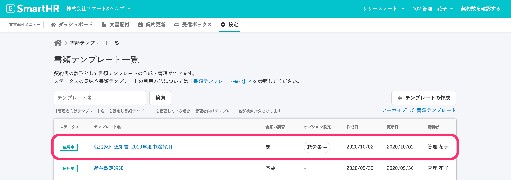
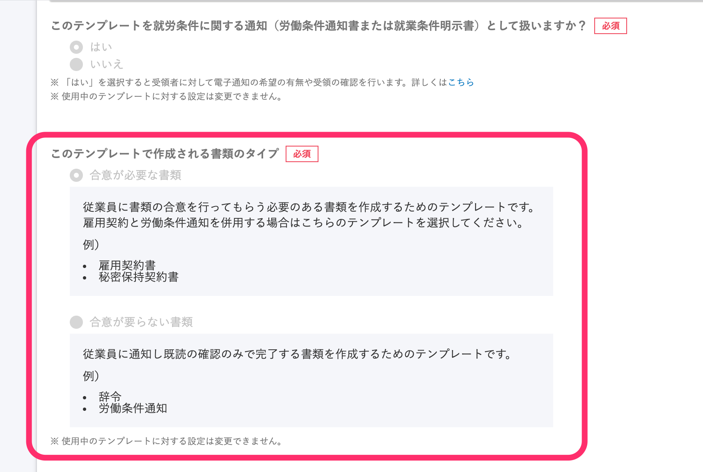
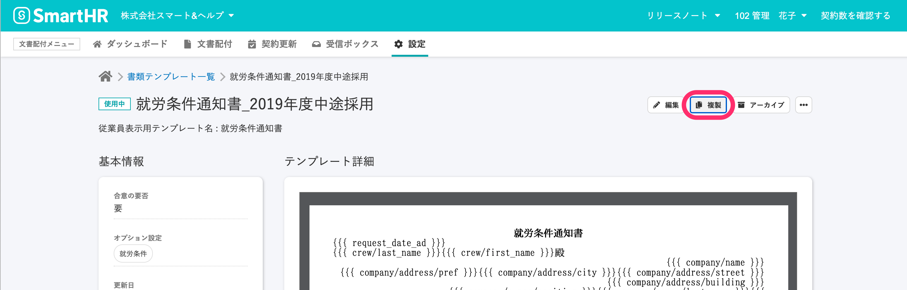
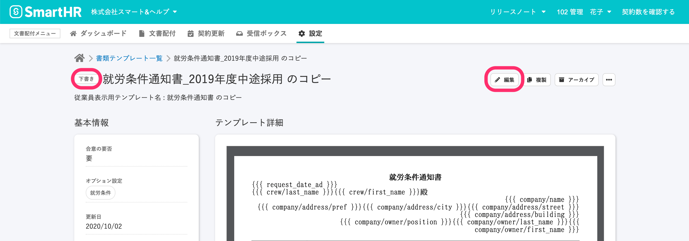
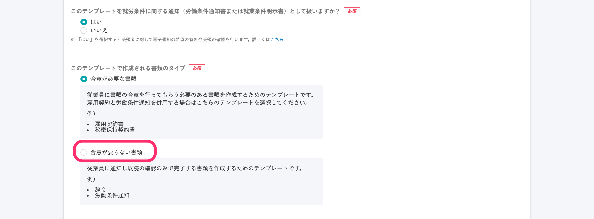

# できません。ただし、複製したものの変更は可能です。

使用中の書類テンプレートは、「**合意が必要な書類**」か、「**合意が要らない書類**」かを設定する **\[書類のタイプ\]** の変更ができません。

書類の内容や書式を保持したまま書類タイプを変更したい場合は、下記手順で書類テンプレートの複製機能を利用してください。

## 1\. 書類テンプレート詳細画面で \[複製\] をクリック

書類タイプを変更したい書類テンプレートの詳細画面を表示し、右上の **\[複製\]** ボタンをクリックして、テンプレートをコピーします。

## 2\. 複製したテンプレートの詳細画面を開き、 \[編集\] 画面から設定

複製して作られたテンプレートのステータスは **\[下書き\]** となり、書類タイプの変更ができるようになります。

複製したテンプレートの詳細画面右上の **\[編集\]** ボタンをクリックして、編集画面を開きます。

編集画面で **\[このテンプレートで作成される書類のタイプ\]** の設定を **\[合意が要らない書類\]** に変更します。

画面を下にスクロールして、 **\[更新\]** ボタンをクリックすると、設定変更が適用されます。

