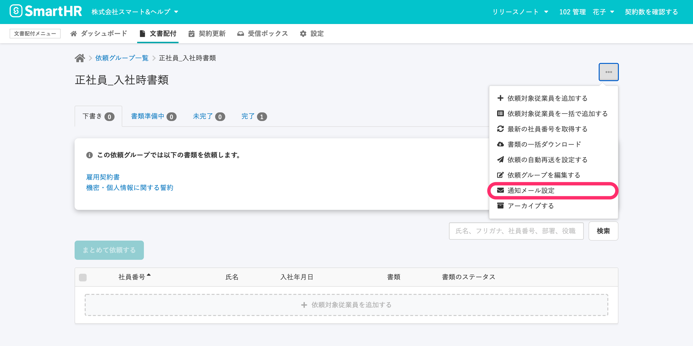

# 依頼グループの \[通知メール設定\] から編集してください

既存の依頼グループの通知メールの設定は、依頼グループで使用中の書類のセットに紐付けるメールフォーマットを変更しても、更新されません。

すでにある依頼グループの通知メールは、**\[依頼グループ詳細\]** 画面右上のメニューの　**\[通知メール設定\]** から編集してください。

もしくは、通知メールの紐付けを変更した書類のセットを使って、新たな依頼グループを作成してください。

:::tips
通知メールのフォーマットは、書類のセットを作成するときに書類セットに紐付けられます。
そして、書類のセットから依頼グループが作られるときに、依頼グループごとの通知メール設定に反映されます。
:::
:::related
[通知メールを書類のセットや依頼グループに紐付ける](https://knowledge.smarthr.jp/hc/ja/articles/360042985914)
:::
