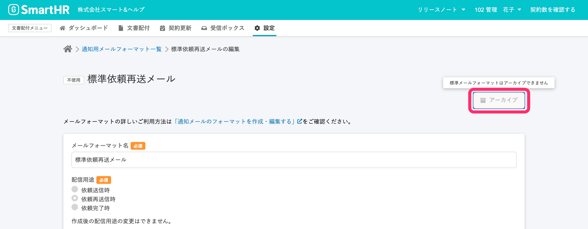
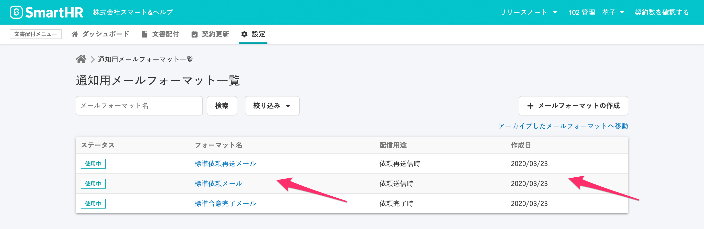
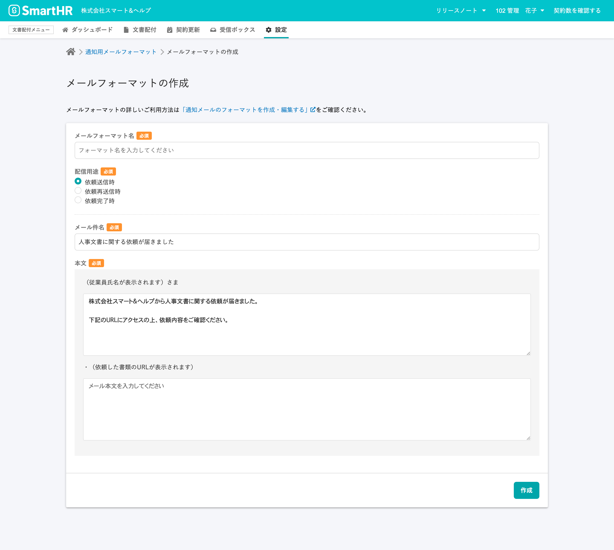
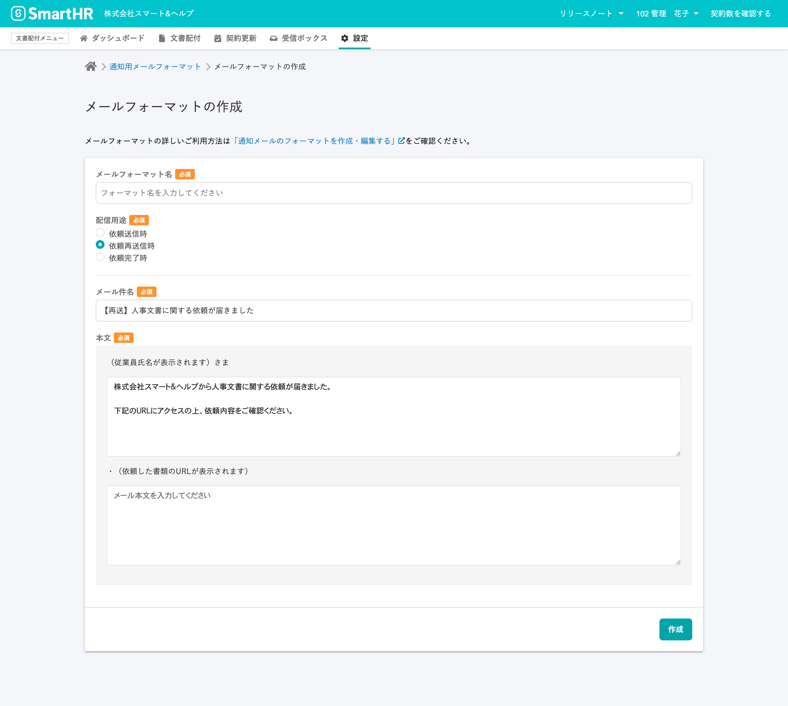
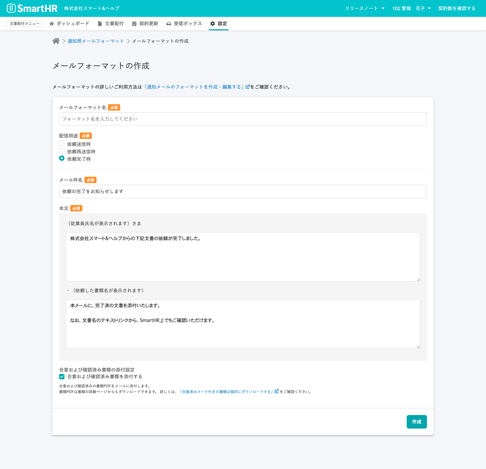

# フォーマット作成で自動適用される件名・本文を参考に、標準メールフォーマットを編集してください

**\[標準メールフォーマット\]** とは、書類セット作成時にあらかじめ選択されている通知メール用のメールフォーマットのことで、件名と本文はカスタマイズできます。

書類セット作成時にあらかじめ選択されるという性格上、アーカイブができません。

文書配付機能リリース時、雇用契約機能時代からご利用いただいているお客様の標準メールフォーマットの更新は控えました。

標準メールフォーマットをカスタマイズしてご利用いただいているケースを想定し、自動的な上書きを回避したために、「合意完了」など雇用契約機能時代の表現が残っています。

これらを解消していただくには、標準メールフォーマットの編集を適宜行っていただく必要があります。

## \[メールフォーマット作成\] 画面で、標準メールフォーマットを確認する

編集にあたっては、文書配付機能リリース後の標準メールフォーマットの内容を参考にしていただくことも可能です。

**\[通知用メールフォーマット一覧\]** 画面右上の **\[+ メールフォーマットの作成\]** をクリックして、 **\[メールフォーマットの作成\]** 画面を表示すると、標準メールフォーマットの内容を確認できます。

## \[メールフォーマットの一覧\] 画面から、標準メールフォーマットのフォーマットを編集する

メールフォーマットの作成・編集する手順は、こちらをご確認ください。

:::related
[通知メールのフォーマットを作成・編集する](https://knowledge.smarthr.jp/hc/ja/articles/360043502353)
:::

また、既存の依頼グループの通知メールは、メールフォーマットの修正では内容が反映されません。
依頼グループ詳細の **\[通知メール設定\]** から編集してください。

:::related
[メールフォーマットを編集しても、通知メールが更新されないのはなぜ？](https://knowledge.smarthr.jp/hc/ja/articles/360057579973)
[通知メールを書類セットや依頼グループに紐付ける](https://knowledge.smarthr.jp/hc/ja/articles/360042985914)
:::
