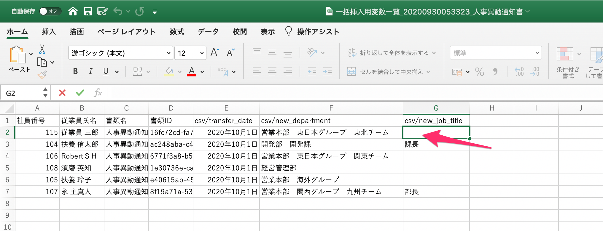
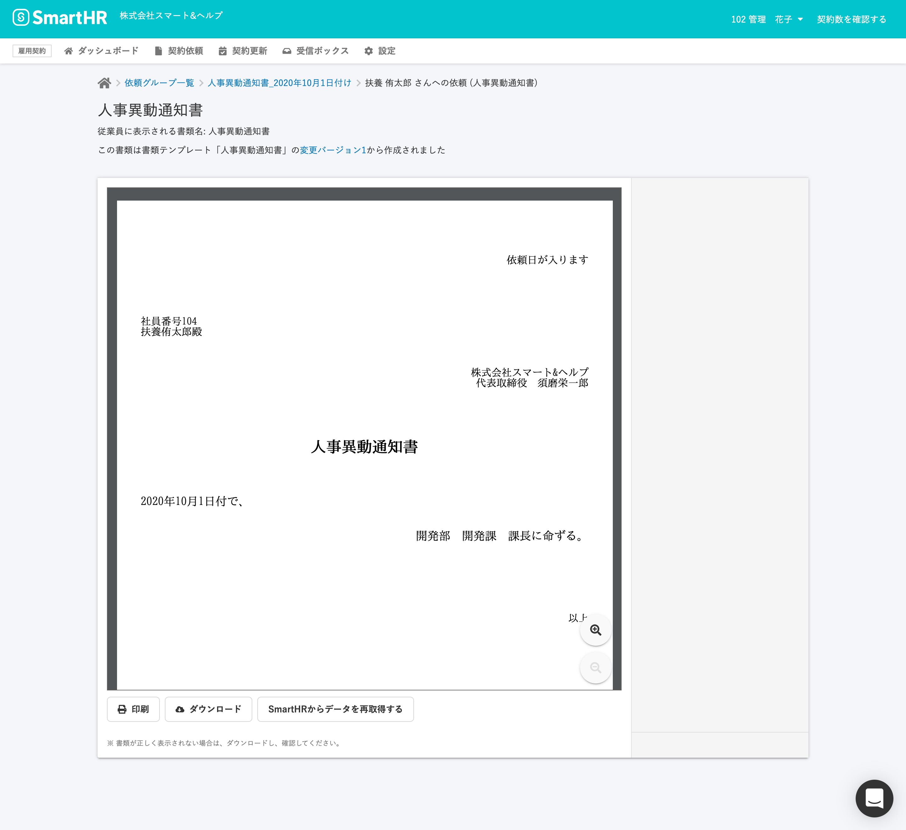
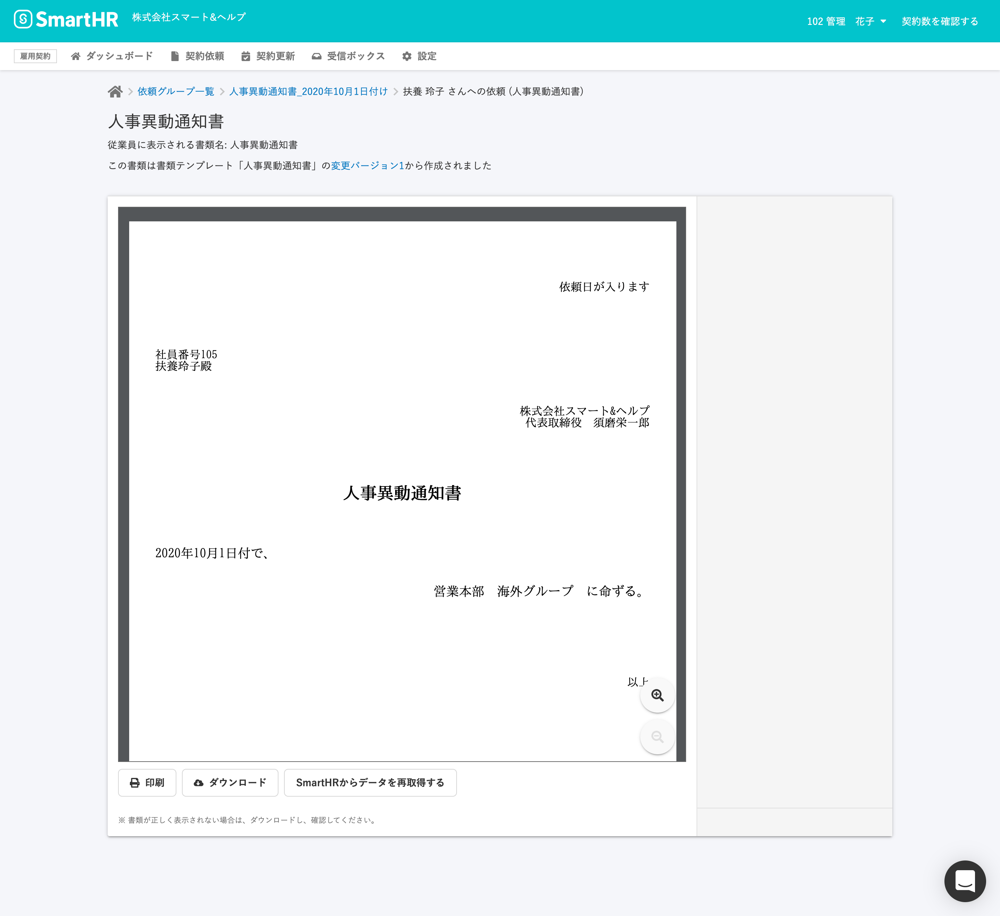

# CSVのセルに全角スペースを入力してください。

CSV挿入用テンプレート変数を使用したテンプレートの場合、1つでも空のテンプレート変数があると、書類作成ができません。

依頼グループで、「以下の書類のCSV挿入用テンプレート変数が登録されていません。」というメッセージが表示されます。

一部の従業員に宛てる書類だけ入力すべき項目がない場合は、セルの中を空欄にせずにCSVファイルの中に全角スペース「　」を入力してください。

### 例：{{csv/new\_job\_title}} に文字が入力されている書類

### 例：{{csv/new\_job\_title}} に全角スペースが入力されている書類

:::related
[テンプレート変数を使って書類テンプレートを作成する](https://knowledge.smarthr.jp/hc/ja/articles/360036818773)
:::
