文書配付機能を使って書類を作成中に、書類ステータスに「**書類の作成に失敗しました。必須項目の内容を確認してください。**」と表示されて従業員の書類を作成できない場合の原因と対処方法を説明します。

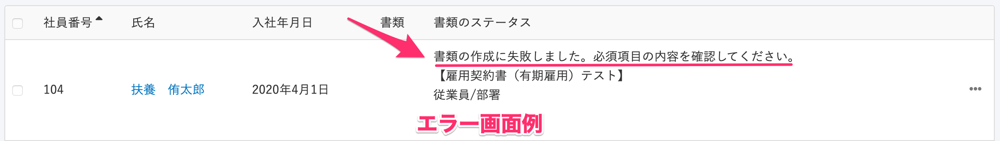

# 書類テンプレートの入力必須項目が足りません。

依頼に使用する書類を作成する際にテンプレート変数に挿入するデータがSmartHRに登録されていないと、書類の作成に失敗します。

対処方法は2つあります。

1.  入力必須項目として設定されているSmartHRの従業員情報を追加する
2.  書類テンプレートを編集し、入力必須項目の設定を変更する

エラーメッセージ **「書類の作成に失敗しました。必須項目の内容を確認してください。」** の **必須項目** とは、書類テンプレートに設定している **［入力必須項目］** のことです。

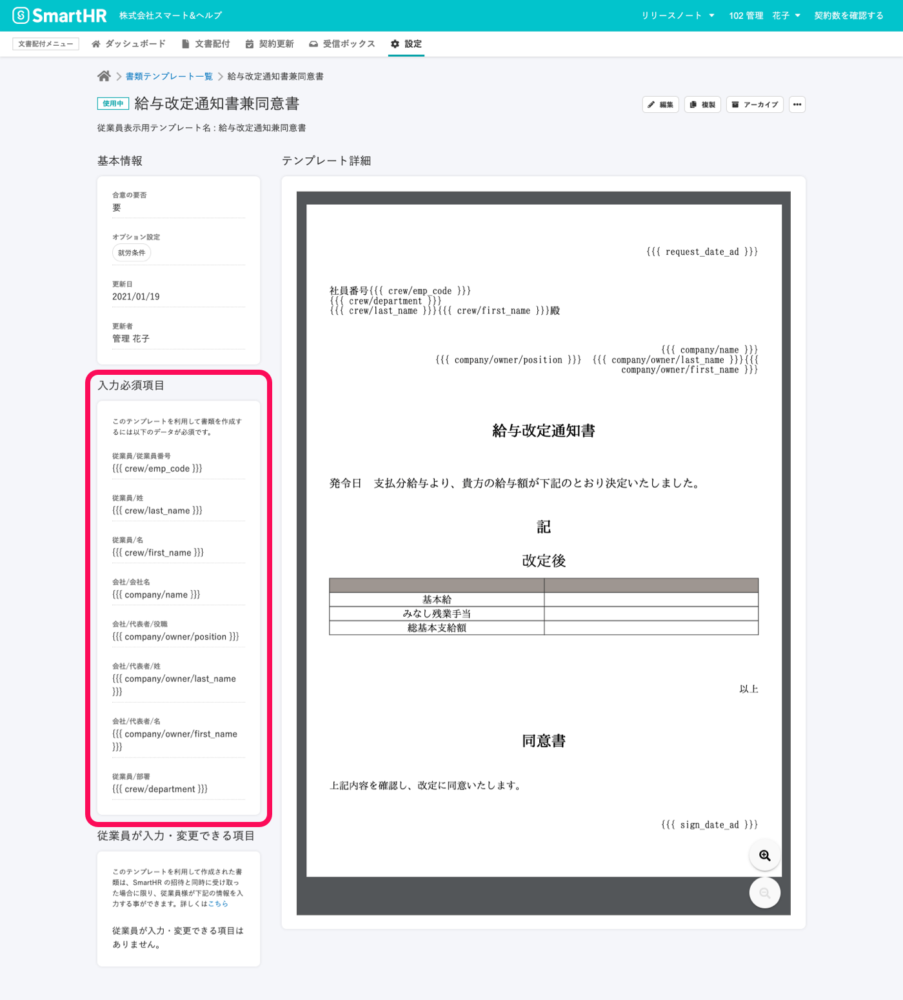

書類テンプレートの詳細画面は、エラーメッセージが表示された画面上の **［この依頼グループでは以下の書類を依頼します。］** の下にあるリンクから移動できます。

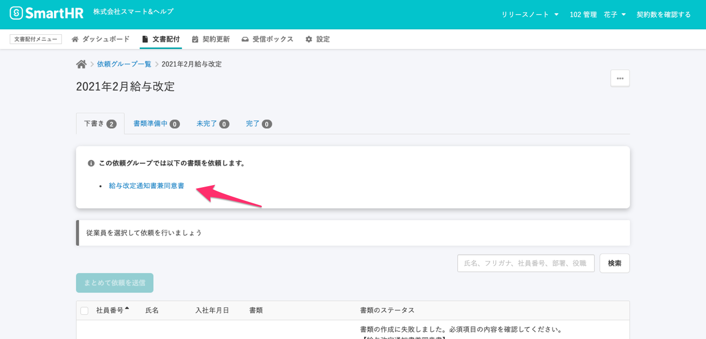

# 必須項目を追加して対応する

## 1\. 従業員情報の編集画面で、必須項目を登録する

エラーメッセージが表示された従業員の  **［氏名］** をクリックして、**従業員情報** 画面へ移動します。

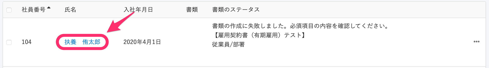

従業員情報の編集画面で、書類テンプレートの入力必須項目に設定している従業員情報を登録してください。

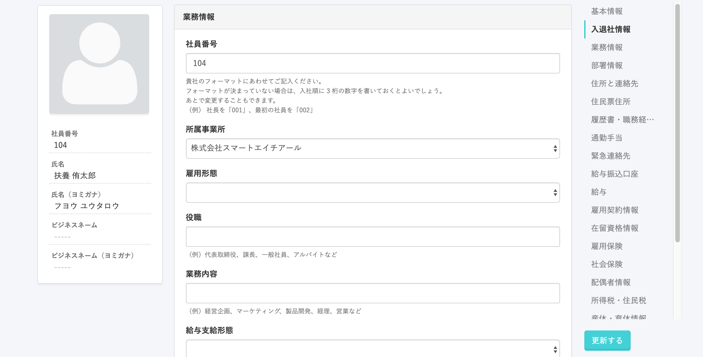

:::related
[従業員情報を個別に更新する](https://knowledge.smarthr.jp/hc/ja/articles/360036957193)
:::

## 2\. ［データを再取得する］をクリック

文書配付機能へ戻り、**依頼グループ詳細** 画面で、エラーメッセージが表示された従業員の行の右端にある **［…］** から **［データを再取得］** をクリックすると、確認の画面が表示されます。

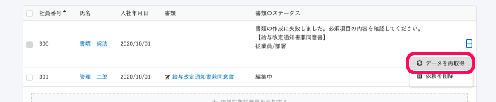

 **［OK］** をクリックすると、画面が切り替わり、書類の作成がはじまります。

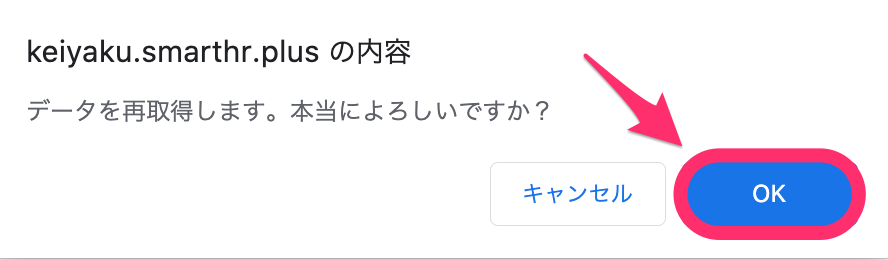

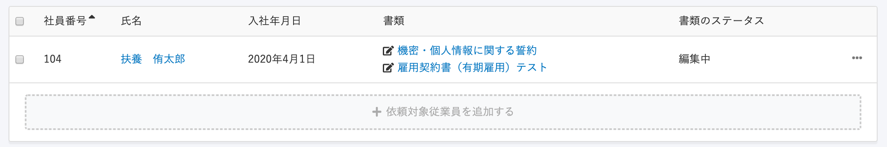

# 書類テンプレートの入力必須項目を変更して対応する

## 1\. 書類テンプレートの編集画面にて必須項目のチェックを外す

使用している書類テンプレート画面へ移動して、**\[…\] メニュー** から **\[この書類テンプレートを編集する\]** をクリックして、テンプレートの編集画面へ移動します。

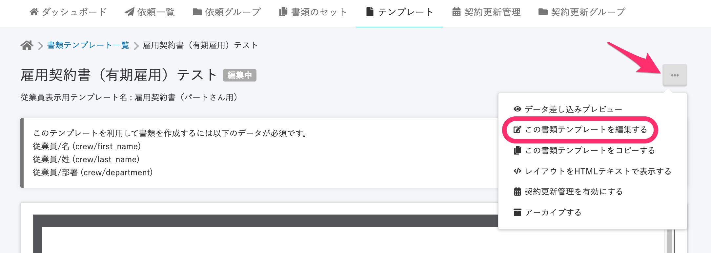

テンプレート編集画面を下へスクロールすると、**\[必須項目\]** を確認できます。

必須項目から外したい項目のチェックを外し、**\[更新\]** をクリックしてください。

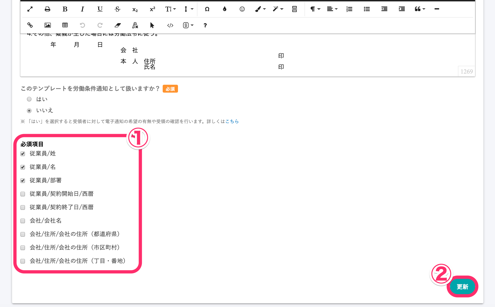

## 2. \[データを再取得\] をクリック

エラーメッセージが表示された画面へ戻り、パネルの右側にある **\[…\] メニュー** を開いて **\[データを再取得する\]** をクリックすると、確認のモーダルが表示されます。

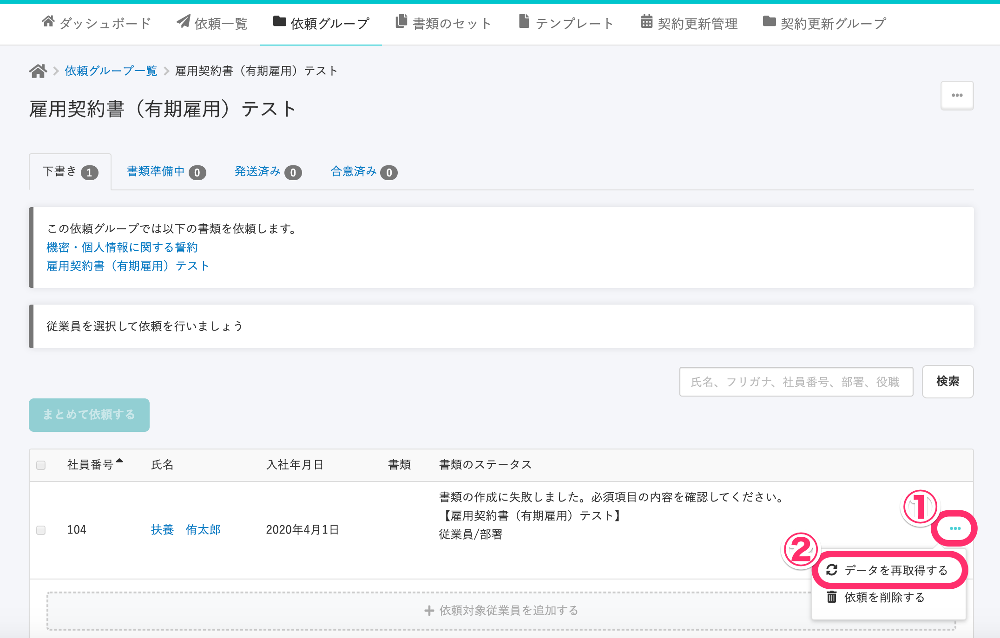

モーダルに表示された **\[OK\]** をクリックすると、画面が切り替わり、書類が作成されたことを確認できます。

