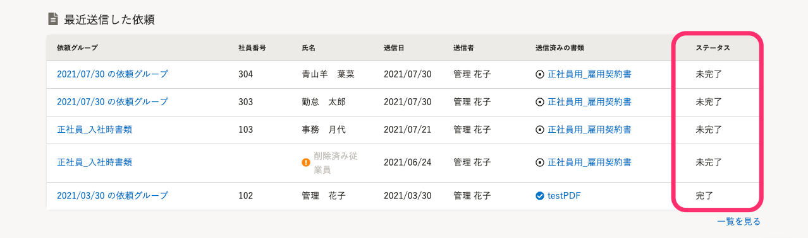
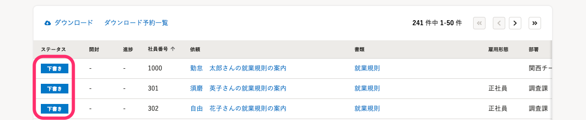
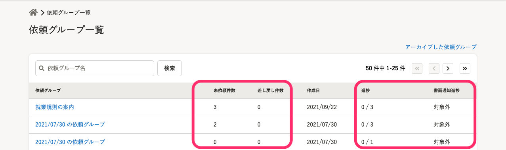

発送した雇用契約書に対して従業員からの合意があったか否かは、文書配付のダッシュボードにある **\[最近依頼した契約\]** 項目、 **\[依頼一覧\]** 、または **\[依頼グループ\]** の画面で確認できます。

# \[最近依頼した契約\] でステータスを確認する

SmartHRにログインし、トップページ左側の **\[機能****\]** 欄にある **\[文書配付\]** をクリックすると、文書配付機能の画面に移動できます。

文書配付のダッシュボード画面を下にスクロールすると、**\[最近依頼した契約\]** の一覧が表示されます。

画面右側に表示される **\[ステータス\]** をご確認ください。

# \[依頼一覧\] でステータスを確認する

文書配付機能の画面上部のメニューにある **\[文書配付\]** から **\[依頼一覧\]** をクリックすると、作成した依頼が一覧表示されます。

画面左側に表示される **\[ステータス\]** をご確認ください。

# \[依頼グループ\] でステータスを確認する

文書配付機能の画面上部のメニューにある **\[文書配付\]** > **\[依頼グループ\]** をクリックすると、作成した依頼グループが一覧表示されます。

画面右側に表示される **\[未依頼件数\] \[差し戻し件数\]** や **\[進捗\]** **\[書面通知進捗\]** にてステータスをご確認ください。
