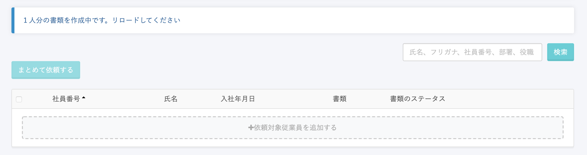

大量に雇用契約書の依頼を行なった場合、一時的に書類ステータスが **\[依頼中\]** となったまま、「◯人分の書類を作成中です。リロードしてください」というメッセージが表示され続ける場合があります。

この場合、しばらくお待ちいただけると解消されます。

すべてのユーザーさまが行なっている依頼の処理を順次サーバー上で処理しているため、恐れ入りますが処理完了までしばらくお待ちください。

:::tips
サーバー上の処理が完了すると、通常どおり数分程度で依頼を送付できます。
:::
