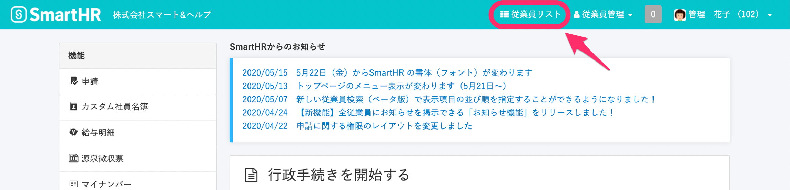
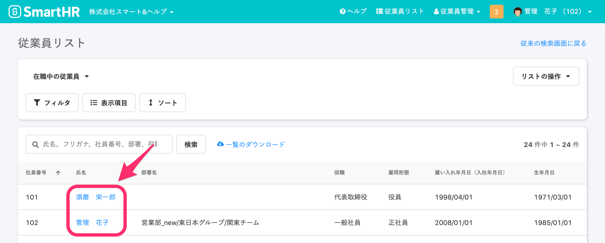
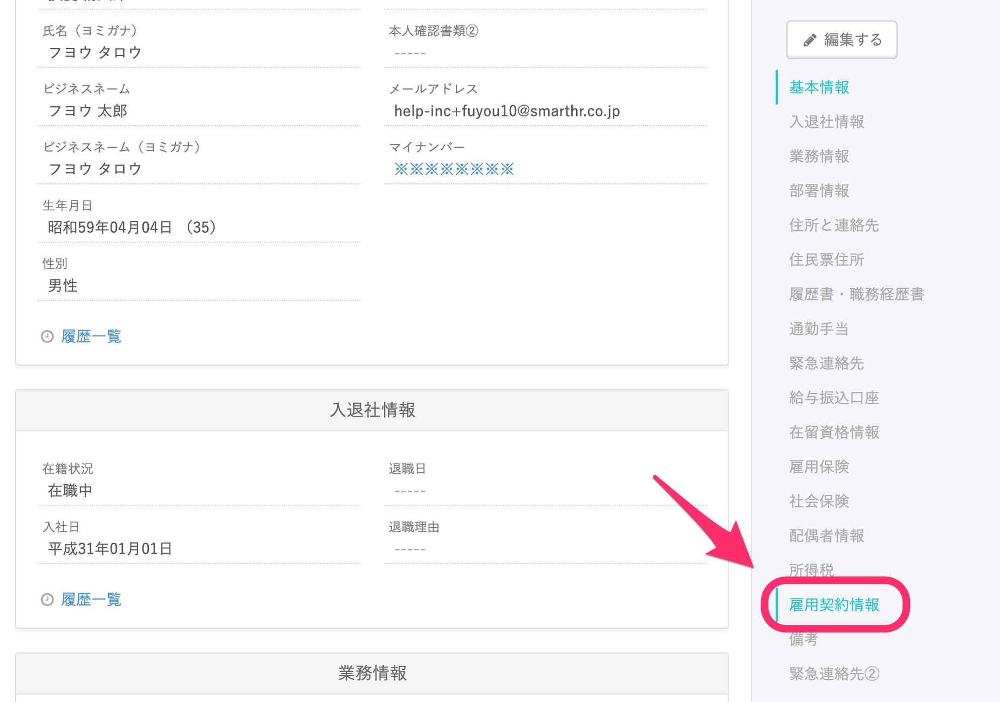
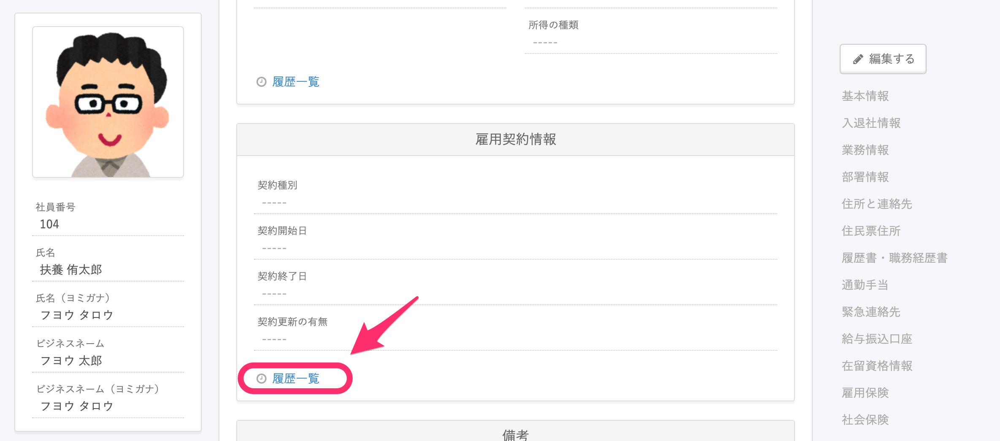
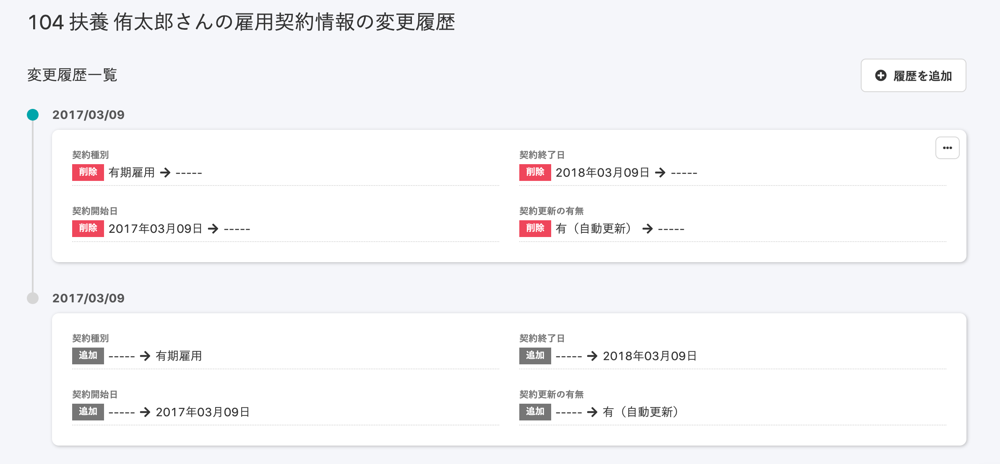
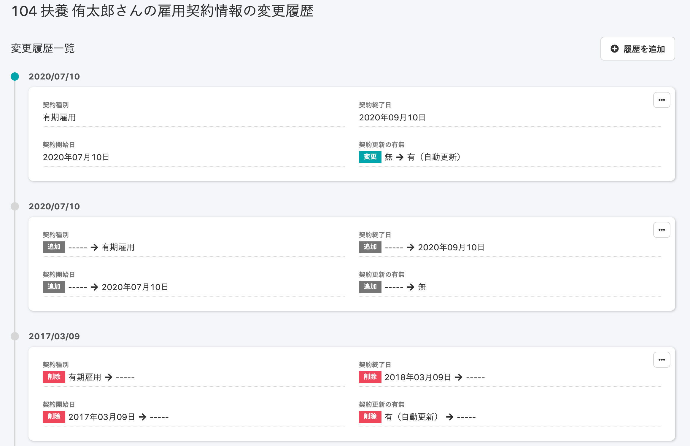
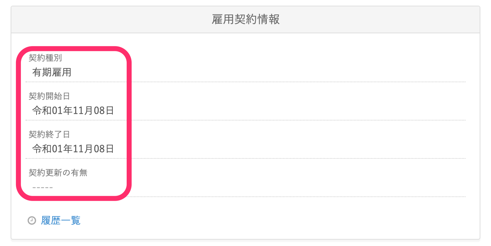
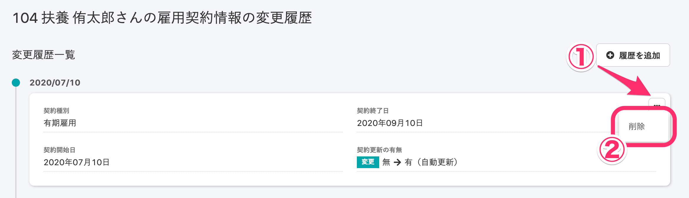

従業員の雇用契約書情報に加えられた変更履歴を閲覧するには、**\[従業員情報\]** ページにある **\[雇用契約情報\] > \[履歴一覧\]** を確認します。

# 1\. \[従業員リスト\]をクリック

トップページの右上にある **\[従業員リスト\]** をクリックすると、従業員名が一覧表示されます。

# 2\. 従業員名をクリック

従業員リストの **\[氏名\]** 欄で、変更履歴を閲覧したい従業員の名前をクリックしてください。

# 3\. \[雇用契約情報\]をクリック

従業員情報のメニュー下部にある **\[雇用契約情報\]** をクリックすると、 **\[雇用契約情報\]** の項目に移ります。

# 4\. \[履歴一覧\]をクリック

雇用契約情報の左下にある **\[履歴一覧\]** をクリックすると、雇用契約情報の変更履歴が表示されます。

# 5\. 変更履歴を閲覧する

該当の変更が適用された時点での従業員情報を閲覧できます。

## 変更履歴の見方

変更履歴の **\[契約種別\] \[契約開始日\] \[契約終了日\] \[契約更新の有無\]** 欄には、更新のあった雇用契約情報の項目が表示されます。

ラベルは **\[追加\] \[変更\] \[削除\]** の3つです。

## \[削除\]の使い方

また、変更履歴の右側にある **\[…\]メニュー > \[削除\]** を押すと、該当の変更履歴は削除され、従業員情報は1つ前の履歴の状態に戻ります。

