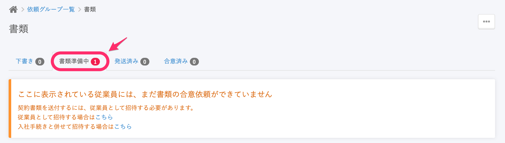
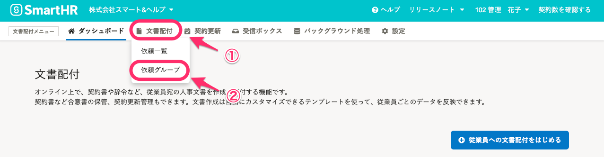
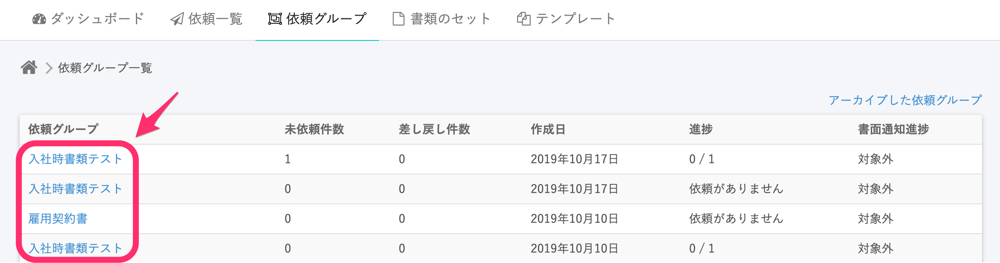
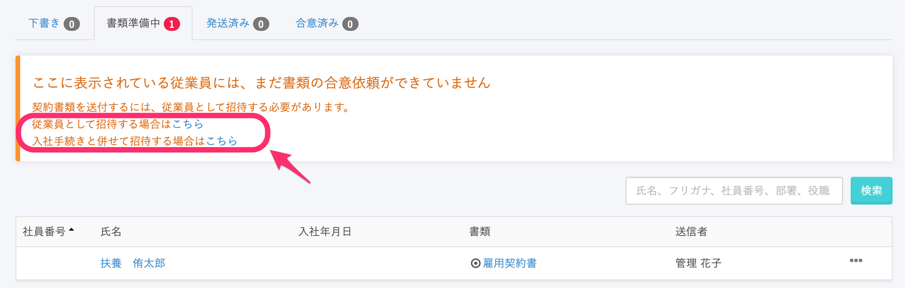

SmartHRに招待されていない従業員に雇用契約書の合意依頼をすると、依頼は「書類準備中」のステータスになります。

# 書類準備中の依頼を発送するには？

## 1\. \[依頼グループ\] メニューをクリック

書類準備中の依頼を従業員に発送するには、 まず文書配付機能のメニューにある **\[依頼グループ\]** をクリックします。

## 2\. 依頼グループ名を選ぶ

**\[依頼グループ\]** をクリックすると表示される **\[依頼グループ\]** の中から、書類準備中の契約書がある依頼グループの名前をクリックします。

## 3\. \[書類準備中\] をクリック

依頼グループの名前をクリックすると、画面の上部に書類のステータスが表示されます。

****

ステータスの **\[書類準備中\]** をクリックすると、「ここに表示されている従業員には、まだ書類の合意依頼ができていません」と書かれたメッセージが表示されます。

## 4\. \[招待する場合はこちら\] をクリック

**\[書類準備中\]** ステータスのメッセージ内にある、 **\[従業員として招待する場合はこちら\]** 、または **\[入社手続きと併せて招待する場合はこちら\]** をクリックします。 

この画面で選んだ方法で、従業員にSmartHRへの招待を行います。

:::tips
従業員として招待するときの操作については、こちらのページをあわせてご覧ください。
[従業員をSmartHRに招待する](https://knowledge.smarthr.jp/hc/ja/articles/360026264133)
:::
:::tips
入社手続きと併せて招待する場合の操作については、こちらのページをご覧ください。
[メールアドレスアカウントに入社の手続きと雇用契約書への合意を同時に依頼する](https://knowledge.smarthr.jp/hc/ja/articles/360026262173)
:::
