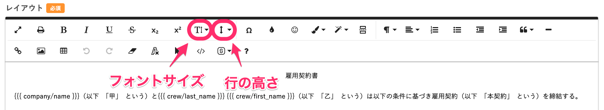

# A. 書類のスペースやフォントサイズを調整するか、表の下の空白を調整してください。

書類テンプレートをPDF1枚に収めたい場合は、書類のスペースやフォントサイズを調整するか、表を挿入されている場合は空白を調整してください。

PDFの枚数を設定する機能はないため、以下の方法をご参考ください。

## フォントサイズ・行の高さを調整する

フォントサイズを小さくするにはエディタ機能にある「フォントサイズ」、行の高さを低くするには「行の高さ」を使用します。

エディタ機能の使い方について、詳しくは下記のページをご覧ください。

[書類テンプレートを作成する](https://knowledge.smarthr.jp/hc/ja/articles/360026263953)

## 表の下の空白を調整する

表を挿入されている場合は、表の下の空白を削除することで行間が詰まります。

詳細は、以下のヘルプページをご覧ください。

[表の下にできた空白を削除する場合｜書類テンプレートのレイアウト作成画面で表を編集する](https://knowledge.smarthr.jp/hc/ja/articles/900007691543#toc--4)
