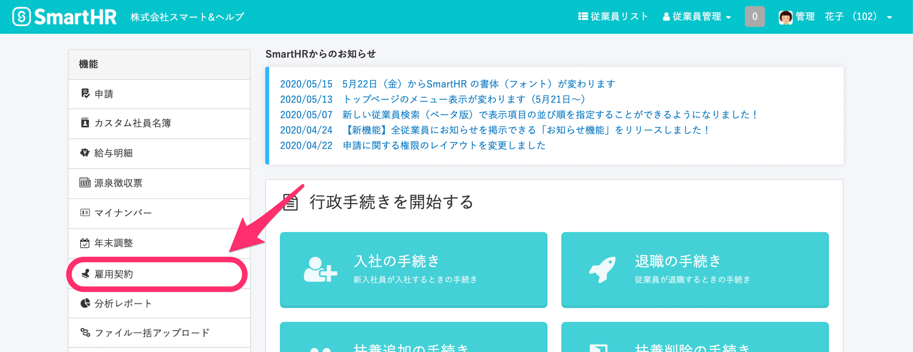
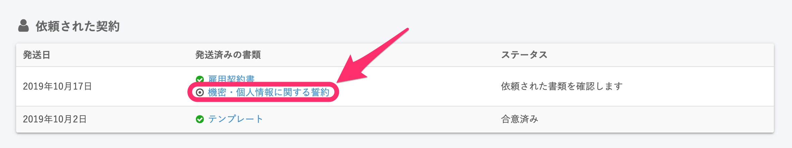
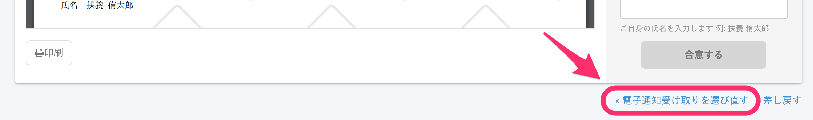
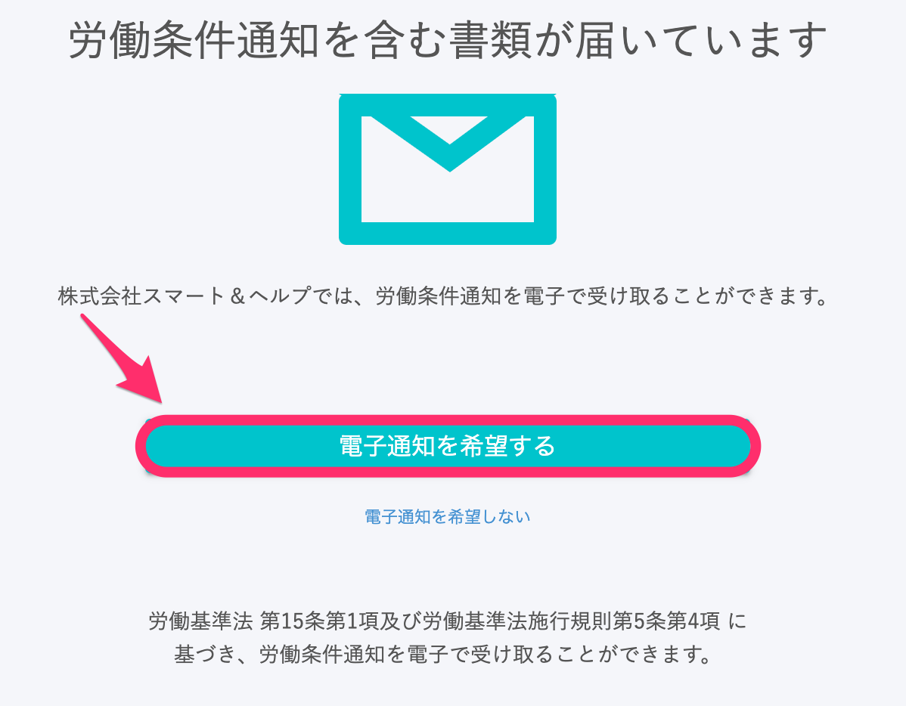

書類への合意をする前であれば、従業員は電子通知希望を選択しなおすことができます。

従業員が「電子通知を希望しない」を選んで書類に合意した後で選択し直すには、管理者が再度合意依頼を送信する必要があります。

# 従業員が書類に合意する前の場合

従業員が該当の書類に合意していない場合、従業員画面から電子通知の希望を選び直せます。

## 1\. トップページ > \[雇用契約\] をクリック

ログイン後、トップページ左側の **\[雇用契約\]** をクリックします。

**\[依頼された契約\]** ページから、一度「電子通知を希望しない」を選んだ書類を選びます。

## 2\. \[電子通知受け取りを選び直す\] をクリック

開いた書類のページをスクロールし、画面下部に表示される **\[電子通知受け取りを選び直す\]** をクリックします。 

クリックすると表示されるページにある **\[電子通知を希望する\]** ボタンを押し、書類に署名して終了です。

# 従業員が書類に合意した後の場合

従業員が「電子通知を希望しない」を選んだまま書類に合意した後は、管理者が書類を再発送する必要があります。

:::tips
従業員への依頼の送信方法については、下記のページをご覧ください。
[依頼グループの作成（従業員に依頼を送信する手順）](https://knowledge.smarthr.jp/hc/ja/articles/360026105334)
:::
