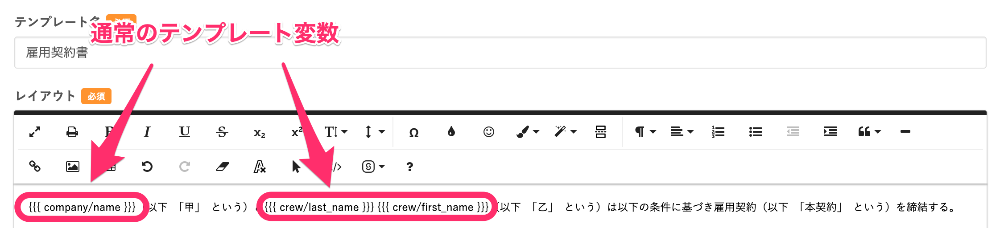
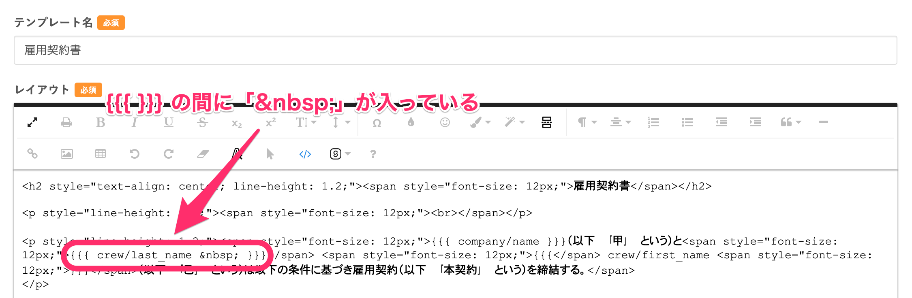
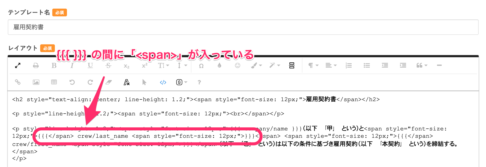
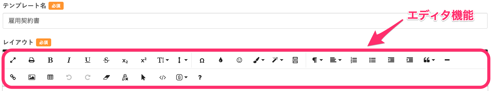
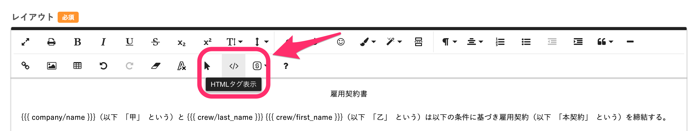
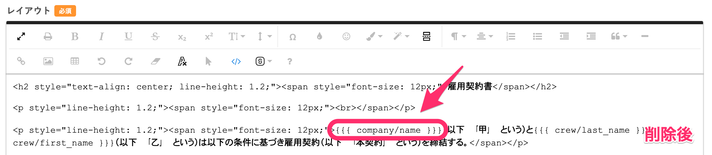
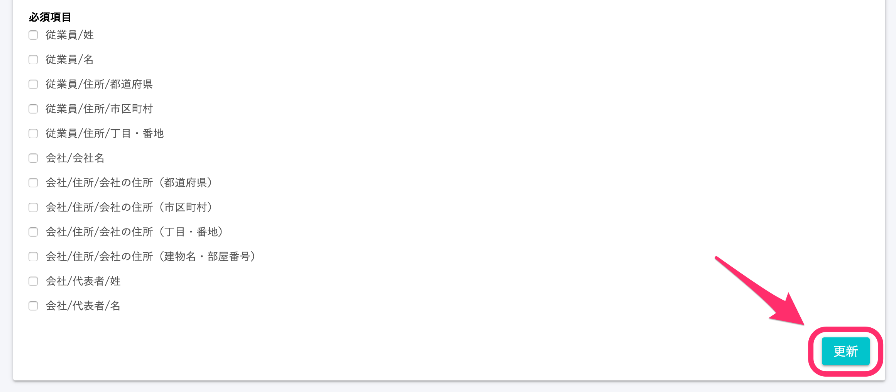

文書配付機能でエラー「テンプレート変数の形式が違います」が起こる原因と対処法をご案内します。

# エラーが起きる場合の例

通常のテンプレート変数は、両端のカッコ「{{{ }}}」の間に変数とスペースのみが含まれています。

「レイアウト：テンプレート変数の形式が違います」のエラーは、テンプレート変数が誤って記入されたときや、テンプレート変数の中にHTMLタグが挿入されてしまったときに起こります。

例えば、このような場合があります。

- テンプレート変数の中にスペース「&nbsp;」が挿入された場合
- テンプレート変数の中にHTMLタグ「~」タグが挿入された場合

# エラーが起きる原因

エラーが起きる原因として、エディタ機能を使用しているうちにHTMLタグが挿入されてしまったことが考えられます。

書類テンプレート画面のエディタ機能の多くは、HTMLタグを挿入するものなので、文字色や文字サイズを変えているうちに、テンプレート変数が変更されることがあります。

# 対応方法

HTMLタグに切り替えて、テンプレート変数内に挿入されたHTMLタグを削除します。

**\[レイアウト\]** 項目上部にあるエディタ機能から **\[HTMLタグ表示\]** を選びます。

テンプレート変数を確認し、変数の中にHTMLタグが挿入されていた場合は削除します。

変更後、編集画面の下にある **\[更新\]** を押します。

